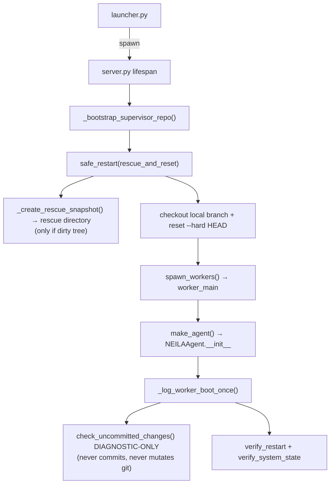

# NEILA v5.8.1 — Architecture & Reference

This document describes every component, page, button, API endpoint, and data flow.
It is the single source of truth for how the system works. Keep it updated.

---

## 1. High-Level Architecture

```
User
  │
  ▼
launcher.py (PyWebView)       ← desktop window, immutable outer shell (tracked in git; bundled as packaged entry point)
  │
  │  spawns subprocess
  ▼
server.py (Starlette+uvicorn) ← HTTP + WebSocket on configurable host:port (default localhost:8765; Docker/non-loopback supported via NEILA_SERVER_HOST=0.0.0.0)
  │
  ├── web/                     ← Web UI (SPA with ES modules in web/modules/)
  │
  ├── supervisor/              ← Background thread inside server.py
  │   ├── message_bus.py       ← Queue-based message bus + Telegram bridge (LocalChatBridge)
  │   ├── workers.py           ← Multiprocessing worker pool (fork/spawn by platform)
  │   ├── state.py             ← Persistent state (state.json) with file locking
  │   ├── queue.py             ← Task queue management (PENDING/RUNNING lists)
  │   ├── events.py            ← Event dispatcher (worker→supervisor events)
  │   └── git_ops.py           ← Git operations (clone, checkout, rescue, rollback, push, credential helper)
  │
  └── NEILA/               ← Agent core (runs inside worker processes)
      ├── config.py            ← SSOT: paths, settings defaults, load/save, PID lock
      ├── agent.py             ← Task orchestrator
      ├── chat_upload_api.py   ← Chat file attachment upload/delete endpoints
      ├── agent_startup_checks.py ← Startup verification and health checks
      ├── agent_task_pipeline.py  ← Task execution pipeline orchestration
      ├── a2a_executor.py      ← A2A AgentExecutor bridging A2A protocol to supervisor via handle_chat_direct
      ├── a2a_server.py        ← A2A Starlette/uvicorn server (port 18800, dynamic Agent Card, JSON-RPC)
      ├── a2a_task_store.py    ← File-based A2A TaskStore (atomic writes, TTL cleanup)
      ├── improvement_backlog.py ← Minimal durable advisory backlog helpers + digest formatting
      ├── loop.py              ← High-level LLM tool loop
      ├── loop_llm_call.py     ← Single-round LLM call + usage accounting
      ├── loop_tool_execution.py ← Tool dispatch and tool-result handling
      ├── pricing.py           ← Model pricing, cost estimation, usage events
      ├── llm.py               ← Multi-provider LLM routing (OpenRouter/OpenAI/compatible/Cloud.ru/Anthropic)
      ├── model_catalog_api.py ← Optional provider model catalog endpoint
      ├── safety.py            ← Policy-based LLM safety check
      ├── consciousness.py     ← Background thinking loop (with progress emission)
      ├── consolidator.py      ← Block-wise dialogue consolidation (dialogue_blocks.json)
      ├── memory.py            ← Scratchpad, identity, chat history
      ├── context.py           ← LLM context builder (public API for consciousness)
      ├── context_compaction.py ← Context trimming and summarization helpers
      ├── local_model.py       ← Local LLM lifecycle (llama-cpp-python)
      ├── local_model_api.py   ← Local model HTTP endpoints
      ├── local_model_autostart.py ← Local model startup helper
      ├── deep_self_review.py   ← Deep self-review: full git-tracked pack + memory → 1M-context model
      ├── review.py            ← Code collection, complexity metrics, pre-commit review
      ├── review_state.py      ← Durable advisory pre-review state (advisory_review.json)
      ├── onboarding_wizard.py ← Shared desktop/web onboarding bootstrap + validation
      ├── owner_inject.py      ← Per-task user message mailbox (compat module name)
      ├── launcher_bootstrap.py ← Bundle-to-repo bootstrap and managed sync helpers (used by launcher.py)
      ├── provider_models.py   ← Provider-specific model ID helpers, direct-provider defaults (OpenAI, Anthropic)
      ├── runtime_mode_policy.py ← Runtime-mode protected-path policy (safety-critical files, frozen contracts, release/managed invariants) shared by registry, git tools, and Claude gateway guards
      ├── reflection.py        ← Execution reflection and pattern capture
      ├── review_evidence.py   ← Structured review findings/obligations snapshot for summaries and reflections
      ├── skill_loader.py      ← Skill discovery + durable skill state (v5.5: walks data/skills/{native,clawhub,NEILAhub,external}/ + optional NEILA_SKILLS_REPO_PATH; persists to data/state/skills/<name>/; tags each LoadedSkill with `source`)
      ├── skill_dependencies.py ← Shared dependency-spec resolution for skill payloads across manifests, sidecars, and provenance
      ├── skill_review.py      ← Tri-model skill review reusing the repo-review infrastructure against the Skill Review Checklist section of docs/CHECKLISTS.md
      ├── extension_loader.py  ← Phase 4 in-process loader for type: extension skills; discovers + imports plugin.py via importlib with a narrow PluginAPIImpl, tracks registrations per-skill for atomic unload
      ├── extension_isolated_deps.py ← Per-extension bridge that exposes reviewed `.NEILA_env` Python site-packages to in-process extensions while they are loaded
      ├── extensions_api.py    ← Phase 5 HTTP surface for extensions (GET /api/extensions, GET /api/extensions/<skill>/manifest, ALL /api/extensions/<skill>/<rest:path> catch-all dispatch, POST /api/skills/<skill>/toggle, POST /api/skills/<skill>/review, POST /api/skills/<skill>/grants)
      ├── marketplace/         ← ClawHub + NEILAHub marketplace package (clawhub.py registry client, NEILAhub.py static GitHub catalog client, fetcher.py staging, adapter.py OpenClaw->NEILA translation, install.py orchestration, isolated_deps.py per-skill dependency prefix, provenance.py durable provenance)
      ├── marketplace_api.py   ← HTTP surface for marketplaces (/api/marketplace/clawhub/* and /api/marketplace/NEILAhub/*); always-on with registry host allowlists and hash checks
      ├── skill_lifecycle_queue.py ← single FIFO lane for mutating skill lifecycle actions (install/update/review/deps/enable/disable/uninstall) with recent event snapshot for Skills UI, chat live-card progress, dedupe keys, and sync tool wrapper
      ├── skill_review_runner.py ← v5.7.2 shared lifecycle-backed skill review runner for API + agent tool paths; writes review_job.json + skill_review_* events
      ├── skill_migrations.py  ← one-shot data-plane migrations for renamed official generation skills (image_gen→nanobanana, audio_gen→music_gen) and user-managed skills accidentally left under native/
      ├── server_auth.py       ← Non-localhost auth gate (NEILA_NETWORK_PASSWORD)
      ├── server_control.py    ← Process-control helpers: restart, panic stop
      ├── server_entrypoint.py ← CLI argument parsing, port-binding helpers
      ├── server_history_api.py ← Chat history + cost breakdown endpoints
      ├── server_runtime.py    ← Server startup/onboarding and WebSocket liveness helpers
      ├── server_web.py        ← Static web file helpers (NoCacheStaticFiles, web dir resolver)
      ├── task_continuation.py ← Durable per-task review continuation state across restart/outage
      ├── task_results.py      ← Durable task result/status files (task_results/<id>.json)
      ├── tool_aliases.py      ← OpenClaw-compatible alias boundary; normalizes alias names/args to canonical tools before safety, timeout, dispatch, and truncation
      ├── tool_capabilities.py ← SSOT for tool sets (core, parallel-safe, truncation, browser)
      ├── tool_policy.py       ← Tool access policy and gating (imports from tool_capabilities)
      ├── utils.py             ← Shared utilities
      ├── world_profiler.py    ← System profile generator (WORLD.md)
      ├── contracts/           ← Frozen ABI (Phase 1 Protocols + TypedDicts + SkillManifest; Phase 4 adds plugin_api.py with PluginAPI + ExtensionRegistrationError + permission/route-method/forbidden-settings tuples)
      │   ├── tool_context.py  ← ToolContextProtocol (minimum tool ABI, duck-typed)
      │   ├── tool_abi.py      ← ToolEntryProtocol + GetToolsProtocol
      │   ├── api_v1.py        ← WS/HTTP envelope TypedDicts
      │   ├── skill_manifest.py ← Unified SKILL.md / skill.json parser (instruction|script|extension)
      │   ├── schema_versions.py ← Opt-in _schema_version helpers
      │   └── plugin_api.py    ← Phase 4: PluginAPI Protocol + ExtensionRegistrationError + FORBIDDEN_EXTENSION_SETTINGS + VALID_EXTENSION_PERMISSIONS + VALID_EXTENSION_ROUTE_METHODS
      ├── gateways/            ← External API adapters (thin transport, no business logic)
      │   └── claude_code.py   ← Claude Agent SDK gateway (edit + read-only paths)
      ├── tools/               ← Auto-discovered tool plugins
      │   ├── release_sync.py    ← Release-metadata sync library; used by _preflight_check check 7 for P9 history-limit validation (check_history_limit) and by agents for version-carrier sync (sync_release_metadata)
      │   ├── review_synthesis.py ← LLM-based claim synthesis (Phase 1): deduplicates raw multi-reviewer findings into canonical issues before durable obligations are created; called from commit_gate._record_commit_attempt; fail-open (returns original on any error)
      │   ├── a2a.py             ← A2A client tools: a2a_discover, a2a_send, a2a_status (non-core, require enable_tools)
      │   ├── ci.py              ← CI trigger and monitoring (GitHub Actions API)
      │   ├── claude_advisory_review.py ← Advisory pre-review tool (read-only Claude Agent SDK)
      │   ├── commit_gate.py     ← Advisory freshness gate and commit-attempt recording (extracted from git.py); `_record_commit_attempt` runs LLM-based claim synthesis (via `review_synthesis.py`) on blocked attempts before durable obligations are created
      │   ├── git_rollback.py    ← rollback_to_target tool (wraps git_ops.rollback_to_version)
      │   ├── git_pr.py          ← PR integration tools: fetch_pr_ref, create_integration_branch, cherry_pick_pr_commits, stage_adaptations, stage_pr_merge (non-core, require enable_tools)
      │   ├── github.py          ← GitHub integration: issues (list/get/comment/close) + PR tools: list_github_prs, get_github_pr, comment_on_pr (non-core; github.py is in _FROZEN_TOOL_MODULES so PR inspection/comment tools work in packaged builds)
      │   ├── parallel_review.py ← Parallel triad+scope orchestration and verdict aggregation (extracted from git.py)
      │   ├── plan_review.py     ← Pre-implementation design review (2–3 distinct parallel full-codebase reviewers, plan_task tool)
      │   ├── review.py          ← Triad diff review (>=2 reviewer models in parallel against CHECKLISTS.md; ships with 3, capped at 10)
      │   ├── review_helpers.py  ← Shared review helpers (section loader, file packs, intent, pytest preflight via agent interpreter)
      │   ├── review_revalidation.py ← Reviewed-commit fingerprint revalidation helpers (blocks when staged diff changes after review)
      │   ├── scope_review.py   ← Blocking scope reviewer (configurable, fail-closed)
      │   ├── skill_exec.py      ← Phase 3 external-skill surface: list_skills, review_skill, toggle_skill, skill_exec (subprocess runner with cwd confinement, env scrubbing, timeout, runtime allowlist python/python3/bash/node/deno/ruby/go; gated by enabled + PASS review + fresh content hash — v5.1.2 Frame A: runtime_mode no longer blocks execution)
      │   └── skill_preflight.py ← v5.7.0 heal-safe, read-only skill payload preflight validator (manifest parse + Python compile() / node --check / bash -n; no review-state mutation)
      └── platform_layer.py    ← Cross-platform process/path/locking helpers

# Build & CI (not part of runtime)
.github/workflows/ci.yml     ← Four-tier CI (quick / full / integration / build+release)
build.sh                      ← macOS build (PyInstaller → .dmg)
build_linux.sh                ← Linux build (PyInstaller → .tar.gz)
build_windows.ps1             ← Windows build (PyInstaller → .zip)
scripts/build_repo_bundle.py  ← Builds `repo.bundle` + `repo_bundle_manifest.json` for packaged releases
scripts/run_external_review.py ← v5.1.2 dev-loop tool: invokes `NEILA.tools.parallel_review.run_parallel_review` from outside the runtime against `git diff --cached`. Reads `~/NEILA/data/settings.json` for `OPENROUTER_API_KEY` / `NEILA_REVIEW_MODELS` / `NEILA_SCOPE_REVIEW_MODEL`, builds a minimal `ToolContext`, prints FULL raw triad+scope output (no truncation). Used to dry-run the same review pipeline `repo_commit` triggers before any actual commit. Output: stdout (and optional `--output PATH`). Not part of the runtime gate; review-exempt dev tool.
Dockerfile                    ← Docker image (web UI runtime)
```

### Two-process model

1. **launcher.py** — immutable outer shell (tracked in the git repo; bundled as the packaged entry point via PyInstaller). Never self-modifies. Handles:
   - PID lock (single instance)
   - Bootstrap: initializes `~/NEILA/repo/` from the embedded `repo.bundle` +
     `repo_bundle_manifest.json` on the first launcher-managed run
   - Managed repo hand-off: after first bootstrap, keeps using the launcher-managed
     git checkout and normal managed-remote branch updates instead of per-launch
     file overwrites
   - Starts `server.py` as a subprocess via embedded Python
   - Shows PyWebView window pointed at `http://127.0.0.1:8765`
   - Monitors subprocess; restarts on exit code 42 (restart signal)
  - First-run wizard (shared desktop/web onboarding for multi-key and optional local setup)
   - **Graceful shutdown with orphan cleanup** (see Shutdown section below)

2. **server.py** — self-editable inner server. Can be modified by the agent.
   - Starlette app with HTTP API + WebSocket
   - Runs supervisor in a background thread
   - Supervisor manages worker pool, task queue, message routing
   - Local model lifecycle endpoints extracted to `NEILA/local_model_api.py`

### Data layout (`~/NEILA/`)

```
~/NEILA/
├── repo/              ← Agent's self-modifying git repository
│   ├── server.py      ← The running server (kept in sync via the launcher-managed git clone, NOT copied from the workspace on each launch; see §2)
│   ├── NEILA/      ← Agent core package
│   │   └── local_model_api.py  ← Local model API endpoints (extracted from server.py)
│   ├── supervisor/     ← Supervisor package
│   ├── web/            ← Web UI files
│   │   └── modules/    ← ES module pages (chat, logs, evolution, etc.)
│   ├── docs/           ← Project documentation
│   │   ├── ARCHITECTURE.md ← This document
│   │   ├── DEVELOPMENT.md  ← Engineering handbook (naming, entity types, review protocol)
│   │   ├── CHECKLISTS.md   ← Pre-commit review checklists (single source of truth)
│   │   └── CREATING_SKILLS.md ← Skill author guide (manifest schema, PluginAPI, widgets, publishing)
│   └── prompts/        ← System prompts (SYSTEM.md, SAFETY.md, CONSCIOUSNESS.md)
├── data/
│   ├── settings.json   ← User settings (API keys, models, budget)
│   ├── state/
│   │   ├── state.json  ← Runtime state (spent_usd, session_id, branch, etc.)
│   │   ├── advisory_review.json ← Durable advisory/review ledger (runs, attempts, obligations, commit-readiness debts)
│   │   ├── evolution_metrics_cache.json ← Cached per-tag Evolution metrics (schema 1; regenerated by `/api/evolution-data` / `collect_evolution_metrics`)
│   │   ├── queue_snapshot.json
│   │   ├── review_continuations/ ← Per-task blocked-review continuation payloads (+ quarantined corrupt files under `corrupt/`)
│   │   └── skills/              ← Phase 3 external-skill state plane (sibling of advisory_review.json, not shared)
│   │       └── <skill_name>/
│   │           ├── enabled.json ← {"enabled": bool, "updated_at": iso_ts}
│   │           ├── review.json  ← {"status": "pass|fail|advisory|pending", "content_hash": str, "findings": [...], "reviewer_models": [...], "timestamp": iso_ts, ...}  (Phase 3 ``pending_phase4`` status retired in Phase 4 — legacy files migrate on load)
│   │           ├── deps.json    ← isolated dependency install fingerprint for skills with reviewed install specs
│   │           └── __extension_imports/<uuid>/skill/  ← Phase 4 staged import tree for type:extension skills (created on load, removed on unload; see §12.1)
│   ├── memory/
│   │   ├── identity.md     ← Agent's self-description (persistent)
│   │   ├── scratchpad.md   ← Working memory (auto-generated from scratchpad_blocks.json)
│   │   ├── scratchpad_blocks.json ← Append-block scratchpad (FIFO, max 10)
│   │   ├── dialogue_blocks.json ← Block-wise consolidated chat history
│   │   ├── dialogue_summary.md ← Legacy dialogue summary (auto-migrated to blocks)
│   │   ├── dialogue_meta.json  ← Consolidation metadata (offsets, counts)
│   │   ├── WORLD.md        ← System profile (generated on first run)
│   │   ├── knowledge/      ← Structured knowledge base files
│   │   ├── identity_journal.jsonl    ← Identity update journal
│   │   ├── scratchpad_journal.jsonl  ← Scratchpad block eviction journal
│   │   ├── knowledge_journal.jsonl   ← Knowledge write journal
│   │   ├── deep_review.md            ← Last deep self-review report (written by deep_self_review task)
│   │   ├── registry.md              ← Source-of-truth awareness map (what data the agent has vs doesn't have)
│   │   ├── knowledge/improvement-backlog.md ← Durable advisory backlog of concrete post-task improvements
│   │   └── owner_mailbox/           ← Per-task user message files (compat path name)
│   ├── logs/
│   │   ├── chat.jsonl      ← Chat message log
│   │   ├── progress.jsonl  ← Progress/thinking messages (BG consciousness, tasks)
│   │   ├── events.jsonl    ← LLM rounds, task lifecycle, errors
│   │   ├── tools.jsonl     ← Tool call log with args/results
│   │   ├── supervisor.jsonl ← Supervisor-level events
│   │   ├── task_reflections.jsonl ← Execution reflections (process memory)
│   │   └── a2a.log         ← A2A server logs (RotatingFileHandler, 2 MB × 3 backups)
│   ├── a2a_tasks/          ← A2A task persistence (FileTaskStore, atomic JSON files with TTL)
│   ├── archive/            ← Rotated logs, rescue snapshots
│   └── uploads/            ← Chat file attachments (uploaded via paperclip button)
└── NEILA.pid           ← PID lock file (platform lock — auto-released on crash)
```

---

## 2. Startup / Onboarding Flow

```
launcher.py main()
  │
  ├── acquire_pid_lock()        → Show "already running" if locked
  ├── check_git()               → Show "install git" wizard if missing
  ├── bootstrap_repo()          → ensure_managed_repo(): first run clones from the embedded
  │                               repo.bundle + validates repo_bundle_manifest.json;
  │                               subsequent runs verify the managed clone's bootstrap pin
  │                               (source_sha + release_tag + bundle_sha256) and ensure the
  │                               managed remote metadata exists. Ordinary restart cleanup
  │                               lives in supervisor/git_ops.checkout_and_reset(), called by
  │                               server.py::_bootstrap_supervisor_repo(); it preserves the
  │                               local branch HEAD and cleans only the working tree. Explicit
  │                               Update Now uses a pinned update-intent SHA for official reset.
  ├── _run_first_run_wizard()   → Show shared setup wizard if no runnable config
  │                               (access entry → models → review mode → budget → summary)
  │                               Saves to ~/NEILA/data/settings.json
  ├── agent_lifecycle_loop()    → Background thread: start/monitor server.py
  └── webview.start()           → Open PyWebView window at http://127.0.0.1:8765
```

### First-run wizard

Shown when `settings.json` does not contain any supported remote provider key and has no
`LOCAL_MODEL_SOURCE`.

- Existing OpenRouter, OpenAI, OpenAI-compatible, Cloud.ru, Anthropic, or local-model-source settings skip the wizard automatically.
- The wizard is shared between desktop and web: one HTML/CSS/JS onboarding flow is rendered directly in pywebview for desktop and injected into a blocking web overlay for Docker/browser runs.
- The wizard is multi-step and provider-aware: it starts with a single access step that accepts multiple remote keys plus optional local-model setup, then shows visible model defaults, a dedicated review-mode step, a dedicated budget step, and the final summary before save.
- When an Anthropic key is present, onboarding shows the Claude runtime status with `Repair Runtime` and `Skip for now` options.
- Desktop first-run uses the same onboarding bundle and talks to Claude SDK install/status through `pywebview` bridge methods.
  Web onboarding uses `/api/claude-code/status` and `/api/claude-code/install`.
- The wizard blocks progression if nothing runnable is configured.
- When OpenRouter is absent and official OpenAI is the only configured remote runtime, untouched default model values are auto-remapped to `openai::gpt-5.5` / `openai::gpt-5.5-mini` so first-run startup does not strand the app on OpenRouter-only defaults.
- `web_search` uses the official OpenAI Responses API only. It requires `OPENAI_API_KEY` and treats any non-empty `OPENAI_BASE_URL` as an incompatible custom runtime configuration rather than a fallback.
- OpenAI-compatible and Cloud.ru remain explicit model-selection flows from the full Settings page because there is no single safe universal default model ID for those providers.
- Closing the wizard without saving is non-fatal: the main app still launches and the user can finish configuration in Settings.

### Launcher-managed bundle bootstrap

Packaged releases ship an embedded git bundle (`repo.bundle`) plus
`repo_bundle_manifest.json`. On the first launcher-managed run the launcher:

- verifies the manifest against the packaged app version,
- checks the bundle SHA-256,
- initializes `~/NEILA/repo/` as a managed git checkout,
- checks out the manifest-pinned `source_sha`,
- then keeps the managed checkout as the self-modifying local branch.
  Later launches clean the working tree without moving local commits;
  official branch following happens only through explicit managed updates.
  If a newer app bundle carries different embedded repo metadata, the
  launcher refreshes the managed remote/manifest metadata in place instead
  of archiving and replacing an existing git checkout.

Safety-critical protection is no longer implemented as "copy these files from the
bundle on every launch". The runtime guardrails are the hardcoded sandbox /
post-edit revert in `registry.py` plus the launcher-managed repo integrity checks.

### Single-source rescue on startup (v4.36.1+)

A dirty worktree (uncommitted changes inherited from the previous session) is
handled by exactly ONE mechanism: `safe_restart(..., unsynced_policy="rescue_and_reset")`
called from `server.py::_bootstrap_supervisor_repo()` at supervisor startup. It
creates a proper rescue snapshot via `supervisor/git_ops.py::_create_rescue_snapshot`
and leaves the `NEILA` dev branch's working tree clean without moving the
branch tip away from local self-modification commits, so the worker respawn and
pytest-subprocess paths never see a dirty tree they could accidentally commit.



Worker-side `NEILA/agent_startup_checks.py::check_uncommitted_changes()` is
**warning-only**: it emits a `supervisor_side_rescue_owns_this` skip marker in
its result when the tree is dirty, and never runs `git add` or `git commit`.
Prior to v4.36.1, the worker-side path performed its own `auto-rescue` commit
directly on `NEILA`; because `NEILA_MANAGED_BY_LAUNCHER=1` is inherited
by every subprocess (pytest runs, A2A agent-card builder via
`_build_skills_from_registry`, supervisor-side `_get_chat_agent`), any of those
code paths would steal the agent's in-progress edits into a commit. The v4.36.1
change removes that duplicate rescue mechanism entirely.

### Agent interpreter handle (`NEILA_AGENT_PYTHON`)

`server.py` exposes the interpreter that launched NEILA as
`NEILA_AGENT_PYTHON` early in startup, immediately after `REPO_DIR` is added
to `sys.path` and before workers or review subprocesses are spawned. Existing
operator/test overrides are respected; the assignment is guarded so exotic
embedded runtimes with `sys.executable is None` or `""` do not write an invalid
environment value.

The three pytest subprocess surfaces use the same fallback chain:
`sys.executable or os.environ["NEILA_AGENT_PYTHON"] or "python3"`, then run
`-m pytest` through that interpreter:

- `NEILA/tools/review_helpers.py::_run_review_preflight_tests`
- `NEILA/tools/git.py::_run_pre_push_tests`
- `NEILA/tools/shell.py::_run_validation`

This keeps packaged app bundles from depending on a `pytest` or `python`
executable on the user's PATH; the test runner comes from the same Python
environment that has NEILA dependencies installed.

---

## 3. Web UI Pages & Buttons

The web UI is a single-page app (`web/index.html` + `web/style.css` + ES modules).
`web/app.js` is the SPA orchestrator and viewport bootstrap that imports from `web/modules/`:
- `ws.js` — WebSocket connection manager
- `utils.js` — shared utilities (markdown rendering, escapeHtml, matrix rain)
- `chat.js` — chat page with message rendering, live task card, compact runtime controls, and budget pill
- `logs.js` — log viewer with category filters and grouped task cards
- `log_events.js` — shared event summarization/grouping helpers used by Chat and Logs
- `files.js` — file browser, preview, uploads, and editor
- `evolution.js` — evolution chart (Chart.js), now mounted as the Dashboard → Evolution panel
- `dashboard.js` — top-level Dashboard page hosting Logs, Evolution, Costs, and Updates as full-height operational panels
- `updates.js` — Dashboard → Updates panel for official update status/check/apply plus local recovery commits/tags rollback/promote controls
- `settings.js` — settings form with local model management and catalog-backed Settings model pickers
- `settings_ui.js` — Settings page HTML layout, tabs, secret input bindings, Network Gate LAN hint container
- `settings_controls.js` — segmented effort controls
- `settings_catalog.js` — optional model-catalog refresh helper; handles `/api/model-catalog`, browser timeout, stale-response suppression, and model-picker catalog broadcasts
- `costs.js` — cost breakdown tables
- `page_header.js` — v5.7.2 shared page-header/tab-strip renderer used by Settings, Dashboard, Skills, Widgets, Files, and Chat; escapes title/description/labels and emits shared `app-page-*` / `app-tab-*` classes without inline styles.
- `skills.js` — Skills page (discover + enable/disable + review trigger + Repair task affordance for non-native failing skills + key-grant state + live-vs-catalog extension status; reads `/api/state` + `/api/extensions`, writes through `/api/skills/<name>/toggle` + `/api/skills/<name>/review`, sends Repair prompts through `/api/command`, and requests key grants through the desktop launcher bridge)
- `widgets.js` — Widgets page for reviewed extension UI surfaces declared through `register_ui_tab`; hosts legacy `inline_card`/`iframe` plus declarative v1 widgets (forms/actions, async job forms/actions, markdown, code, JSON, key/value, tables, tabs, charts, stream, progress, `subscription` WS updates, poll with `auto_start`, files, galleries, image/audio/video media, **map/calendar/kanban (v5.7.0)**) and tears down widget timers/listeners/streams on remount while resuming async jobs by `job_id`. **v5.7.0** also adds `kind: "module"` widgets: the host fetches reviewed `widget.js` through `/api/extensions/<skill>/module/<entry>`, embeds it into a sandboxed `<iframe srcdoc sandbox="allow-scripts">` with no `allow-same-origin`, and injects a parent-mediated `fetch` bridge restricted to `/api/extensions/<skill>/...`.

(`about.js` was removed in v5.7.0 when About moved into Settings as a sub-tab.)

Navigation is a left sidebar with 6 pages (Chat, Files, Skills, Widgets, Dashboard, Settings). About lives as a sub-tab inside Settings (v5.7.0+) — there is no top-level About page; the desktop launcher's `#nav-version` span keeps a compact version label visible above the rail's footer. Dashboard is the operational hub for Logs, Evolution, Costs, and Updates; Settings holds Providers / Models / Behavior / Integrations / Advanced / About sub-tabs. The Dashboard nav button uses the Lucide `gauge` icon (a half-circle speedometer with needle) — the previous `layout-dashboard` glyph was visually indistinguishable from the `layout-grid` Widgets glyph at 20×20 px. On narrow viewports (`@media (max-width: 640px)`) `#nav-rail` collapses to a horizontal bottom bar — `position: fixed; bottom: 0; flex-direction: row; justify-content: safe center` with `padding-bottom: calc(6px + env(safe-area-inset-bottom, 0px))` for the iOS home-indicator and `#content { padding-left: 0; padding-bottom: calc(62px + env(safe-area-inset-bottom, 0px)) }` to clear the bar. Mobile Settings keeps the horizontal pill strip (no drill-down accordion) — the active pill auto-scrolls into view via `scrollIntoView({ inline: 'center' })`. The Skills page manages external + bundled skill packages — review trigger, key grants, enable/disable, status badges, and live-vs-catalog extension state — and reads from `/api/state` + `/api/extensions`. Each skill card carries a kebab (⋮) menu in its header (right of the toggle) that opens as an anchored non-modal popover via `dialog.show()`; the menu hosts Re-review / Update / Uninstall actions. The Widgets page hosts reviewed extension UI declarations separately so useful widgets do not get buried in long skill lists; inline-card widgets now preserve their current state across SPA tab switches.

v5.7.2 normalizes page-level headers and top tab strips through `web/modules/page_header.js`: Settings, Dashboard, Skills, Widgets, Files, and Chat share the same title/action/tab structure and `app-page-*` / `app-tab-*` CSS rhythm. Chat keeps the `chat-page-header` overlay variant for scroll-under behavior; Settings/Dashboard/Skills tabs are all horizontal pill strips.

### 3.1 Chat

- **Status badge** (top-right): "Online" (green) / "Thinking..." / "Working..." (amber pulse) / "Reconnecting..." (muted offline).
  Driven by WebSocket connection state, typing events, and live task state.
- **Header controls**: compact buttons for `/evolve`, `/bg`, `/review`, `/restart`, `/panic` — the canonical location for runtime controls. The chat header is a floating transparent overlay (`position: absolute`, gradient fade with a non-zero opacity floor plus backdrop blur) so messages scroll beneath it without text reading through the header labels. On narrow viewports (`@media (max-width: 640px)`) the header remains an overlay, but row gaps and button spacing are tightened; `#chat-messages` reserves `80px` of top padding to clear the wrapped mobile action row while preserving the same scroll-under gradient behaviour.
- **Budget pill**: compact amber pill in the header showing `$spent / $limit` with a mini progress bar, updated from `/api/state` polling every 3 seconds.
- **Message input**: absolute-positioned overlay anchored to the bottom of the chat page (`position: absolute; bottom: 0`). It contains the paperclip attachment button, multiline textarea, and send group. The send group (`bottom: 7px`) and paperclip (`bottom: 9px`) anchor near the textarea baseline so multiline/mobile composition keeps controls beside the final line. There is no separate bottom fade layer: `#chat-input-area` carries only a compact darkening gradient (no wrapper blur), while `#chat-input` itself carries the frosted-glass blur (`backdrop-filter: blur(20px)`) and semi-transparent fill. `#chat-messages` reserves bottom padding via `--chat-input-reserve`, set from the actual `#chat-input-area.offsetHeight + 16px` (fallback `108px`; mobile adds safe-area). This avoids the huge blank gap of a worst-case static reserve while still keeping the last message reachable when the textarea grows or an attachment preview is visible. `updateMessagesPadding()` owns only this CSS variable plus scroll-stickiness; it never writes `paddingBottom` directly. Files are staged locally and uploaded to `data/uploads/` only when Send/Enter is triggered; offline WebSocket state blocks upload to avoid orphan files. Shift+Enter inserts a newline; Enter sends.
- **Clipboard image paste**: `#chat-input` registers a `paste` listener that scans `e.clipboardData.items` for `image/*` MIME types, calls `getAsFile()` on the first match, wraps the blob as a `File` named `clipboard-<unix-ts>.<ext>` (extension derived from the MIME), and stages it through the **same** `pendingAttachment` slot used by the paperclip button (the badge / removal UI / upload-on-Send path are all reused — no inline upload happens until Send/Enter, mirroring the paperclip semantics including the offline-WS guard). Non-image clipboard payloads fall through to native paste (text / formatted text). When an image is staged this way, `e.preventDefault()` suppresses the browser's default paste so a giant base64 string is not also inserted into the textarea.
- **Input recall**: ArrowUp / ArrowDown cycles through recent submitted messages without leaving the textarea. On the **first** successful `syncHistory` call of this page lifetime, it seeds `inputHistory` from server-side user messages (including Telegram and other-session messages that never went through the local `rememberInput()` path). Merge strategy: server messages (older) prepend before local session entries (newer); deduped from the end so most-recent entries always win; capped at 50 via `slice(-50)`. `PLAN_PREFIX` preambles are stripped before storage. Seeding is gated on a dedicated one-shot `inputHistorySeededFromServer` flag (not `historyLoaded`) so it fires on the first successful server sync even when the initial fetch failed and `historyLoaded` was already set true by the sessionStorage-fallback bootstrap path. Subsequent WebSocket reconnects deliberately do NOT re-seed (that would reset `inputHistoryIndex` mid-scrub), so Telegram/other-session messages that arrive while this tab stays open only surface in recall after the next full page reload.
- **Messages**: user bubbles (right, steel-blue-tinted), assistant bubbles (left, crimson), and system-summary bubbles (left, amber). Non-user bubbles render markdown. Live task card uses crimson accent glass matching the assistant palette.
- **Multi-user visibility**: user messages are now session-aware. The current browser session stays labeled as `You`; other Web UI sessions render as `WebUI (<session>)`; Telegram-origin messages render with their Telegram sender label.
- **Timestamps**: smart relative formatting (today: "HH:MM", yesterday: "Yesterday, HH:MM", older: "Mon DD, HH:MM"). Shown on hover.
- **Live task card**: reasoning/progress/tool chatter no longer spams the transcript as many assistant bubbles.
  Chat listens to `log_event`/task events plus progress messages and collapses them into one expandable task card with a timeline of steps.
- **Recoverable step failures**: step-level shell/tool failures stay as timeline notes and no longer freeze the card in a terminal `Issue` state.
  Later progress updates can retake the headline until the task actually finishes.
- **System summaries**: `direction="system"` entries from `chat.jsonl` are shown in the same timeline with a 📋 label instead of being hidden or treated as user text.
- **Typing indicator**: animated "thinking dots" bubble appears when the agent is processing.
- **Persistence**: chat history loaded from server on page load (`/api/chat/history`), survives app restarts. Fallback to sessionStorage. `syncHistory` uses two-pass processing: progress/summary messages are replayed first (building live card timelines), then regular assistant/user messages are processed (calling `finishLiveCard`). This guarantees thinking bubbles are never discarded due to `taskState.completed` being set before progress events are applied. After first load, if any live card is still active (task ongoing mid-reload), `showTyping()` is called to restore the typing indicator.
- **Duplicate-bubble prevention**: queued local user bubbles carry a `client_message_id`; echoed WebSocket/history messages with the same id are merged instead of duplicated.
- **Empty-chat init**: if neither server history nor sessionStorage has messages, the UI shows a transient assistant bubble: `NEILA has awakened`. This is visual-only and is not written to chat history.
- **Telegram bridge**: Web UI initiated chats can be mirrored into the bound Telegram chat, Telegram text input is injected back into the same live chat timeline, and Telegram photos are bridged as image-aware user messages (including while a direct-chat turn is already running).
- **Live card cleanup and reconnect recovery**: after a 2-minute `scheduleTaskUiCleanup` timer, finished task cards are **left fully intact** — the DOM node, backing `rec.items` array, and `liveCardRecords` entry are all preserved so the card remains visible with working expand/collapse interactions and so a later reconnect `syncHistory` can rebind the existing node without creating a duplicate. Only the task ID is added to `retiredTaskIds` so routine incremental `scheduleHistorySync()` calls (fired 700ms after each new task) do NOT re-build the card from history mid-session. On soft restart (same-SHA WS reconnect), `syncHistory` receives `fromReconnect=true` so `retiredTaskIds` is cleared and server history is authoritative — cards are reconstructed from `progress.jsonl` entries. The final `liveCardRecords` sweep in `syncHistory` skips cards where `ts.cardVisible === false && ts.completed === true` (trivial 0-tool-call tasks) to avoid a cluster of invisible placeholder nodes appearing at the end of the chat.
- **Mobile keyboard safety**: `web/app.js` creates a `<style id="runtime-vvh">` element at startup. On desktop/wide viewports (`>640px`), `updateVvh()` writes `:root{--vvh:100dvh}` so the browser owns dynamic viewport sizing and transient `visualViewport.height` pixel snapshots cannot collapse the Chat flex scroll chain until a resize. On narrow viewports (`≤640px`), it writes a clamped pixel value (`max(320px, visualViewport.height || window.innerHeight)`) because mobile keyboard layout still needs the live visual viewport height. `--vvh` also defaults to `100dvh` in `:root`. The narrow branch uses a frozen baseline captured from `documentElement.clientHeight`, `window.innerHeight`, and `screen.height/availHeight` while the keyboard is closed; this avoids the platform split where iOS makes `innerHeight == visualViewport.height` and Android/Opera may shrink `clientHeight` with the keyboard. When `(baseline - visualViewport.height) > max(120px, baseline * 0.25)`, it toggles both `html.keyboard-open` and `body.keyboard-open`, scrolls the document back to the top, and installs touch listeners that allow normal scrolling inside `#chat-messages`, `#chat-input`, and `.chat-live-timeline` while preventing document/visualViewport overscroll at their boundaries. When the keyboard closes or the viewport widens beyond 640px, the listeners are removed and both `keyboard-open` classes are cleared. The CSS keyboard block is scoped to `@media (max-width: 640px)`: `html.keyboard-open`, `body.keyboard-open`, `#content`, and `#page-chat.active` become fixed `height: var(--vvh)` containers, `#nav-rail` is hidden, the chat header/input become normal flex children, and only `#chat-messages` keeps `overflow-y: auto` (`overscroll-behavior: contain`) so messages scroll without revealing background pages.
- Messages sent via WebSocket `{type: "chat", content: text, sender_session_id: "uuid"}`.
- Responses arrive via WebSocket `{type: "chat", role, content, ts, source?, sender_label?, sender_session_id?, client_message_id?}` and `{type: "photo", role, image_base64, mime, caption?, ts, source?, sender_label?}`. On page-load history sync, `/api/chat/history` can also return `role: "system"` entries for internal summaries plus metadata for multi-user reconstruction.
- Supports slash commands: `/status`, `/evolve`, `/review`, `/bg`, `/restart`, `/panic`.

### 3.2 Files

- **Browser pane**: directory tree for the configured root, breadcrumb navigation, inline filter, refresh button,
  create-file/create-directory actions, clipboard-style copy/move/paste, and delete/download context menu.
- **Preview pane**: text preview/editor, image preview, PDF preview in a sandboxed iframe, binary-file placeholder, and drag-drop upload target.
- **Download/Open externally**: the web fallback downloads via Blob URLs; the desktop launcher bridge (`MainApi.download_file_to_downloads`) accepts local `/api/files/download` and same-origin `/api/extensions/<skill>/...` URLs on the active server port, writes to the OS Downloads folder, and can then open the saved file through `platform_layer.open_path_external`. Widget download controls use the same host-owned helper so media downloads never navigate the NEILA window away from the app.
- **Write safety**: unsaved text edits are guarded on folder switches, file switches, page navigation, and browser refresh.
- **Root policy**: localhost requests fall back to the current user's home directory when no root is configured.
  Network/Docker access requires an explicit `NEILA_FILE_BROWSER_DEFAULT` directory.
- **Network policy**: `NEILA_NETWORK_PASSWORD` is optional. When configured, non-loopback browser/API access is gated.
  When omitted, the full HTTP/WebSocket surface remains reachable by design. `/api/health` always stays public.
- **Symlink policy**: entries are constrained lexically to the configured root, but symlink targets may resolve outside that root intentionally.
  External symlink paths support list/read/download/content/write/mkdir/upload/copy/move/delete. Root-delete protection still applies only to the configured root itself.
- **Transfer semantics**: copy/move of symlink entries preserves the link object; writing through a symlink-backed file edits the target content.
- **Bounds**: directory listings are capped, previews are bounded to a text/byte limit, and uploads reject oversized payloads.

### 3.3 Dashboard

The Dashboard tab is the operational hub. It hosts four full-height sub-tabs:

- **Logs** — live log timeline and filters.
- **Evolution** — runtime/evolution status chart.
- **Costs** — budget controls and spend breakdown. The Chat budget pill opens this sub-tab directly.
- **Updates** — official update status plus a separate local recovery area.

### 3.4 Settings

- **Tabbed layout (v5.7.0+)**: `Providers`, `Models`, `Behavior`, `Integrations`, `Advanced`, `About`. On every viewport (including mobile) the tab row stays a horizontal-scroll pill strip; the active pill auto-scrolls into view. The v5.6.0 mobile drill-down with Back-to-Settings button has been retired — `bindSettingsTabs` no longer toggles `settings-subtab-open` and the `.settings-mobile-back` element is hidden via CSS for back-compat with anyone querying it from outside.
- **Provider cards**: OpenRouter, OpenAI, OpenAI-compatible, Cloud.ru, Anthropic, plus optional Network Password. Cards are collapsible and use masked-secret inputs with show/hide toggles.
- **API Keys**: OpenRouter, OpenAI, OpenAI-compatible, Cloud.ru, Anthropic, Telegram Bot Token, GitHub Token, and Network Password.
  Keys are displayed as masked values (e.g., `sk-or-v1...`), can be explicitly cleared, and are only overwritten on save if the user enters a new value (not containing `...`).
- **Claude Runtime Status**: the Anthropic card shows app-managed Claude runtime status with a `Repair Runtime` action. The card is visible when the user has configured `ANTHROPIC_API_KEY` **or** when the last `/api/claude-code/status` poll stored a non-empty `error` on the runtime card state (`claudeRuntimeHasError` in `web/modules/settings.js::applyClaudeCodeStatus`). Two distinct paths set that `error`: (a) backend `NEILA/platform_layer.py::resolve_claude_runtime` marks the SDK below the `_CLAUDE_SDK_MIN_VERSION` baseline (the only backend-originated path today — other not-ready conditions such as a missing bundled CLI currently fall through to `status_label() == "no_api_key"` until a key is configured); (b) the browser-side `refreshClaudeCodeStatus` `catch` block synthesizes an error payload for any `/api/claude-code/status` transport failure, non-OK HTTP response, or JSON parse error, so loss of connectivity to the backend also surfaces the card before a key is configured. The Claude runtime (SDK + bundled CLI) powers delegated code editing and advisory review and is managed automatically by the app.
- **Providers tab**: also contains `Legacy OpenAI Base URL` (backward-compatibility escape hatch for older installs) and `Network Gate` (optional non-localhost password + restart-required `NEILA_SERVER_HOST`) at the bottom. The Network Gate section also shows a read-only LAN hint (via `_meta` from `/api/settings`): loopback-bound instances show a restart instruction, LAN-reachable instances show a clickable URL, and non-loopback binds without `NEILA_NETWORK_PASSWORD` render as a warning with a set-password CTA. Saving a non-loopback host through `/api/settings` is limited to wildcard hosts (`0.0.0.0`, `::`) and requires a non-empty `NEILA_NETWORK_PASSWORD` in the same save; specific LAN IP binds are manual/env-only so the desktop launcher can keep probing loopback reliably. Manual env/settings-before-launch and Docker flows may still bind open by explicit operator choice. Bracketed IPv6 literals (e.g. `[::1]`) are normalized by `_build_network_meta` — brackets are stripped before the `is_loopback_host` classification, and URL construction uniformly re-brackets IPv6 addresses so there is no double-bracketing.
- **Models tab**: Main, Code, Light, Fallback model routing. Each card has a `Local` toggle to route through the GGUF server configured in Advanced. `Claude Code Model` field selects the Anthropic model for `claude_code_edit` / `advisory_pre_review`.
- **Model catalog**: optional `Refresh Model Catalog` action calls `/api/model-catalog`. The backend uses native async `httpx.AsyncClient` provider calls (no default-threadpool `requests` path); failures are non-fatal and the API response includes provider `stage`/`duration_ms` metadata while the Settings inline warning stays compact (provider names only). The browser refresh uses a 25s `AbortController` timeout and ignores stale refresh completions so older requests cannot wipe newer catalog results.
- **Model pickers**: searchable provider-aware pickers replace legacy raw dropdowns for remote models. Selecting a model writes it into the field and closes the results panel; typing/focus reopens the filtered list.
- **Unsaved draft indicator**: Settings does not block SPA navigation and does not show a modal. Edits persist in the DOM while navigating between pages, and a small `Unsaved changes.` footer indicator remains visible until Save or Reload resets the loaded baseline. Masked secrets keep the existing save semantics: untouched masked values are omitted, typed values overwrite, and explicit Clear persists an empty value.
- **Provider prefixes**:
  - OpenRouter model values stay unprefixed (`anthropic/claude-opus-4.6`).
  - OpenAI model values use `openai::...`.
  - OpenAI-compatible model values use `openai-compatible::...`.
  - Cloud.ru model values use `cloudru::...`.
  - Anthropic model values use `anthropic::...` (e.g. `anthropic::claude-opus-4-6`).
- **Behavior tab**: agent-behavior policy settings — Reasoning Effort, Review Enforcement (the two-button advisory/blocking toggle), **Runtime Mode** (Phase 2, three-button segmented control: `Light` / `Advanced` / `Pro`), and **External Skills Repo** (text field bound to `NEILA_SKILLS_REPO_PATH`). Review models and Web Search Model live in the Models tab alongside model routing.
- **Reasoning Effort**: Five segmented controls for task/chat, evolution, review, scope review, and consciousness.
  Backed by `NEILA_EFFORT_TASK`, `NEILA_EFFORT_EVOLUTION`, `NEILA_EFFORT_REVIEW`,
  `NEILA_EFFORT_SCOPE_REVIEW`, `NEILA_EFFORT_CONSCIOUSNESS`. Loading falls back to legacy
  `NEILA_INITIAL_REASONING_EFFORT` for task/chat when the new key is absent.
- **Review Models**: Comma-separated remote model IDs for pre-commit review.
  Backed by `NEILA_REVIEW_MODELS`.
- **Scope Review Model**: Single model for the blocking scope reviewer.
  Backed by `NEILA_SCOPE_REVIEW_MODEL` (default `openai/gpt-5.5`).
- **Provider change classification** (`server_runtime.classify_runtime_provider_change`, v4.40.6): classifies provider state after a settings save. Returns `"direct_normalize"` (an exclusive-direct provider is active → direct-provider autofill ran, warning appropriate), `"reverse_migrate"` (OpenRouter is present, no exclusive-direct provider active → `apply_runtime_provider_defaults` returned without changes, pure housekeeping, no warning), or `"none"` (neither condition). Used by `server.py::api_settings_post` to suppress the misleading "Normalized direct-provider routing" warning when the user adds OpenRouter back. `_MODEL_LANE_KEYS` renamed to `_ALL_MODEL_SLOT_KEYS` for consistency.
- **Direct-provider review fallback** (formerly "OpenAI-only review fallback"; updated v4.39.0 for `plan_task` quorum): if exactly one of **official OpenAI** or **Anthropic** is configured (no OpenRouter, no legacy OpenAI base URL, no OpenAI-compatible, no Cloud.ru) and the configured review list is invalid or doesn't match the exclusive provider prefix, review falls back to `[NEILA_MODEL, NEILA_MODEL_LIGHT, NEILA_MODEL_LIGHT]` (3 commit-triad slots, 2 unique models) drawn from `_DIRECT_PROVIDER_AUTO_DEFAULTS` (which pairs e.g. `openai::gpt-5.5` + `openai::gpt-5.5-mini` or `anthropic::claude-opus-4-6` + `anthropic::claude-sonnet-4-6`). This shape preserves the commit triad's "three models review the staged diff" contract (DEVELOPMENT.md) while yielding exactly 2 unique reviewers for `plan_task`'s quorum gate. If `main` and `light` happen to equal (user overrode both lanes to the same model), the fallback degrades to legacy `[main] * _DIRECT_PROVIDER_REVIEW_RUNS` — commit triad still works, `plan_task` then emits its quorum-error recovery hint. This replaces the old `[main] * 3` fallback which broke `plan_task` on first-run single-provider setups. Current scope is OpenAI-only and Anthropic-only — the detector (`NEILA/config.py::_exclusive_direct_remote_provider_env`) early-returns `""` when OpenAI-compatible or Cloud.ru keys are present, so those provider-only setups do not yet receive the fallback. The fallback additionally requires the main slot `NEILA_MODEL` — after `provider_models.migrate_model_value` — to already start with the exclusive provider prefix (`openai::` / `anthropic::`); if the normalized main model does not match the prefix, `get_review_models` leaves the configured reviewer list untouched and does **not** rewrite it to `[main]*3`. This covers the edge case where the Settings `#s-model` free-text input accepts a non-default cross-provider value. The same SSOT (`NEILA/config.py::get_review_models`) powers both the commit triad and `plan_task`.
- **Review Enforcement**: `Advisory` or `Blocking` for pre-commit review behavior. Rendered as a two-button segmented toggle (advisory = amber, blocking = crimson) rather than a dropdown.
  Backed by `NEILA_REVIEW_ENFORCEMENT`. Review always runs in both modes.
- **Runtime Mode**: `Light` / `Advanced` / `Pro` segmented control backed by `NEILA_RUNTIME_MODE` (default `advanced`). Onboarding can choose the initial boot baseline before the agent starts. After launch, the Settings control is interactive only in desktop builds: `web/modules/settings.js` calls the pywebview launcher bridge `request_runtime_mode_change`, the launcher shows a native confirmation dialog, and the launcher saves the new mode with `allow_elevation=True`; the change is reported as restart-required. Web/Docker sessions can view the current mode but cannot elevate it through `/api/settings`. The normal HTTP save path still omits/drops `NEILA_RUNTIME_MODE`, and `NEILA/config.py::save_settings` plus the boot-baseline pin, `_data_write` settings.json block, shell filters, and Files API guard remain the self-elevation defenses. `NEILA/config.py::VALID_RUNTIME_MODES = ("light", "advanced", "pro")` is the SSOT; `normalize_runtime_mode` runs on the read path (`get_runtime_mode`) so unknown values can never drift into `/api/state`.
- **External Skills Repo**: text input backed by `NEILA_SKILLS_REPO_PATH`. v5 changed the discovery model: the primary location is now the in-data-plane tree `data/skills/{native,clawhub,external}/`, and `NEILA_SKILLS_REPO_PATH` is an OPTIONAL extra discovery root for users who keep skills in their own checkout. The skill loader walks all three buckets + the optional path, tagging each `LoadedSkill` with `source` (`native`/`clawhub`/`external`/`user_repo`); `skill_exec` runs reviewed scripts from those packages; `review_skill`/`toggle_skill`/`list_skills` manage lifecycle, and the Skills page exposes the same direct review/toggle flow plus a Marketplace sub-tab for ClawHub installs. Absolute path or `~`-prefixed; empty means "use only the data plane". NEILA never clones or pulls this directory — the user manages it out-of-band. `get_skills_repo_path()` expands `~` at read time; `/api/state` surfaces only a `skills_repo_configured` boolean so the absolute path never leaks to the UI.
- **ClawHub Marketplace**: always-on Marketplace sub-tab backed by `NEILA_CLAWHUB_REGISTRY_URL` (default `https://clawhub.ai/api/v1`). The old `NEILA_CLAWHUB_ENABLED` key is ignored when present in legacy settings and is no longer part of defaults or env propagation. Browse uses `/packages?family=skill`; text search uses `/search?q=&limit=16` (full-index relevance ranking, single-page) and enriches thin hits through a merged `/packages/<slug>` + `/skills/<slug>` detail lookup to recover stats, official badges, license, and homepage metadata. The Official-only checkbox is clickable in both modes: browse forwards `isOfficial=true` to the catalogue, while text search applies it after enrichment because `/search` has no official filter parameter. Registry reads and downloads retry bounded 429 responses with `Retry-After` when present; persistent rate limits surface as a human-readable "try again later" state with a retry affordance instead of a raw HTTP 429. Every install runs through a fixed pipeline — registry resolve -> archive download (50 MB cap, text-only, sensitive-filename + loadable-binary refusal) -> staging extract -> OpenClaw frontmatter translation (writing original `SKILL.md` aside as `SKILL.openclaw.md` for audit) -> atomic land into `data/skills/clawhub/<owner>__<slug>/` -> tri-model `review_skill` auto-trigger -> durable provenance at `data/state/skills/<name>/clawhub.json`. v5.4.0 adds a card-level lifecycle CTA: install auto-runs review, then the card offers Enable only after a fresh PASS review and any required grants; otherwise the same card becomes Fix / Grant / Enable / Open widgets / Disable / Uninstall. Plugins (Node/TS) are filtered at search time and refused at install time; only skill packages are accepted. The registry-host allowlist prevents a settings override from redirecting HTTP traffic, and a custom redirect handler re-validates the host on every 30x hop. Core settings keys (`OPENROUTER_API_KEY` etc.) requested by OpenClaw `requires.env` become per-skill grant requirements and are forwarded only after fresh PASS review plus desktop-launcher owner grant; this is a trust-local model with `_data_write`, Files API, and `run_shell` owner-state defenses rather than an OS-level same-user sandbox.
- **Advanced tab**: local model runtime, max workers, tool timeout, soft/hard timeout, and reset controls. Total budget and per-task cost cap live in **Dashboard → Costs**.
- **Local Model Runtime**: source, GGUF filename, port, GPU layers, context length, chat format, start/stop/test buttons, live local-model status, real download progress bar (updates via `download_progress` from `/api/local-model/status`), and an **Install Local Runtime** button (hidden until runtime is missing). The Start button performs a preflight check via `/api/local-model/start` before downloading; on a `runtime_missing` (HTTP 412) response it surfaces the install button and a human-readable hint instead of a raw traceback. After install completes (`runtime_status == "install_ok"`), the start flow resumes automatically if a source was configured. `LOCAL_MODEL_FILENAME` now accepts subfolder paths (`quant/model.gguf`) and split GGUF patterns (`quant/model-00001-of-00003.gguf`); all shards are downloaded automatically and the server is started with the first shard. If the user omits the subfolder prefix (types just the bare filename), `_resolve_hf_path` auto-resolves the full path by querying `list_repo_files` on the HF repo (fail-open on network errors).
- **Telegram**: Bot Token and primary chat id. If no primary chat id is pinned, the bridge binds to the first active Telegram chat and keeps replies attached there.
- **GitHub**: Token + Repo (for remote sync).
- **Save Settings** button → POST `/api/settings`. Hot-reload contract:
  - **Budget (`TOTAL_BUDGET`), timeouts (`NEILA_SOFT_TIMEOUT_SEC`, `NEILA_HARD_TIMEOUT_SEC`, `NEILA_TOOL_TIMEOUT_SEC`), and integrations (`TELEGRAM_BOT_TOKEN`, `TELEGRAM_CHAT_ID`, `GITHUB_TOKEN`, `GITHUB_REPO`)**: refresh immediately in the running supervisor (no restart, no task boundary). `/status` reads live timeout values.
  - **Models, API keys, effort, review settings, `NEILA_PER_TASK_COST_USD`**: applied via `apply_settings_to_env(load_settings())` at the start of the **next task**. Current in-flight task is unaffected.
  - **Local model server, worker count, base URLs, and some provider runtime parameters**: require a full process restart to take effect.
  - Save response always includes `status: "saved"`. Optional keys present only when applicable: `no_changes` (bool), `restart_required` (bool) + `restart_keys` (list), `immediate_changed` (bool, true when any key from `_IMMEDIATE_KEYS` changed — budget, timeouts, Telegram, GitHub), `next_task_changed` (bool, true when any other hot-reloadable key changed — models, API keys, effort, review settings, per-task cost), `warnings` (list). UI shows a 5-state message: no changes → restart required → mixed immediate+next-task → immediate only → next-task only; warnings appended to all branches.
- **Reset All Data** button (Danger Zone) → POST `/api/reset`.
  Deletes: state/, memory/, logs/, archive/, uploads/, settings.json.
  Keeps: repo/ (agent code).
  Triggers server restart. On next launch, onboarding wizard appears.

### 3.5 Logs

- **Filter chips**: Tools, LLM, Errors, Tasks, System, Consciousness.
  Toggle on/off to filter log entries.
- **Clear** button: clears the in-memory log view (not files on disk).
- Log entries arrive via WebSocket `{type: "log", data: event}`.
- The page renders a live timeline: standalone system/error entries stay as rows, while task/LLM/tool/progress events with a shared `task_id` collapse into grouped task cards with an expandable internal timeline.
- Chat and Logs share the same event summarization logic from `log_events.js`, so a task phase is described the same way in both places.
- Each standalone row or grouped task card has a **Raw** toggle that expands the latest original JSON payload.
- New live-only timeline events cover task start, context building, LLM round start/finish,
  tool start/finish/timeout, and compact task heartbeats during long waits.
- Repeated startup/system events such as verification bursts are compacted in the UI.
- Max 500 entries in view (oldest removed).

### 3.6 Versions (merged into Evolution in v4.10.0)

The standalone Versions tab has been merged into the Evolution page as a sub-tab.
See section 3.8 (Evolution) for the combined page.

### 3.7 Dashboard → Costs

- **Budget card** at top of the Dashboard Costs sub-tab: Total Budget (`s-budget`) and Per-task Cost Cap (`s-per-task-cost`) inputs with a **Save Budget** button that POSTs directly to `/api/settings`. The chat budget pill opens this tab directly.
- **Total Spent / Total Calls / Top Model** stat cards below the budget card.
- **Breakdown tables**: By Model, By API Key, By Model Category, By Task Category.
  Each row shows name, call count, cost, and a proportional bar.
- **Refresh** button reloads data from `/api/cost-breakdown`.
- Data auto-loads when the Dashboard `Costs` sub-tab is shown.

### 3.8 Dashboard → Evolution

- **Runtime status card**: evolution mode / consciousness pills, cycle count, queue, budget remaining, last evolution timestamp, next wakeup.
- **Chart**: interactive Chart.js line graph showing code LOC, prompt sizes (BIBLE, SYSTEM),
  identity, scratchpad, and total memory growth across all git tags.
- **Dual Y-axes**: left axis for Lines of Code, right axis for Size (KB).
- **Tags table**: detailed breakdown per tag with all metrics.
- Data fetched from `/api/evolution-data` (cached 60s server-side).
- Chart.js bundled locally (`web/chart.umd.min.js`) — no CDN dependency.

### 3.9 Dashboard → Updates

- **Official update card**: shows current version/SHA, latest official remote SHA/message, dirty/ahead/behind state, and an explicit **Check for updates** action. Passive status reads are strictly read-only: they do not fetch, create remotes, rewrite remote URLs, or otherwise mutate `.git`. Manual Check may normalize/fetch the launcher-managed `managed` remote, which points to the hardcoded official repo `https://github.com/joi-lab/NEILA-desktop`. Source-mode checkouts without launcher-managed metadata report managed updates as unavailable rather than pretending an `origin` pull can be applied by the launcher restart path.
- **Official releases vs local recovery**: official tags come from the official managed remote. Local commits/tags remain visible only in the Local Recovery area and are labelled as recovery/developer refs, not official releases.
- **Update Now / Update with Options** → POST `/api/update/apply`. Safe clean updates are one-click. Divergent/dirty worktrees show an explicit confirmation; the backend always writes a rescue snapshot first, preserves ahead commits on a `local-keep-*` branch before any official reset, and writes a one-shot update-intent marker pinned to the exact target SHA before restart. The current process may pre-checkout that SHA before exiting so the launcher starts the updated `server.py`, but the marker is intentionally kept until post-restart bootstrap; `checkout_and_reset` consumes and clears it only there so the restarted process applies the commit the user approved, not a later moving branch tip. Ordinary restarts without an update intent never reset the active local branch to `managed/<branch>`.
- **Current branch + SHA** displayed at top.
- **Recent Commits** list with SHA, date, message, and "Restore" button.
- **Tags** list with tag name, date, message, and "Restore" button.
- **Restore** button → POST `/api/git/rollback` with target SHA/tag.
  Creates rescue snapshot, resets to target, restarts server.
- **Promote to Stable** button → POST `/api/git/promote`.
  Updates `NEILA-stable` branch to match `NEILA`.
- Data loaded on first visit to the Updates sub-tab and refreshed by Check for updates.

### 3.10 About (Settings sub-tab, v5.7.0+)

About is a Settings sub-tab — there is no top-level About page in the
nav rail. The compact version label (`#nav-version` span) stays in
the sidebar between the last nav button and the rail footer, and a
detailed version string is rendered inside the About panel.

The About panel content:

- Logo (large, centered — the only location for the logo image)
- "A self-creating AI agent" description
- Created by Anton Razzhigaev & Andrew Kaznacheev
- Links: @abstractDL (Telegram), GitHub repo
- "Joi Lab" footer

Static checks: `tests/test_chat_logs_ui.py::test_about_uses_css_classes_not_inline`
asserts the About markup lives in `web/modules/settings_ui.js` (under
`data-settings-panel="about"`) and continues to use the `.about-*` CSS
classes rather than inline `style=""` attributes.

---

## 4. Server API Endpoints

If `NEILA_NETWORK_PASSWORD` is configured, non-loopback HTTP/WebSocket access requires
authentication. If the password is blank, non-loopback access stays open by design.
`/api/health`, `/auth/login`, and `/auth/logout` remain reachable without an existing session.

| Method | Path | Description |
|--------|------|-------------|
| GET | `/` | Serves `web/index.html` |
| GET | `/api/health` | `{status, version, runtime_version, app_version}` |
| GET | `/api/state` | Dashboard data: uptime, workers, budget, branch, etc. Phase 2 adds `runtime_mode` (current `light \| advanced \| pro`) and `skills_repo_configured` (boolean — never the absolute path). Full happy-path shape is pinned by `NEILA.contracts.api_v1.StateResponse`. |
| GET | `/api/extensions` | Phase 5: catalogue of every discovered skill (bundled + `NEILA_SKILLS_REPO_PATH`) plus `extension_loader.snapshot()` of live registrations. |
| GET | `/api/extensions/{skill}/manifest` | Phase 5: parsed manifest for one skill (name/type/version/permissions/env_from_settings/ui_tab, plus enabled + review status + content hash). |
| GET | `/api/extensions/{skill}/module/{entry}` | Phase 5.7: reviewed static widget module source for `kind: "module"` tabs. Only serves a live extension's declared module entry, confines the path to `skill_dir`, returns JavaScript text with `Cache-Control: no-store`. |
| GET | `/api/extensions/{skill}/settings_section` | Phase 5.7: declarative Settings sections registered via `PluginAPI.register_settings_section`. Returns `{skill, sections[]}` filtered to the skill. |
| ALL | `/api/extensions/{skill}/{rest:path}` | Phase 5: catch-all dispatcher that forwards to the handler registered via `PluginAPI.register_route`. Honors the registered methods tuple; `405` on method mismatch, `404` on unknown mount. |
| POST | `/api/skills/{skill}/toggle` | Phase 5: UI-direct enable/disable. Enabling requires a fresh PASS review plus approved grants; disabling remains available to take skills offline. Wraps `save_enabled` plus the `extension_loader.load_extension` / `unload_extension` machinery so the Skills page can flip state without round-tripping through the agent. |
| GET | `/api/skills/lifecycle-queue` | v5.5: recent global FIFO skill lifecycle jobs (install/update/review/deps/enable/disable/uninstall) for My skills virtual rows, tab badges, and operator feedback. |
| POST | `/api/skills/{skill}/review` | Phase 5 / v5.7.2: UI-direct tri-model review trigger. Uses the shared `skill_review_runner` lifecycle job path, offloads blocking LLM calls to a worker thread, dedupes active reviews by skill/content hash, reconciles isolated dependencies after PASS, and writes `review_job.json` + `skill_review_*` events. |
| POST | `/api/skills/{skill}/grants` | Sentinel endpoint that returns 403; explicit per-skill core-key grants are owner-only and are written by the desktop launcher bridge after native confirmation. v5.2.2 dual-track: ``type: script`` and ``type: extension`` skills are both eligible (instruction skills are not). |
| POST | `/api/skills/{skill}/reconcile` | Reload/unload the live extension state after owner key grants or catalogue changes; used by launcher/UI flows to make persisted skill state match runtime registrations. |
| GET | `/api/migrations` | List native-skill upgrade notices shown on the Skills page. |
| POST | `/api/migrations/{key}/dismiss` | Mark a native-skill upgrade notice as seen so the Skills page stops surfacing it. |
| GET | `/api/files/list` | Directory listing for Files tab root/path |
| GET | `/api/files/read` | File preview payload (text/image metadata/binary placeholder) |
| GET | `/api/files/content` | Raw file content response for image preview |
| GET | `/api/files/download` | Attachment download for a file |
| POST | `/api/files/write` | Create or overwrite a text file from Files editor |
| POST | `/api/files/mkdir` | Create a directory inside current Files path |
| POST | `/api/files/delete` | Delete a file/directory (root delete is rejected) |
| POST | `/api/files/transfer` | Copy or move files/directories within the Files root |
| POST | `/api/files/upload` | Multipart upload into current Files directory |
| GET | `/api/settings` | Current settings with masked API keys; also injects `_meta` (bind_host, bind_port, lan_ip, reachability, recommended_url, warning) for the Settings UI network hint |
| POST | `/api/settings` | Update settings (partial update, only provided keys) |
| GET | `/api/claude-code/status` | App-managed Claude runtime status (SDK version, CLI path/version, legacy detection, API key readiness) |
| POST | `/api/claude-code/install` | Repair/update the app-managed Claude runtime |
| GET | `/api/model-catalog` | Optional provider model catalog (OpenRouter/OpenAI/compatible/Cloud.ru) |
| GET | `/api/marketplace/clawhub/search` | ClawHub search/browse catalogue. |
| GET | `/api/marketplace/clawhub/info/{slug}` | ClawHub package detail. |
| GET | `/api/marketplace/clawhub/installed` | ClawHub-installed local skills with provenance/review/grant state. |
| GET | `/api/marketplace/clawhub/preview/{slug}` | Staged ClawHub preview with translated manifest and adapter warnings. |
| POST | `/api/marketplace/clawhub/install` | Queue ClawHub install, review, and isolated dependency handling. |
| POST | `/api/marketplace/clawhub/update/{name}` | Queue ClawHub update. |
| POST | `/api/marketplace/clawhub/uninstall/{name}` | Queue ClawHub uninstall. |
| GET | `/api/marketplace/NEILAhub/catalog` | Official static GitHub catalog listing from `NEILA_HUB_CATALOG_URL`. |
| GET | `/api/marketplace/NEILAhub/installed` | NEILAHub-installed local skills with review/grant state. |
| GET | `/api/marketplace/NEILAhub/preview/{slug}` | Official skill metadata/file preview from the catalog. |
| POST | `/api/marketplace/NEILAhub/install` | Queue official skill install from pinned raw GitHub files and auto-review. |
| POST | `/api/marketplace/NEILAhub/update/{name}` | Queue official skill update (install with overwrite). |
| POST | `/api/marketplace/NEILAhub/uninstall/{name}` | Queue official skill uninstall. |
| POST | `/api/command` | Queue a local command/task payload. Optional `visible_text` broadcasts and logs a short system status (used by skill Repair) while the full payload stays off the visible chat transcript; skill review/dependency lifecycle progress uses the live-card stream separately. |
| POST | `/api/reset` | Delete all runtime data, restart for fresh onboarding |
| GET | `/api/git/log` | Recent commits + tags + current branch/sha |
| POST | `/api/git/rollback` | Rollback to a specific commit/tag `{target: "sha"}` |
| POST | `/api/git/promote` | Promote NEILA → NEILA-stable |
| GET | `/api/update/status` | Passive managed-update status: current SHA/version, dirty state, and whether a check is needed. Does not fetch or mutate `.git` / remotes. |
| POST | `/api/update/check` | Ensure/fetch the official launcher-managed remote and return fresh latest SHA/version, divergence, and safety status. |
| POST | `/api/update/apply` | Prepare a managed update, writing a rescue snapshot first and preserving local ahead commits on `local-keep-*`; then request restart so `safe_restart` applies the pinned update-intent SHA. |
| GET | `/api/cost-breakdown` | Cost dashboard aggregation by model/key/category |
| POST | `/api/local-model/start` | Start/download local model server |
| POST | `/api/local-model/stop` | Stop local model server |
| GET | `/api/local-model/status` | Local model status and readiness |
| GET | `/api/evolution-data` | Evolution metrics per git tag (LOC, prompt sizes, memory) |
| GET | `/api/chat/history` | Merged chat + system summaries + progress messages (chronological, limit param) |
| POST | `/api/chat/upload` | Upload a file attachment; saved to `data/uploads/` with UUID-prefixed unique name; returns `{ok, filename, display_name, path, size, mime}` |
| DELETE | `/api/chat/upload` | Delete a previously uploaded chat attachment by filename |
| POST | `/api/local-model/test` | Local model sanity test (chat + tool calling) |
| POST | `/api/local-model/install-runtime` | Install llama-cpp-python into the app-managed interpreter; returns `{status: "installing"}` immediately. Poll `/api/local-model/status` for `runtime_status` field (`installing` → `install_ok` / `install_error`). On macOS, sets `CMAKE_ARGS="-DGGML_METAL=on"` for Metal acceleration. |
| GET/POST | `/auth/login` | Password gate entrypoint for non-localhost browser/API access |
| GET/POST | `/auth/logout` | Clear auth cookie/session |
| WS | `/ws` | WebSocket: chat messages, commands, log streaming |
| GET | `/static/*` | Static files from `web/` directory (NoCacheStaticFiles wrapper forces revalidation) |

**A2A endpoints (port 18800, served by separate uvicorn server when `A2A_ENABLED=True`):**

| Method | Path | Description |
|--------|------|-------------|
| GET | `/.well-known/agent-card.json` (port 18800) | A2A Agent Card — dynamic JSON describing agent identity, skills, capabilities |
| POST | `/` (port 18800) | A2A JSON-RPC endpoint — message/send, tasks/get, tasks/cancel |

### WebSocket protocol

**Client → Server:**
- `{type: "chat", content: "text", sender_session_id: "uuid", client_message_id?: "msg-..."}` — send chat message
- `{type: "command", cmd: "/status"}` — send slash command

**Server → Client:**
- `{type: "chat", role, content, ts, source?, sender_label?, sender_session_id?, client_message_id?, telegram_chat_id?}` — user/assistant/system chat payloads
- `{type: "log", data: {type, ts, ...}}` — real-time log event
- `{type: "typing", action: "typing"}` — typing indicator (show animation)
- `{type: "photo", image_base64, mime, caption, ts}` — assistant image/photo payload

---

## 5. Supervisor Loop

Runs in a background thread inside `server.py:_run_supervisor()`.

Each iteration (0.5s sleep):
1. `rotate_chat_log_if_needed()` — archive chat.jsonl if > 800KB
2. `ensure_workers_healthy()` — respawn dead workers, detect crash storms
3. Drain event queue (worker→supervisor events via multiprocessing.Queue)
4. `enforce_task_timeouts()` — soft/hard timeout handling
5. `enqueue_evolution_task_if_needed()` — auto-queue evolution if enabled
6. `assign_tasks()` — match pending tasks to free workers
7. `persist_queue_snapshot()` — save queue state for crash recovery
8. Poll `LocalChatBridge` inbox for user messages
9. Route messages: slash commands → supervisor handlers; text → agent

### Worker crash handling and retry limits

When a worker process dies unexpectedly (e.g. SIGSEGV, signal -11) while
running a task, `ensure_workers_healthy()` in `supervisor/workers.py` performs
a three-way decision before requeueing:

1. **Already-completed check**: calls `load_task_result()` — if the task already
   reached a terminal state (e.g. completed via direct-chat inline path), the
   crash is silently skipped and the task is NOT requeued. Prevents duplicate execution.

2. **Retry limit exhausted** (`task["_attempt"] > QUEUE_MAX_RETRIES`): marks
   the task as `STATUS_FAILED`, emits a `task_done` event to close the chat UI
   live card, and sends an assistant message via `get_bridge()`. No requeue.

3. **Normal retry**: increments `task["_attempt"]` on a dict copy BEFORE requeue.
   The task is written with `STATUS_INTERRUPTED` and pushed to the front of the queue.

**Crash storm detection**: `respawn_worker()` no longer resets `_LAST_SPAWN_TIME`
(only `spawn_workers()` sets it at initial startup). This allows `CRASH_TS` to
accumulate 3 timestamps within 60 seconds during rapid crash loops, triggering
storm detection which kills all workers and switches to direct-chat mode.

**`deep_self_review` tasks** are exempt from the normal retry path — they fail
immediately on a crash signal (SIGSEGV) with a diagnostic message suggesting
`/restart` followed by `/review`.

### Slash command handling (server.py main loop)

| Command | Action |
|---------|--------|
| `/panic` | Kill workers (force), request restart exit |
| `/restart` | Run `safe_restart` (git/deps/import preflight); on success, write `owner_restart_no_resume.flag` plus a stable-compatible skip marker, cancel active worker tasks with owner-restart result text, tell the owner the active task is stopping, exit 42 |
| `/review` | Queue a deep self-review (1M-context single-pass Constitution review) |
| `/evolve on\|off` | Toggle evolution mode in state, prune evolution tasks if off |
| `/bg start\|stop\|status` | Control background consciousness |
| `/status` | Send status text with budget breakdown |
| (anything else) | Route to agent via `handle_chat_direct()` |

---

## 6. Agent Core

### Task lifecycle

1. Message arrives → `handle_chat_direct(chat_id, text, image_data)`
2. Creates task dict `{id, type, chat_id, text}`
3. `NEILAAgent.handle_task(task)` →
   a. Build context (`context.py`): system prompt + bible + architecture + development guide + README + checklists, plus a **3-block system-memory layout**: (1) static governance/docs block (`cache_control: ttl=1h`), (2) semi-stable memory block for low-churn artifacts such as identity, knowledge base, patterns, and deep review (`cache_control: ephemeral`), and (3) dynamic working-memory/runtime block for scratchpad, dialogue history/summary, registry digest, drive/runtime state, review continuity, and recent sections
   b. `run_llm_loop()`: LLM call → tool execution → repeat until final text response
   c. Emit final `send_message`, `task_metrics`, and `task_done`; any restart request is latched until after those final events are queued
   d. Store task result synchronously, then start a daemon thread that runs **execution reflection, backlog-candidate persistence, and task summary** off the reply critical path. LLM-heavy post-task work must not block `send_message` delivery. On explicit `restart_request`, the restart event is queued after the reply events, giving the daemon thread a best-effort window to flush before shutdown; a dropped reflection on hard restart is acceptable (reflections are not durable contract data). For non-trivial tasks, the task-summary prompt explicitly requests a short operational meta-reflection about friction and process improvements; the trivial fast-path (`0 tool calls AND ≤1 round`) keeps a 1–2 sentence summary.
4. Events flow back to supervisor via event queue

### Tool capability sets (tool_capabilities.py)

Single source of truth for all tool classification sets:
- **`CORE_TOOL_NAMES`** — tools available from round 1 (no `enable_tools` needed)
- **`META_TOOL_NAMES`** — discovery tools (`list_available_tools`, `enable_tools`)
- **`READ_ONLY_PARALLEL_TOOLS`** — safe for concurrent execution in ThreadPoolExecutor
- **`STATEFUL_BROWSER_TOOLS`** — require thread-sticky executor (Playwright affinity)
- **`REVIEWED_MUTATIVE_TOOLS`** — tools (`repo_commit`, `repo_write_commit`) that must NOT
  end with ambiguous timeouts; executor waits synchronously for the final result
- **`UNTRUNCATED_TOOL_RESULTS`** — tools whose output must never be truncated
- **`UNTRUNCATED_REPO_READ_PATHS`** — repo files that must stay whole when read
- **`TOOL_RESULT_LIMITS`** — per-tool output size caps (chars)

`tool_policy.py` and `loop_tool_execution.py` import from this module. The legacy
copy in `tools/registry.py` is kept for backward compatibility but is not the
runtime authority.

### Tool execution (loop.py)

- Pricing/cost estimation logic extracted to `pricing.py` (model pricing table, cost estimation, API key inference, usage event emission)
- `build_llm_messages()` keeps the **3-block system prompt layout** stable for caching: (1) static governance/docs, (2) semi-stable identity + knowledge + patterns + deep review, (3) dynamic scratchpad/dialogue/registry/runtime sections.
- `call_llm_with_retry()` now records `cache_hit_rate` in each `llm_round` event (`cached_tokens / prompt_tokens`, clamped to 0 when prompt tokens are zero) so cache behaviour is observable in logs and health checks.
- `_sanitize_chat_completion_tools()` sorts tool schemas by function name before dispatch, stabilising cache keys across rounds while preserving deduplication of duplicate tool names.
- Direct `anthropic::...` routing preserves multipart system text blocks (including `cache_control`) instead of flattening them into one string, so the same cache boundaries survive both OpenRouter-Anthropic and direct Anthropic paths.
- **Per-task soft threshold**: Each task has a soft threshold (default $20, env `NEILA_PER_TASK_COST_USD`). When a task exceeds this, the LLM is asked to wrap up soon. This is a reminder, not a hard stop.
- **Budget tracking coverage**: All LLM spend reaches the budget via two patterns: (1) **Tool path** — tools emit `llm_usage` events to `ctx.pending_events` (falling back from `ctx.event_queue`); (2) **Daemon thread path** — background threads (consolidation, reflection, supervisor dedup) call `supervisor.state.update_budget_from_usage` directly. Covered paths: main agent loop, safety LLM, web search, triad review, scope review (with pending_events fallback added v4.27.0), plan_task per-reviewer (added v4.27.0), advisory_pre_review SDK + fallback LLM costs (added v4.27.0), claude_code_edit (conditional on cost_usd > 0), consciousness loop, consolidation daemon threads (added v4.27.0), reflection LLM calls (added v4.27.0), supervisor _find_duplicate_task (added v4.27.0), review_synthesis LLM calls (added v4.42.0).
- **`memory_tools.py`**: Provides `memory_map` (read the metacognitive registry of all data sources) and `memory_update_registry` (add/update entries). Part of the Memory Registry system (v3.16.0).
- **`tool_discovery.py`**: Provides `list_available_tools` (discover non-core tools) and `enable_tools` (activate extra tools for the current task). Enables dynamic tool set management.
- **`code_search`**: First-class code search tool in `tools/core.py`. Literal search by default, regex optional. Skips binaries, caches, vendor dirs. Bounded output (max 200 results, 80K chars). Available from round 1 as a core tool. Replaces the pattern of using `run_shell` with `grep`/`rg` for code search.
- Core tools always available; extra tools discoverable via `list_available_tools`/`enable_tools`
- OpenClaw-compatible tool aliases live in `NEILA/tool_aliases.py` as a boundary layer only. Aliases such as `web_fetch`, `exec`, `read_file`, `write_file`, and `edit` are exposed as cloned schemas but normalize to canonical tools (`browse_page`, `run_shell`, `repo_read`, `repo_write`, `str_replace_editor`) before parallel classification, timeout lookup, safety policy, dispatch, and result truncation. They are not separate registry identities.
- Read-only tools can run in parallel (ThreadPoolExecutor)
- Browser tools use thread-sticky executor (Playwright greenlet affinity)
- All tools have hard timeout (default 600s, per-tool overrides for browser/search/vision); `NEILA_TOOL_TIMEOUT_SEC` in `settings.json` is the runtime SSOT override read on each tool call. The actual timeout is `max(settings_value, per_tool_declared)` so tools declaring a higher minimum (e.g. `claude_code_edit` at 1200s) are never silently capped by a lower global default.
- Layered safety: hardcoded sandbox (registry.py) → policy-based LLM safety check (safety.py `TOOL_POLICY`, single light-model call; unknown tools fall through to `DEFAULT_POLICY = check`)
- Tool results use explicit per-tool caps with visible truncation markers (`repo_read`/`data_read`/`knowledge_read`/`run_shell`: 80k, default: 15k chars). Cognitive reads (`memory/*`, prompts, BIBLE/docs, commit/review outputs) are exempt from silent clipping. `data_read` returns `DATA_NOT_YET_CREATED` only for genuine `FileNotFoundError`; permission, directory, and other I/O errors still propagate so missing-state recovery does not hide real filesystem faults.
- `repo_read` gives a friendly memory-artifact hint for bare `identity.md` / `scratchpad.md`-style paths only after the repo-root file is actually missing. A real repo file with the same name wins and is read normally.
- `run_shell` now treats non-zero exits as explicit failed tool outcomes and records exit/signal metadata in the tool trace.
- `run_shell` recovers `cmd` passed as a string via a three-step cascade: `json.loads` (JSON array strings) → `ast.literal_eval` (Python literal lists) → `shlex.split` (plain shell strings). Malformed JSON/Python-shaped strings are refused before `shlex` so they do not become garbage argv; POSIX `[ ... ]` test commands remain valid shell-string recovery. The `cmd` parameter schema remains `type: array` (intended contract), but the runtime gracefully handles LLM misformatting.
- `run_shell` detects the specific GNU/BSD `grep "A\|B"` argv-mode trap and returns `SHELL_REGEX_HINT`; explicit regex/string modes (`-E`, `-G`, `-P`, `-F`, including clustered flags like `-rnE`) and valid BRE/fixed-string patterns pass through.
- `set_tool_timeout` persists `NEILA_TOOL_TIMEOUT_SEC` to `settings.json` and hot-applies it without restart.
- `/api/claude-code/status` returns app-managed Claude runtime status (SDK version, CLI path/version, app-managed flag, legacy detection, API key readiness, last stderr on failure); `/api/claude-code/install` repairs/updates the app-managed runtime.
- Desktop onboarding shows Claude runtime status and repair action (the runtime is managed automatically by the app).
- **Local model tool-call parsing** (`LLMClient._parse_tool_calls_from_content`): when a local model returns text instead of structured `tool_calls`, this static method detects `<tool_call>{"name":...,"arguments":...}</tool_call>` XML blocks and converts them to the standard tool-call format. Safety guard: response must consist *solely* of one or more `<tool_call>` blocks — mixed prose is rejected. **Qwen3 think mode** (v4.28.0): `<think>...</think>` and `<reasoning>...</reasoning>` wrappers are stripped before the full-match safety guard; the extracted reasoning text is preserved in `msg["content"]` so `loop.py` can emit it as a progress note. Arbitrary prose without a think wrapper is still rejected, keeping the false-positive rate low. Double-brace `{{...}}` Qwen Jinja2 template artefacts are also handled.
- **`seal_task_transcript`**: called after compaction and before each `call_llm_with_retry`. Marks one stable tool-result boundary with `cache_control: ephemeral` to improve Anthropic prompt cache hits. Reverts all previous seals first so compaction always sees plain strings. Provider handling: OpenRouter (Anthropic models) passes list content blocks through as-is; direct Anthropic path preserves list content for `tool_result` (Anthropic API supports content blocks there); `_strip_cache_control` in `llm.py` now flattens tool-role list content back to a plain string for OpenAI, OpenAI-compatible, Cloud.ru, and local providers.
- **Reviewed mutative tool timeout handling** (v4.9.0): `repo_commit` and `repo_write_commit`
  are classified as `REVIEWED_MUTATIVE_TOOLS`. When they exceed the configured tool timeout,
  the executor emits a `tool_call_late` progress event but continues waiting synchronously
  for the real result (hard ceiling: 1800s). This prevents ambiguous "tool timed out, maybe
  still running" states for commit operations.
- **Context compaction policy** (v4.36.3): automatic semantic compaction is disabled for remote models. The previous policy (`compact_tool_history_llm` every round after round_idx > 12) caused the compactor to fire on every round once tool-rounds exceeded `keep_recent=50`, destroying raw tool outputs, fragmenting working memory, and killing cache hit rate. New policy: (1) **Remote** — emergency only: compact when total context exceeds 1.2M chars (~300k tokens); (2) **Local** — aggressive: compact when messages > 40 after round 6, to fit small context windows; (3) **Manual** — `_pending_compaction` from `compact_context` tool is always honoured. Exact history is preserved at the cost of larger context for remote tasks.
- **Loop checkpoint** (`_maybe_inject_self_check`): every 15 rounds, a plain `user` message is
  inserted into the transcript (as the LAST message, AFTER `_drain_incoming_messages`, so that any
  queued owner messages are already flushed to the transcript and the checkpoint is what the LLM
  sees last) carrying (a) checkpoint number, round/max, context-token estimate,
  cost so far; (b) a `_build_recent_tool_trace` listing the last 15 tool calls with argument
  summaries (P5 LLM-First — the trace is factual data, the LLM decides what it means);
  (c) a short directed self-check prompt asking the model to consider whether it is still
  making progress, whether the current approach is still right or scope should narrow,
  and whether the task is effectively done and should wrap up. Not a special round —
  tools remain enabled, reasoning effort is unchanged. On subsequent (non-checkpoint)
  rounds the message flows through normal `compact_tool_history_llm` like any other user
  turn; the checkpoint round itself skips compaction (guard: `if not _checkpoint_injected`
  around the compactor call in `run_llm_loop`) because running the light-model compactor
  on the same turn we just appended the self-check would double the LLM cost for no
  behavioural gain (the fresh message is inside `keep_recent=50` anyway).
  **Consecutive-user-message safety**: if the transcript already ended with a `user` turn
  at injection time (for example: an owner message drained by `_drain_incoming_messages`
  between rounds), the checkpoint text is **merged into that existing turn** with a
  `\n\n---\n\n` separator instead of being appended as a second user message. Anthropic's
  Messages API rejects consecutive same-role messages with a 400, and OpenRouter routes
  Anthropic models through that path — a naive append could silently drop the
  checkpoint round's LLM call on Claude models. Observability: a single `task_checkpoint`
  event is emitted via the supervisor event queue (or direct file append when the
  queue is absent), surfaced in the Logs tab and chat live card via
  `web/modules/log_events.js::summarizeLogEvent` and `summarizeChatLiveEvent`
  (chat live card returns `visible: false` so the `emit_progress` path remains the
  single visible chat source). The event is persisted to `logs/events.jsonl` by
  `supervisor/events.py::_handle_log_event` for postmortem analysis.
  **Rationale for the minimalist design**: the previous structured-reflection
  mechanism (`Known/Blocker/Decision/Next` four-field contract, tools disabled,
  `effort=xhigh`, audit-only invariant with reflection/anomaly classification)
  produced **0 valid reflections and 37 `task_checkpoint_anomaly` records** in
  production logs before this rewrite. Root causes: (1) `role=system` injection
  was absorbed into the top-level system prompt on Anthropic-via-OpenRouter,
  so the last message in the conversation was still the previous `tool_result`
  and the model continued by inertia; (2) `effort=xhigh` plus `tools=None` invalidated
  the prompt cache on every checkpoint; (3) the strict four-field parser rejected
  almost every real answer the model tried to give. The ceremony competed with
  the model's actual work without adding usable signal, so it was retired in favour
  of this single-message self-check.
  **Checkpoint and compaction interaction**: checkpoint rounds suppress ONLY the
  routine per-round compaction path (local threshold). Manual `_pending_compaction`
  and the remote emergency threshold (> 1.2M chars) are unconditional and run even
  on checkpoint rounds — the suppression guard (`elif not _checkpoint_injected`) is
  the innermost branch, not the outer one.

### Claude runtime (gateways/claude_code.py + platform_layer.py)

- **App-managed runtime**: the app bundle owns a pinned `claude-agent-sdk` + bundled
  Claude CLI baseline. The SDK's own bundled-CLI-first resolution is preserved — the
  gateway never overrides CLI path selection via PATH heuristics.
- **Auth model**: `ANTHROPIC_API_KEY` only. No support for native Claude login.
- **Full stderr capture**: both edit and readonly paths pass a `stderr` callback into
  `ClaudeAgentOptions`. Raw CLI stderr is stored in a ring buffer and surfaced in
  `ClaudeCodeResult.stderr_tail` on failure, eliminating the old "Check stderr output
  for details" blind spot.
- **Runtime resolver** (`NEILA.platform_layer.resolve_claude_runtime`): deterministic
  snapshot of SDK version, CLI path/version, app-managed vs legacy status, API key
  readiness. Used by the status API, install/repair endpoint, and gateway diagnostics.
- **Legacy detection**: SDK installed outside `python-standalone` (e.g. user-site in
  `~/.local/lib`) is classified as legacy and silently de-prioritized.
- **Two execution modes:**
  - **Edit mode** (`run_edit`): `allowed_tools=["Read","Edit","Grep","Glob"]`,
    `disallowed_tools=["Bash","MultiEdit"]`, `permission_mode="acceptEdits"`,
    PreToolUse hook blocks writes outside `cwd` and to protected runtime paths
    (safety-critical files, frozen contracts, and release/managed invariants)
    unless `runtime_mode=pro`; pro-mode protected edits still require the
    normal triad + scope review before commit
  - **Read-only mode** (`run_readonly`): uses the simpler `query()` function with
    `allowed_tools=["Read","Grep","Glob"]`,
    `disallowed_tools=["Bash","Edit","Write","MultiEdit"]` (SDK enforces tool
    restrictions at the CLI level; no hooks needed)
- **Structured result**: `ClaudeCodeResult` dataclass with `success`, `result_text`,
  `session_id`, `cost_usd`, `usage`, `error`, `stderr_tail`. Callers populate
  `changed_files`, `diff_stat`, and `validation_summary` (orchestration lives in tool layer)
- **Orchestration in callers**: project context injection (BIBLE.md, DEVELOPMENT.md,
  CHECKLISTS.md, ARCHITECTURE.md), git stat, and post-edit validation live in
  `NEILA/tools/shell.py` helpers — the gateway stays a pure transport boundary
- **Defense-in-depth**: post-edit revert in `registry.py` remains as secondary safety layer
- Safety-critical files mirror: `BIBLE.md`, `NEILA/safety.py`,
  `NEILA/runtime_mode_policy.py`, `NEILA/tools/registry.py`,
  `prompts/SAFETY.md`

### PR integration tools (tools/git_pr.py + tools/github.py)

**Non-core tools** — require `enable_tools("fetch_pr_ref,create_integration_branch,cherry_pick_pr_commits,stage_adaptations,stage_pr_merge,list_github_prs,get_github_pr,comment_on_pr")` before use.

**Prerequisite:** `gh` CLI must be installed and on PATH for all `github.py` tools: PR tools (`list_github_prs`, `get_github_pr`, `comment_on_pr`) and existing issue tools (`list_github_issues`, `get_github_issue`, `comment_on_issue`, `close_github_issue`, `create_github_issue`). The pure-git tools in `git_pr.py` (`fetch_pr_ref`, `create_integration_branch`, `cherry_pick_pr_commits`, `stage_adaptations`, `stage_pr_merge`) use only `git` and do NOT require `gh`. Install: https://cli.github.com/ (available for macOS, Linux, Windows). Authentication uses `GITHUB_TOKEN` from Settings — no interactive `gh auth login` required.

**Frozen-bundle availability split:**
- `list_github_prs`, `get_github_pr`, `comment_on_pr` (from `github.py`) — **available in frozen/packaged builds** because `github` is in `_FROZEN_TOOL_MODULES`.
- `fetch_pr_ref`, `create_integration_branch`, `cherry_pick_pr_commits`, `stage_adaptations`, `stage_pr_merge` (from `git_pr.py`) — **unavailable in frozen/packaged builds** until a new bundle is cut with `git_pr` added to `registry.py::_FROZEN_TOOL_MODULES`.

**Attribution design (critical):**
- `cherry_pick_pr_commits` uses `git cherry-pick --no-edit` (NOT `--no-commit`).
  By default each PR commit is replayed as a **real commit** with:
  - `author name / email` = original contributor (preserved by git)
  - `author date`         = original timestamp (preserved by git)
  - `committer`           = repo-local configured identity (`user.name` / `user.email`),
                            atomic-pair fallback to `NEILA <NEILA@local.mac>` when
                            either local field is missing or empty
- GitHub contribution counting is based on `author.email`, so external contributors receive full graph credit.
- `Co-authored-by` in the final merge commit message is an additional hint, NOT the primary attribution mechanism.
- **Optional author override** (v4.35.0): `cherry_pick_pr_commits(..., override_author={"name": "X", "email": "Y"})` rewrites the author name+email on every cherry-picked commit via a second step `git commit --amend --no-edit --author="Name <email>" --date=<original>`. The original author DATE is captured from the source commit via `%aI` BEFORE the cherry-pick and passed to `--date` so timestamps are preserved, and the repo-local committer identity (atomic-pair fallback to NEILA defaults when missing; via GIT_COMMITTER_* env) is preserved. Used when an external contributor ran NEILA locally without configuring git `user.email`, leaving all their commits attributed to the default `NEILA <NEILA@local.mac>` placeholder identity; the override restores their real GitHub identity so the contribution graph credits them. The override applies to the entire batch uniformly — intended for single-author placeholder commit sets; split the batch by source-author if mixed authors need different identities. `_validate_override_author` rejects missing/empty fields, emails without `@`, and names/emails containing control characters (`\r`, `\n`, `\t`, `\x00`) or angle brackets (`<`, `>`) which would corrupt the `--author="Name <email>"` argument. When an `--amend` call fails (typically a git-config problem), the just-added commit is rolled back via `git reset --hard HEAD~1`, the function returns a diagnostic error, and earlier successfully-amended commits in the same batch are kept; advisory invalidation still fires for them. Amend failures always abort regardless of `stop_on_conflict` — fail-fast is intentional because amend failures are config problems, not PR content problems.
- `stage_adaptations` stages NEILA adaptation changes without committing. Call it immediately before `stage_pr_merge` — do NOT run `repo_commit` in between, because `repo_commit` always checks out `branch_dev` (NEILA) first, which drops off the integration branch and discards the staged state. Staged adaptation changes survive into the final merge commit created by `advisory_pre_review → repo_commit` after `stage_pr_merge`.
- `stage_pr_merge` uses `git merge --no-ff --no-commit` which sets `MERGE_HEAD` and stages the diff. The resulting `repo_commit` creates a proper merge commit with both parents, permanently linking the integration branch (with its original-author history). Any staged adaptation changes from `stage_adaptations` are included in this merge commit.

**PR intake workflow:**
1. `list_github_prs(state, limit)` — list open PRs
2. `get_github_pr(number=N)` — inspect PR: metadata, commits with authors/emails, changed files, diff/patch (truncated), review comments, mergeability + integration instructions
3. `fetch_pr_ref(pr_number=N)` — fetch `+refs/pull/N/head:pr/N` (force-update for rebased PRs); lists commits with original author metadata
4. `create_integration_branch(pr_number=N)` — create `integrate/pr-N` from `NEILA`
5. `cherry_pick_pr_commits(shas=[...])` — replay each commit with `--no-edit`; real authored commits, original authorship preserved. Provides `Co-authored-by` hint for final merge commit (references the ORIGINAL upstream author — also in override mode, since the override identity is already the commit author and repeating it in Co-authored-by would be redundant). Optional `override_author={"name": "login", "email": "id+login@users.noreply.github.com"}` rewrites author name+email on every commit (batch-wide) while preserving original author dates and the repo-local committer identity (atomic-pair fallback to NEILA defaults when local `user.name`/`user.email` is missing) — use when the external contributor ran NEILA locally and their commits are all attributed to the default placeholder identity.
6. `stage_adaptations()` — optional: stage NEILA adaptation/fixup changes without committing. Call `stage_pr_merge` immediately after — do NOT run `repo_commit` here (see note above).
7. `stage_pr_merge(branch="integrate/pr-N")` → `advisory_pre_review` → `repo_commit` — finalise through the standard reviewed pipeline; creates a merge commit with both parents (staged adaptations from step 6 land here)
8. `comment_on_pr(number=N, body="...")` — leave an audit trail on the PR

**GitHub PR tools (tools/github.py):**
- `list_github_prs(state, limit)` — list PRs via `gh pr list`; shows draft/review status and commit count per PR
- `get_github_pr(number)` — full PR detail: author, commits with author names/emails, changed files list, diff/patch, review comments, mergeability
- `comment_on_pr(number, body)` — add comment to a PR via `gh pr comment` (body via stdin, no injection risk)

**Frozen-bundle limitation (known):** `git_pr.py` is auto-discovered by `pkgutil` at runtime in dev/source mode. It is intentionally NOT in `_FROZEN_TOOL_MODULES` in `registry.py`, so PR tools are **unavailable in the packaged `.app`/`.tar.gz` bundle** until a new bundle is cut that includes an updated `registry.py`. This is a documented limitation, not an oversight.

### Git tools (tools/git.py + tools/review.py + supervisor/git_ops.py)

- **`repo_write`** (v3.24.0): write file(s) to disk WITHOUT committing. Supports single-file
  (`path` + `content`) and multi-file (`files` array) modes. Use for new files or
  intentional full rewrites.
- **Edit workflow**: choose the right edit tool first — `str_replace_editor` for one
  exact replacement, `repo_write` for new files or intentional full rewrites, and
  `claude_code_edit` for anything beyond one exact replacement — then finish all edits,
  run `advisory_pre_review` on the final diff, and call `repo_commit`.
- **`repo_commit`**: stage + advisory freshness gate + unified pre-commit review + commit + tests + auto-tag + auto-push.
  Includes `review_rebuttal` parameter for disputing reviewer feedback.
- **`repo_write_commit`**: legacy single-file write+commit (kept for compatibility).
  Also checks advisory freshness, then runs unified review before commit.
- **Unified pre-commit review** (v3.24.0; v4.39.0 reviewer count flexible):
  triad diff review (2-3 models against `docs/CHECKLISTS.md` — the "triad"
  name is legacy; the actual count is driven by `NEILA_REVIEW_MODELS`
  via `config.get_review_models()`, which pads single-provider direct
  fallback to `[main, light, light]` but honours an explicit `"a,b"` user
  list as 2 reviewers) plus a blocking scope review that runs in parallel
  on the same staged snapshot. `Blocking` mode keeps critical findings as
  hard gates; `Advisory` mode surfaces the same findings as warnings and
  lets the commit continue. Review history carried across blocking
  iterations. Quorum: at least 2 triad reviewers must succeed in blocking
  mode (when 2 models are configured that means both must succeed). Deterministic preflight
  (uses `git diff --cached --name-status`;
  renames expand to `D src + A dst`; copies expand to `A dst` only; deleted files excluded
  from companion-file presence checks) catches VERSION/README mismatches; blocks when any
  `.py` file under `NEILA/` or `supervisor/` is added, modified, deleted, or renamed
  but no `tests/` file is staged; blocks when a new `.py` appears under those dirs but
  `docs/ARCHITECTURE.md` is not staged as a non-deleted file — all before the expensive LLM call.
- **`pull_from_remote`**: fast-forward only pull from origin. Does NOT work when
  local and remote histories are unrelated (e.g. fresh app bundle vs full remote
  history) — use `rollback_to_target` for that case.
- **`rollback_to_target`**: reset current branch to any tag or commit SHA. Creates
  a rescue snapshot of uncommitted work first. Wraps `supervisor/git_ops.rollback_to_version()`.
  Equivalent to the UI "Restore" button in Evolution → Versions. Review-exempt: restores to
  an already-reviewed state. After the local `git reset --hard`, rollback now also does a
  best-effort `git push --force-with-lease origin <branch>` when `origin` exists and the
  branch diverges; if that remote sync fails, the rollback still succeeds locally but returns
  a `⚠️ Remote not synced` warning. Useful for syncing with remote after `pull_from_remote` fails
  due to unrelated histories: `pull_from_remote` (fetches), then
  `rollback_to_target(target="origin/NEILA", confirm=true)`.
- **`restore_to_head`**: discard uncommitted changes (review-exempt)
- **`revert_commit`**: create a revert commit for a specific SHA (review-exempt)
- **Auto-tag**: on VERSION change, creates annotated tag `v{VERSION}` after tests pass
- **Auto-push**: best-effort push to origin after successful commit (non-fatal)
- **Post-push CI status note** (v4.42.4): after a successful push, when `GITHUB_TOKEN` and `GITHUB_REPO` are configured, `_check_ci_status_after_push` queries the GitHub Actions API filtered by `head_sha` of the just-pushed commit and appends a one-line status note to the commit result: `✅ Run passed for this commit` / `⏳ Run not yet registered` (GitHub may take 5–30 s) / `⚠️ CI STATUS: Run FAILED (run #N) → job → failed step + URL`. Filtering by SHA prevents stale results from a prior push being reported. The lookup is non-blocking, fails silently on any exception, and is skipped entirely when push did not succeed.
- **Credential helper**: `git_ops.configure_remote()` stores credentials in repo-local
  `.git/credentials`. `migrate_remote_credentials()` migrates legacy token-in-URL origins.
  Both are wired at startup and on settings save. Saving `GITHUB_TOKEN` + `GITHUB_REPO`
  in Settings automatically calls `configure_remote()`, so the remote is ready immediately
  after save — no restart required.

### Deterministic preflight checks (`_preflight_check` in `NEILA/tools/review.py`)

Run before the expensive LLM review on every `repo_commit`. All 8 checks are
non-fatal on exception (LLM reviewers catch anything that slips through).

| # | Check | Triggers | Action |
|---|-------|----------|--------|
| 1 | `version_readme_sync` | VERSION staged but README.md not staged | Block |
| 2 | `version_in_commit` | Commit message has version pattern but VERSION not staged | Block |
| 3 | `tests_affected` | `.py` files in `NEILA/`/`supervisor/` changed without staged tests | Block |
| 4 | `architecture_doc` | New `.py` in `NEILA/`/`supervisor/` but `ARCHITECTURE.md` not staged | Block |
| 5 | `version_values_match` | VERSION staged: pyproject.toml must match the PEP 440 form of VERSION; README badge + ARCHITECTURE.md header must match the author-facing VERSION spelling | Block on mismatch |
| 6 | `readme_changelog_row` | VERSION staged: staged README.md changelog must have a table row for the new version | Block if missing |
| 7 | `version_history_limits` | VERSION staged: staged README.md Version History must not exceed P9 limits (2 major / 5 minor / 5 patch rows); reads staged content via `git show :README.md`, delegates to `check_history_limit()` from `release_sync.py` | Block on any over-limit category |
| 8 | `conftest_no_tests` | `conftest.py` staged with `test_*` functions (AST parse of staged content, not regex/worktree read) | Block with move hint |

### Reviewer calibration (`CRITICAL_FINDING_CALIBRATION` in `NEILA/tools/review_helpers.py`)

A shared calibration text block injected into triad reviewer prompts (`review.py`),
scope reviewer prompt (`scope_review.py`), and advisory reviewer prompt
(`claude_advisory_review.py`). A parallel condensed "Critical threshold rule"
subsection in `docs/CHECKLISTS.md` provides a summary for the checklist's own context.
Enforces: (1) exact repo-local artifact required before CRITICAL; (2) hypothetical/
plugin/env concerns → advisory; (3) one root cause = one FAIL; (4) do not hold
obligation open by abstracting a fixed concrete issue.

### Obligation accumulation (P3, `NEILA/review_state.py::_update_obligations_from_attempt`)

Each critical finding gets a stable public `obligation_id` plus a separate internal
fingerprint. By default the fingerprint is keyed by normalized checklist item + normalized
reason text, so every distinct same-item finding creates a **separate obligation** while an
identical repeated finding reuses the same obligation. When a reviewer explicitly returns an
existing `obligation_id`, that public id wins even if the reason text is rephrased on retry.
This keeps distinct bugs from collapsing together without losing the ability to round-trip a
known obligation across review attempts.

`_resolve_matching_obligations` in `NEILA/tools/claude_advisory_review.py` resolves
by both `obligation_id` (primary) and `item.lower()` (fallback for legacy saved state),
so the dual-path resolution handles obligations created under either scheme.

### Deterministic readiness gate (`NEILA/tools/review_helpers.py::check_worktree_readiness`)

`check_worktree_readiness(repo_dir, paths)` runs cheap deterministic checks BEFORE the
expensive advisory SDK call. Returns a list of warning strings (empty = ready):
1. **No uncommitted changes** — blocking: if git status shows nothing to review, advisory
   returns an error immediately without calling the SDK.
2. **Version-sync warning** — delegates to `check_worktree_version_sync`.
3. **Python-without-tests warning** — if `.py` files under `NEILA/` or `supervisor/` are
   modified but no `tests/` files are changed, emits a warning (non-blocking).
4. **Diff size warning** — warns if combined staged+unstaged diff exceeds advisory thresholds.

Called at the start of `_handle_advisory_pre_review`, before the `already_fresh` short-circuit.
Non-blocking warnings are emitted to `events.jsonl` as `advisory_readiness_gate` events.

### Shared worktree version-sync preflight (`NEILA/tools/review_helpers.py::check_worktree_version_sync`)

`check_worktree_version_sync(repo_dir)` reads VERSION, pyproject.toml, README badge, and
ARCHITECTURE.md header from the **worktree** (before `git add`) and returns a warning string
on mismatch. For RC/pre-release versions, `pyproject.toml` is compared against the PEP 440
canonical spelling while README/ARCHITECTURE keep the author-facing spelling from `VERSION`.
The advisory path (`claude_advisory_review.py`) delegates to this shared helper via a
backward-compatible `_check_worktree_version_sync` alias. The staged-index equivalent in
`_preflight_check` (review.py) remains separate — it reads from `git show :PATH` after staging
and is the authoritative gate.

### Self-verification template (P2, `NEILA/tools/review.py::_build_critical_block_message`)

From attempt ≥ 2, blocked commit messages include a structured self-verification
table requiring the agent to map each open finding to a status, evidence, and note
before calling `repo_commit` again. The same blocked message also adds explicit
re-audit guidance: after the first blocked review, re-read the full diff, group
obligations by root cause, rewrite the plan, then continue instead of patching one
finding at a time. Suppresses the "blind retry" pattern.

### Safety system (safety.py + registry.py)

Layered security:
1. **Hardcoded sandbox** (registry.py): deterministic blocks on safety-critical file writes, mutative git via shell, GitHub repo/auth commands. Runs BEFORE any LLM check and cannot be bypassed by any LLM.
2. **Policy-based LLM check** (safety.py): each built-in tool has an explicit entry in `TOOL_POLICY` — `skip` (trusted, no LLM call), `check` (always one light-model call), or `check_conditional` (currently `run_shell`: safe-subject whitelist bypasses LLM, otherwise LLM check). Unknown tools (e.g. newly-created agent tools not yet in the policy) fall through to `DEFAULT_POLICY = check`, so any new tool still gets at least one cheap recheck per call until it is added to the map. The check is a single light-model call (`NEILA_MODEL_LIGHT`, default `anthropic/claude-sonnet-4.6`) returning SAFE/SUSPICIOUS/DANGEROUS. **Fail-open contract** — `_resolve_safety_routing()` returns `(use_local, is_fallback, skip_reason)` and `_run_llm_check()` returns `(True, "⚠️ SAFETY_WARNING: …")` instead of blocking in three cases: (a) `skip_reason` is set when no remote provider key is configured AND no `USE_LOCAL_*` lane is enabled, or when a remote key is set but it doesn't cover `NEILA_MODEL_LIGHT`'s provider (e.g. OpenRouter key only + `anthropic::…` light model without `ANTHROPIC_API_KEY`) and no local lane is available; (b) the local branch was chosen as a fallback (provider-mismatch with a `USE_LOCAL_*` lane enabled, or provider-less runtime with local routing) and the local transport itself raises; (c) when `USE_LOCAL_LIGHT` is explicitly opted in, local is primary (not fallback) and a local failure remains a real `SAFETY_VIOLATION` — no silent degradation of an explicitly-configured path. The hardcoded sandbox (layer 1) still applies to every fail-open call; the `claude_code_edit` post-execution revert (layer 3) still applies to that specific tool.
3. **Post-execution revert / pro gate**: After `claude_code_edit`, modifications
   to protected paths are automatically reverted unless `runtime_mode=pro`.
   In pro mode the edit result includes `CORE_PATCH_NOTICE`, and `repo_commit`
   must pass normal triad + scope review before the protected diff can land.
- Safety LLM calls emit standard `llm_usage` events, so safety costs and failures appear in the same audit/health pipeline as other model calls.
`identity.md` is intentionally mutable (self-creation) and can be rewritten radically;
the constitutional guard is that the file itself must remain non-deletable.

### Background consciousness (consciousness.py)

- Daemon thread, sleeps between wakeups (interval controlled by LLM via `set_next_wakeup`)
- Loads full agent context: BIBLE, **ARCHITECTURE.md** (v4.28.4+), identity, scratchpad, knowledge base, drive state,
  health invariants, recent chat/progress/tools/events (same context as main agent)
- Owner messages are forwarded to background consciousness in full text (not first-100-char previews).
- Calls LLM with lightweight introspection prompt
- Has limited tool access (memory, messaging, read-only; `schedule_task` is non-core and requires `enable_tools` if used)
- **Progress emission**: emits 💬 progress messages to UI via event queue + persists to `progress.jsonl`
- Pauses when regular task is running; deferred events queued and flushed on resume
- Budget-capped (default 10% of total)
- As of v4.29.4, background consciousness also reads the compact `Improvement Backlog` digest so it can groom, dedupe, or nominate existing backlog items without auto-starting implementation work.
- As of v4.29.4, CONSCIOUSNESS.md includes an 8-item rotating maintenance checklist (dialogue consolidation, identity freshness, scratchpad freshness, knowledge gaps, process-memory freshness, improvement backlog, tech radar, registry sync). One item is addressed per wakeup cycle.

### A2A (Agent-to-Agent) protocol

- **Disabled by default** (`A2A_ENABLED=False`). Enable in Settings → Integrations; requires restart.
- **Dual-server model**: when enabled, `server.py` lifespan spawns a second `asyncio.create_task(start_a2a_server(settings))` running `uvicorn` on port 18800 (configurable via `A2A_HOST`/`A2A_PORT`). The main server (port 8765) is unaffected.
- **Security**: the A2A Starlette app is wrapped in `NetworkAuthGate` (same middleware as the main server) before being passed to uvicorn. Non-loopback binding without `NEILA_NETWORK_PASSWORD` logs a warning but is allowed — the gate rejects unauthenticated non-local requests when a password is configured.
- **Agent Card** (`GET /.well-known/agent-card.json`): dynamic JSON served via `A2AStarletteApplication`. Card fields (name, description) are read from `memory/identity.md`; skills are populated live from `ToolRegistry.schemas()` on each request via `card_modifier=_refresh_skills`. Falls back to a generic "General Assistant" skill if the registry is not yet available.
- **Task execution** (`POST /`): `NEILAA2AExecutor` bridges A2A tasks to the supervisor via `LocalChatBridge.handle_chat_direct()`. Uses a response-subscription API (`subscribe_response`/`unsubscribe_response`) added to `LocalChatBridge` for async response routing.
- **Task persistence**: `FileTaskStore` stores tasks as atomic JSON files in `data/a2a_tasks/`. TTL-based cleanup loop runs every hour, removing expired tasks (default TTL: 24 hours, configurable via `A2A_TASK_TTL_HOURS`).
- **Logging**: structured logs written to `data/logs/a2a.log` (RotatingFileHandler, 2 MB × 3 backups).
- **Client tools** (non-core, require `enable_tools("a2a_discover,a2a_send,a2a_status")`): `a2a_discover` fetches remote Agent Cards, `a2a_send` sends tasks and waits for results, `a2a_status` polls task status.
- **Settings**: `A2A_ENABLED` (bool), `A2A_HOST` (default `127.0.0.1`), `A2A_PORT` (default `18800`), `A2A_MAX_CONCURRENT` (default `3`), `A2A_AGENT_NAME`, `A2A_AGENT_DESCRIPTION`, `A2A_TASK_TTL_HOURS` (default `24`). All changes require restart (all seven keys are in `server.py::_RESTART_REQUIRED_KEYS`; all included in `apply_settings_to_env` for consistency).
- **Base dependency**: `a2a-sdk[http-server]>=0.3.20,<1.0.0` is part of the base runtime in `requirements.txt` and `pyproject.toml`. The `a2a` extra remains as compatibility metadata for package installers that still request it explicitly. All four A2A modules (`a2a_server.py`, `a2a_executor.py`, `a2a_task_store.py`, `tools/a2a.py`) still guard their top-level `from a2a.*` imports with `try/except ImportError` so source checkouts with incomplete dependency installs fail gracefully. `start_a2a_server` returns early with a warning if the SDK is missing.
- **Concurrency safety**: `supervisor/workers.py` exposes a module-level `_chat_agent_lock` (`threading.Lock`) that `handle_chat_direct` acquires before touching the shared `_chat_agent` singleton. This serializes all callers — A2A tasks (via `asyncio.to_thread`) and Web UI direct-chat — against the agent's mutable per-call state (`_busy`, `_current_chat_id`, `_current_task_id`). A2A tasks are accepted up to `A2A_MAX_CONCURRENT` (semaphore) but their supervisor dispatches are serialized through this shared lock.
- **Client auth**: `A2A_CLIENT_PASSWORD` env var (not a settings key — read at call time). When set, `a2a_discover`, `a2a_send`, and `a2a_status` pass it as HTTP Basic auth (`NEILA:<password>`) so they can reach remote A2A servers protected by `NetworkAuthGate` / `NEILA_NETWORK_PASSWORD`.
- **Memory isolation**: A2A traffic uses negative `chat_id` values (base `-1001`, decremented per task) to distinguish it from human dialogue. `supervisor/message_bus.py::broadcast` and `send_message` check `chat_id >= 0` before WebSocket broadcast; `NEILA/server_history_api.py` filters negative `chat_id` from `/api/chat/history` replay; `NEILA/consolidator.py::_read_chat_entries` skips `chat_id < 0` entries to prevent A2A traffic from contaminating `dialogue_blocks.json`; `NEILA/memory.py::chat_history` (exposed as the `chat_history` tool) filters `chat_id < 0` entries so A2A traffic never appears in the agent's dialogue tool results. Raw A2A entries may still be present in `data/logs/chat.jsonl` (written by `log_chat`); all consumer paths above guard against them. Structured A2A audit logs also go to `data/logs/a2a.log`.
- **Panic cleanup**: `NEILA/server_control.py::execute_panic_stop` sweeps the A2A port (`A2A_PORT`, default `18800`) alongside the main server port (`8765`) and local-model port (`8766`) so a stuck A2A uvicorn server does not leave the port in `TIME_WAIT` after an emergency stop.
- **Frozen-bundle support (v4.36.1+):** `tools/a2a.py` is listed in `_FROZEN_TOOL_MODULES` in `registry.py`, so the three A2A client tools (`a2a_discover`, `a2a_send`, `a2a_status`) are loaded in packaged `.app` / `.tar.gz` / `.zip` bundles alongside the dev/source auto-discovery path. The A2A server itself (port 18800) starts normally in packaged builds when `A2A_ENABLED=True`. Prior to v4.36.1 the client tools were dev-only while a bundle with updated `registry.py` was pending; that limitation is now lifted.

### Block-wise dialogue consolidation (consolidator.py)

- Triggered after each task completion (non-blocking, runs in a daemon thread)
- Reads unprocessed entries from `chat.jsonl` in BLOCK_SIZE (100) message chunks
- Calls LLM (Gemini Flash) to create summary blocks stored in `dialogue_blocks.json`
- **Era compression**: when block count exceeds MAX_SUMMARY_BLOCKS (10), oldest blocks
  compressed into single "era summary" (30-40% of original length)
- **Auto-migration**: legacy `dialogue_summary.md` episodes auto-migrated to blocks
  on first consolidation run
- First-person narrative format ("I did...", "Anton asked...", "We decided...")
- Context reads blocks directly from `dialogue_blocks.json` instead of flat markdown

### Scratchpad auto-consolidation (consolidator.py)

- **Block-aware**: operates on `scratchpad_blocks.json` when blocks exist
- Triggered after each task when total block content exceeds 30,000 chars
- LLM extracts durable insights into knowledge base topics, compresses oldest blocks
- Falls back to flat-file mode for pre-migration scratchpads
- Writes knowledge files to `memory/knowledge/`, rebuilds `index-full.md`
- Uses platform-aware file locking to serialize concurrent calls
- Runs in a daemon thread (same pattern as dialogue consolidation)

### Execution reflection (reflection.py)

- Triggered at end of task when ANY of: tool calls had errors or results contained
  blocking markers (`REVIEW_BLOCKED`, `TESTS_FAILED`, `COMMIT_BLOCKED`, etc.),
  OR `rounds >= NONTRIVIAL_ROUNDS_THRESHOLD` (default 15), OR `cost_usd >= NONTRIVIAL_COST_THRESHOLD`
  (default $5.0). The two threshold constants live in `NEILA/reflection.py` and
  can be changed without touching trigger logic. Non-error triggers use a separate
  `_REFLECTION_PROMPT_NONTRIVIAL` that asks about friction/detours rather than errors.
- Light LLM produces 150-250 word reflection. Error-path prompt: goal, errors, root cause,
  lessons. Non-error (nontrivial) prompt: goal, friction sources, weak assumptions, cheaper/faster approach.
- Reflection, backlog-candidate persistence, and task summary all run inside the
  daemon thread started by `_run_post_task_processing_async` so LLM-heavy work
  stays off the reply critical path. A hard worker restart mid-reflection can
  drop the in-flight entry; that's an accepted trade — reflections are
  best-effort process memory, not durable contract data.
- Reflection prompt now includes structured review evidence (recent reviewed attempts,
  advisory runs, open obligations, live freshness, continuations) so blocked-review lessons
  affect process memory instead of collapsing into a generic failure note.
- Stored in `logs/task_reflections.jsonl`; last 20 entries loaded into dynamic context
- Pattern register: recurring error classes tracked in `memory/knowledge/patterns.md`
  via LLM, loaded into semi-stable context as "Known error patterns"
- Secondary reflection/pattern prompts use explicit truncation markers when compacted for prompt size; no silent clipping of these helper summaries.
- Daemon-thread post-task processing tolerates worker shutdown — queued `restart_request` events fire after `send_message`/`task_metrics`/`task_done` so the daemon thread has a best-effort window to flush.

### Crash report injection (agent.py)

- On startup, `_verify_system_state()` checks for `state/crash_report.json`
- If present, logs `crash_rollback_detected` event to `events.jsonl`
- File is NOT deleted — persists so `build_health_invariants()` surfaces
  CRITICAL: RECENT CRASH ROLLBACK on every task until the agent investigates

### Subtask lifecycle and trace summaries

- `schedule_task` now writes durable lifecycle states in `task_results/<id>.json`: `requested` → `scheduled` → `running` → terminal status (`completed`, `rejected_duplicate`, `failed`, etc.)
- Duplicate rejects are persisted explicitly, so `wait_for_task()` can report honest status instead of pretending the task is still running.
- Completed subtasks persist the full result text; parent tasks no longer see silently clipped child output.
- When a subtask completes, a compact trace summary is included alongside the full result.
- Task results also persist `review_evidence` so blocked-review history, obligations, and
  advisory state can feed summaries, reflections, and later diagnostics from the same durable record.
- Parent tasks see tool call counts, error counts, and agent notes.
- Trace compaction remains explicit: max 4000 chars with visible omission markers, plus first/last 15 tool calls for long traces.

### Context building (context.py)

- As of v3.16.0, the Memory Registry digest (from `memory/registry.md`) is injected into every LLM context to enable source-of-truth awareness.
- As of v3.20.0, `patterns.md` (Pattern Register) is injected into semi-stable context, and execution reflections from `task_reflections.jsonl` are injected into dynamic context.
- As of v4.29.4, `memory/knowledge/improvement-backlog.md` is maintained as a small durable advisory backlog. `agent_task_pipeline.py` nominates concrete follow-up items from execution reflections and structured review evidence after task completion, `context.py` injects only a compact digest into the dynamic block, and `consciousness.py` sees the same digest for grooming/nomination without auto-starting implementation.
- As of v3.22.0, all docs are always in static context: BIBLE.md (180k), ARCHITECTURE.md (60k), DEVELOPMENT.md (30k), README.md (10k), CHECKLISTS.md (5k).
- `Health Invariants` are placed at the start of the dynamic context block, before drive state/runtime/recent sections, so warnings influence planning before the model reads the noisier tail sections.
- Main task context now injects a dedicated `Review Continuity` section between runtime and recent-history sections:
  live repo gate status, stale markers, bypass reasons, open obligations, open commit-readiness debt,
  `retry_anchor` (currently `commit_readiness_debt` when debt is open), open review continuations, and
  the recent review ledger.
- `build_recent_sections()` keeps recent dialogue broad, but task-scopes recent progress/tools/events when `task_id` is available.
- `build_health_invariants()` is split into focused helpers and now also surfaces recent provider/routing errors plus local context overflows.
- Local-model path no longer silently slices the live system prompt. It compacts non-core sections explicitly and raises an overflow error if core context still cannot fit.

### Pre-implementation design review (plan_task)

- **Module**: `tools/plan_review.py`. Tool name: `plan_task`.
- **Purpose**: review a proposed implementation plan BEFORE writing any code. Call this
  for non-trivial tasks (>2 files or >50 lines of changes) to surface forgotten touchpoints,
  implicit contract violations, and simpler alternatives before the first edit.
- **Models**: delegated to `NEILA.config.get_review_models()` — the same SSOT
  that powers `repo_commit`'s triad, so plan_task and commit review stay in
  lockstep. Empty `NEILA_REVIEW_MODELS` uses the shipped `SETTINGS_DEFAULTS`
  triad (3 distinct OpenRouter models, each voting once).
  **Quorum requirement (v4.39.0)**: at least **2 distinct reviewer models**
  after parse/normalize — majority-vote needs independent votes, and the same
  model voting multiple times produces a fake majority. Single-provider
  direct-routing setups (OpenAI-only or Anthropic-only) are handled
  automatically by `server_runtime._normalize_direct_review_models`, which
  seeds `[main, light, light]` (3 commit-triad slots, 2 unique) so both the
  commit triad and `plan_task` work out of the box. Users who override both
  `main` and `light` lanes to the same model, or who configure an explicit
  list with fewer than 2 unique entries or user-authored duplicates
  (e.g. `"a,a,b"`), get an explicit `plan_task` `ERROR` pointing at
  `NEILA_REVIEW_MODELS` with a recovery hint. The pad-to-3 mechanism in
  `_get_review_models` is retained so upstream callers expecting 3 slots
  still work, but `_run_plan_review_async` immediately dedupes the padded
  list (`list(dict.fromkeys(...))`) before launching the parallel reviewers
  so no model casts more than one vote. Aggregate count therefore reflects
  2–3 unique reviewers depending on configuration.
- **Inputs**: `plan` (description of what to change), `goal` (problem being solved), and
  optional `files_to_touch` (repo-relative paths whose HEAD content is injected for context).
- **Context per reviewer**: full repo pack (same as scope review — no char cap, binary/sensitive
  filtered via `build_full_repo_pack`) + HEAD snapshots of planned-touch files + "Plan Review
  Checklist" from `docs/CHECKLISTS.md` + BIBLE.md + DEVELOPMENT.md + ARCHITECTURE.md.
- **Checklist items**: completeness, correctness, minimalism, bible_alignment,
  implicit_contracts, testability, architecture_fit, forgotten_docs (8 items total).
- **Reviewer stance — GENERATIVE, not audit (v4.36.2)**: the system prompt frames
  each reviewer as a design PARTNER who contributes ideas first and audits second.
  The primary job is surfacing simpler alternatives, existing surfaces that already
  solve the goal, and subtle contract breaks the implementer missed.
- **Required output structure** (v4.36.2, enforced by prompt and by the aggregate
  coordinator): (1) **Your own approach** — 1-2 sentences stating what the reviewer
  would do with full repo access; (2) **`## PROPOSALS` section** — top 1-2
  contributions (existing surface reuse, subtle contract break, simpler path,
  risk-pattern from codebase history, or BIBLE.md alignment cite); (3) per-item
  verdicts (PASS/RISK/FAIL) with detailed explanation + concrete fix naming exact
  file/function/symbol when RISK or FAIL; (4) final `AGGREGATE:` line. The `## PROPOSALS`
  section is mandatory — if a reviewer genuinely sees no better approach, they must
  say so explicitly rather than omit the section.
- **Reviewer quorum validation (v4.39.0)**: `_run_plan_review_async` now
  rejects reviewer-model lists that cannot support sound majority-vote via
  two **separate branches** running on two **separate signals** (each
  regression-guarded independently; keep both branches in sync when
  changing the contract):
  1. **User-authored duplicate gate** — runs against the raw
     `NEILA_REVIEW_MODELS` env string. Rejects lists where the same
     model appears more than once (e.g. `"a,a,b"`) because the duplicated
     reviewer would cast two votes and corrupt majority-vote coordination.
     Exception: when an exclusive direct provider is active AND the raw
     env equals EXACTLY the shape `direct_provider_review_models_fallback`
     would emit (`[main, light, light]` or legacy `[main]*N` when light
     collapses to main), the gate skips because that payload is
     server-generated (written by `apply_settings_to_env` after
     `_normalize_direct_review_models` seeds the fallback) and is not a
     user error. Any *other* duplicate list under the same direct provider
     — e.g. a user-authored `"anthropic::a,anthropic::a,anthropic::b"` —
     still fails the gate.
  2. **Minimum-unique gate** — runs against the resolved
     `NEILA.config.get_review_models()` output (post-fallback). Rejects
     lists with `< 2` distinct models so a one-reviewer vote does not
     masquerade as a quorum; error message includes a single-provider
     hint when the intent is clearly `[main]*N` fallback, pointing the
     user at a workable two-distinct-models-from-same-provider example.
  Both branches fire BEFORE repo-pack assembly so a misconfigured setup
  fails fast without expensive I/O. Both return a message naming
  `NEILA_REVIEW_MODELS` and citing the shipped 3-model example.
  Regression guard: `tests/test_plan_review_quorum.py` (17 tests: 6
  quorum-contract cases + 1 gate-fires-before-pack ordering + 2
  no-duplicate-votes-in-actual-run tests + 4 real-env-var integration
  tests covering the pad-vs-user-intent split + 3 direct-provider-fallback
  tests — auto-generated `[main, light, light]` shape passes, explicit
  user-authored duplicates under direct-provider still fail, raw env with
  fallback payload does not trip the duplicate gate + 1 OpenRouter
  user-authored duplicates still rejected).
- **Aggregate signal — majority-vote (v4.36.2, updated v4.39.0)**: coordination
  across the 2–3 unique reviewers is now:
  - `GREEN` — every reviewer returned a parseable `AGGREGATE: GREEN`.
  - `REVIEW_REQUIRED` — one or more of: (a) exactly one reviewer flagged
    `REVISE_PLAN` (minority dissent); (b) one or more RISK items were raised;
    (c) non-substantive degradation occurred (reviewer errored, timed out, or
    returned an unparseable response, so `GREEN` cannot be confirmed).
  - `REVISE_PLAN` — **≥2 reviewers independently flagged `REVISE_PLAN`**. Majority
    confirms a structural problem with the plan.
  The aggregate block surfaces per-reviewer signal counts (`REVISE_PLAN=N,
  REVIEW_REQUIRED=N, GREEN=N, DEGRADED=N`) for auditability. A minority dissenter
  is explicitly noted so the implementer reads the dissent instead of being
  auto-blocked. The prior `any-FAIL-blocks` semantics was intentionally retired in
  favour of coordinative advisory output — the implementer decides.
- **Non-blocking**: results are advisory only — the implementer decides what to do.
  Reviewers are instructed not to penalise missing tests, VERSION bumps, README
  changelog rows, or ARCHITECTURE.md updates (the plan has no code yet) and not to
  mark `minimalism` RISK on taste alone (need concrete fewer-files / fewer-lines /
  named-existing-surface).
- **Budget gate**: if the assembled prompt exceeds `_PLAN_BUDGET_TOKEN_LIMIT` (850K tokens),
  review is skipped with a non-blocking `⚠️ PLAN_REVIEW_SKIPPED:` warning. Unified with scope/deep
  review at 850K as a best-effort shared policy. plan_task uses the configurable
  `NEILA_REVIEW_MODELS` set (not a fixed 1M-context model), so headroom depends on each
  reviewer's actual context window; `estimate_tokens` (chars/4) under-counts by ~15%, so at
  gate=850K actual input reaches ≈1M tokens and individual reviewers may still reject at the
  API level.
- **Cost**: ~$6-8 (3 × full-repo-pack reviewers, same cost as scope review × 3).
  Use for tasks where the alternative is 5+ blocked commits totaling $30-100.

### Review stack (advisory → triad + scope in parallel → commit)

The commit pipeline runs review stages before creating a git commit:

1. **Advisory pre-review** (`tools/claude_advisory_review.py` + `review_state.py`) — runs first, sequentially.
2. **Triad diff review** (`tools/review.py`) + **Blocking scope review** (`tools/scope_review.py`) — run **concurrently** via `ThreadPoolExecutor` (orchestrated in `tools/parallel_review.py`). Both execute on the same staged snapshot. The agent receives all findings (triad + scope) in a single blocking round.

Shared helpers live in `tools/review_helpers.py`: checklist section loader,
touched-file pack builder (`build_touched_file_pack`, 1MB file limit; sensitive files omitted case-insensitively before any read), full repo pack builder
(`build_full_repo_pack` — no char cap, binary/vendored/sensitive filtering, replaces deprecated
`build_broader_repo_pack`; excludes `assets/` and `tests/` in addition to the standard skip
list — untouched test files are excluded to reduce scope review prompt size; scope review
does not duplicate touched tests as full current-file snapshots, but every touched test still
appears in the staged diff and in the explicit context-deduplication note), HEAD snapshot section builder, goal/scope resolution,
advisory SDK diagnostic helpers (`get_advisory_runtime_diagnostics`, `format_advisory_sdk_error`)
shared with `claude_advisory_review.py` to keep that module closer to the one-context-window target (P7).
`_FILE_SIZE_LIMIT` was raised from 100KB to 1MB in v4.13.0 to stop cutting off normal-sized files.

All LLM calls in the review stack (triad `_query_model`, scope `run_scope_review`) route through
the shared `LLMClient` from `NEILA/llm.py` — the same layer used by the main agent. This ensures
cost events flow through the standard `llm_usage` audit pipeline, budget is tracked uniformly, and
errors surface via the same observability path.

#### Advisory pre-review gate

- **Worktree version-sync preflight**: `_check_worktree_version_sync` runs before the
  expensive SDK call. Reads VERSION, pyproject.toml, README badge, and ARCHITECTURE.md
  header from the worktree (not staged index — advisory runs before `git add`). RC versions
  compare `pyproject.toml` against the PEP 440-canonical form while README/ARCHITECTURE keep
  the author-facing `VERSION` spelling. If they disagree, a warning is emitted via
  `emit_progress_fn` and the advisory continues.
  Non-fatal and non-blocking; the staged-index equivalent in `repo_commit` preflight is
  the authoritative gate.
- **`advisory_pre_review`** tool: runs a read-only Claude Agent SDK review of the current
  worktree BEFORE `repo_commit`. Permitted tools: `Read`, `Grep`, `Glob` only (no Edit/Bash).
  **LLM-first parse fallback** (v4.24.0): when the SDK returns a narrative-style response where
  JSON findings appear after long reasoning text (common on large diffs), the structural JSON
  extractor may fail to find items. If `_parse_advisory_output()` returns empty but `raw_text`
  is non-empty, `_llm_extract_advisory_items()` makes a cheap call to `NEILA_MODEL_LIGHT`
  (`no_proxy=True`, `reasoning_effort="low"`) asking the LLM to extract the JSON array from the
  narrative. Uses a head+tail window so JSON near the end of long responses is always included.
  This converts `parse_failure` → `fresh` run on the vast majority of real advisory outputs,
  saving $32–64 per bypass cycle.
  Model resolved via `resolve_claude_code_model()` — respects `CLAUDE_CODE_MODEL` setting,
  defaults to `claude-opus-4-6[1m]` (same helper used by `claude_code_edit`; the `[1m]` suffix
  is a Claude Code selector requesting the 1M-context extended mode on Opus 4.6). Shared
  Claude Code turn budget: 50 turns for both advisory and edit paths. Per-tool timeout
  floor: 1200s (20 min).
  Prompt includes the "Repo Commit Checklist" section from
  CHECKLISTS.md (precise section loader), plus BIBLE.md, DEVELOPMENT.md, ARCHITECTURE.md,
  touched-file pack, goal/scope sections, git status, and worktree diff.
- **Advisory test preflight (v4.41.0, interpreter-stable in v5.7.1)**: before the Claude SDK call, `_run_advisory_tests(ctx)` delegates to `review_helpers._run_review_preflight_tests`, which runs `[agent_python, "-m", "pytest", "tests/", "-q", "--tb=line", "--no-header"]` (timeout 120s) in the worktree. `agent_python` resolves as `sys.executable or NEILA_AGENT_PYTHON or "python3"` so packaged builds use the bundled interpreter instead of PATH. On failure, `_handle_advisory_pre_review` returns `status="tests_preflight_blocked"` with the pytest output, saving the ~$1.3 SDK spend on already-broken code. Respects `NEILA_PRE_PUSH_TESTS=0` env gate (same as post-commit test runner). Pass `skip_tests=True` to bypass for intentional WIP code. Tool schema exposes this parameter with `default: false`. `_run_advisory_tests` remains a thin wrapper so the existing monkeypatch-based tests keep working while the bypass path (below) can reuse the same implementation.
- **Bypass path test preflight**: when `skip_advisory_pre_review=True` is passed to `repo_commit` / `repo_write_commit` (or advisory is auto-bypassed because no Anthropic key is configured), the advisory-side test runner never fires. To stop broken code reaching the expensive triad + scope review, `_run_reviewed_stage_cycle` in `NEILA/tools/git.py` calls `review_helpers._run_review_preflight_tests(ctx)` immediately after the advisory-freshness check passes and before `_fingerprint_staged_diff` / the parallel review runs. Two explicit skip paths remain: `skip_tests=True`, and diff-aware doc-only bypass for prose `.md`/`.txt`/`.rst` files outside any `tests/` path. JSON, config, schema, package metadata, and code-to-doc renames are not doc-only and still run preflight. A test failure here unstages the diff (`git reset HEAD`), records a `_record_commit_attempt` with `block_reason="tests_preflight_blocked"`, stales any just-created bypass advisory record for the same snapshot, and returns a blocked result — the LLM review is never invoked. Gated by `skip_advisory_pre_review OR absent ANTHROPIC_API_KEY`; the non-bypass path (advisory ran normally) still relies on the advisory-side runner so tests do not run twice for the same commit. Both call sites share a single runner helper (`review_helpers._run_review_preflight_tests`) so the `NEILA_PRE_PUSH_TESTS=0` kill switch disables both layers together.
- **Advisory budget gate** (v4.15.0): if the assembled advisory prompt exceeds
  `_ADVISORY_PROMPT_MAX_CHARS` (~1.6M chars / ~400K tokens — Claude Code has a 1M token
  context, so 400K tokens leaves healthy headroom), advisory is skipped with a
  non-blocking `⚠️ ADVISORY_SKIPPED:` warning instead of timing out silently.
- **Obligation-based blocking history injection** (v4.12.0, expanded in v4.40.4): when previous
  `repo_commit` calls were blocked, their `critical_findings` are accumulated as structured
  `ObligationItem` entries in durable state. Each obligation now has a stable public
  `obligation_id` (`obl-XXXX`) plus a separate internal `fingerprint`; identical findings reuse the
  same obligation, while distinct same-item findings stay separate unless the reviewer explicitly
  round-trips the prior `obligation_id`. When open obligations exist, the advisory prompt includes
  an "Unresolved obligations from previous blocking rounds" section listing each obligation by id,
  item, severity, and reason. Advisory MUST explicitly address each obligation by checklist item
  name — a generic PASS without addressing obligations is a weak signal (expected but not enforced
  at code level). Blocking history and open obligations are repo-scoped. The prompt section is
  omitted entirely when no obligations are open.
- **Commit-readiness debt layer** (v4.40.4): recurring blocked-review signals are also mirrored into
  repo-scoped `CommitReadinessDebtItem` entries with statuses
  `detected -> queued -> reopened/verified`. Debt observations are synthesized from repeated open
  obligations, stale-advisory markers, and readiness warnings. `agent_task_pipeline.build_review_context()`
  injects a dedicated "Commit-readiness debt (start retry here)" section and sets
  `retry_anchor=commit_readiness_debt` whenever debt is open so the agent starts retries from the
  recurring blockers instead of rediscovering them from scratch.
- **Obligation resolution**: `_resolve_matching_obligations()` runs on every parseable advisory
  result (regardless of whether other items fail). An obligation is marked resolved only when the
  advisory emits an unambiguous PASS for its checklist item (PASS present AND no FAIL for the same
  item in the same run). `on_successful_commit()` clears all obligations on a successful commit.
- **Auto-stale on edit** (v4.12.0): `_repo_write` and `_str_replace_editor` automatically call
  `mark_advisory_stale_after_edit()` after any successful worktree write, setting
  `last_stale_from_edit_ts` and marking all fresh/bypassed runs as stale. This was later generalized
  to repo-scoped invalidation after successful worktree mutations from `_repo_write`,
  `_str_replace_editor`, `claude_code_edit`, and mutating `run_shell` / commit paths.
  `add_run()` clears this flag when any advisory runs for the current snapshot (including `parse_failure`).
- **`review_status`** tool: read-only diagnostic showing advisory freshness, open obligations,
  open commit-readiness debt, staleness-from-edit, last commit attempt state, and a concrete
  next-step recommendation. Returns structured JSON with: `latest_advisory_status`,
  `latest_advisory_hash`, `stale_from_edit`, `open_obligations_count`,
  `commit_readiness_debts_count`, `repo_commit_ready`, `retry_anchor` (`commit_readiness_debt`
  when debt is open, otherwise `null`), `next_step`, plus
  `last_commit_attempt` details when blocked/failed. When open obligations or open debt exist
  after a blocked review, the next-step guidance explicitly instructs the agent to re-read the
  full diff, group obligations by root cause, rewrite the plan, and only then continue instead of
  patching one finding at a time.
  **Verbose mode** (v4.33.0): passing `include_raw=true` attaches a `raw_evidence` block for the
  targeted commit attempt containing the full per-actor records — `triad_raw_results` (per triad
  model: `model_id`, `status`, `raw_text`, `parsed_items`, `tokens_in/out`, `cost_usd`) and
  `scope_raw_result` (same shape plus `prompt_chars`). This is a durable read path for
  epistemic-integrity forensics: the agent no longer has to open `data/state/advisory_review.json`
  by hand to reconstruct why a review produced a given verdict.
- **`review_state.py`**: durable state. State file: `data/state/advisory_review.json`.
  Stores advisory runs plus a typed reviewed-attempt ledger, bounded blocking-attempt history,
  open obligations, stale markers, repo/tool/task identities, and reviewed-diff fingerprints.
  Advisory runs have: `snapshot_hash`, `commit_message`, `status`
  (fresh / stale / bypassed / skipped / parse_failure / preflight_blocked —
  the last one added v4.39.0 for syntax-preflight short-circuits; it is
  explicitly NOT considered fresh by `is_fresh` so `repo_commit` cannot
  proceed until the underlying SyntaxError is fixed and advisory re-runs),
  `items`, `raw_result` (full, no truncation), audit fields,
  `snapshot_paths` (optional list of paths used to compute the scoped hash — `None` = whole repo),
  **forensic fields** `readiness_warnings` (list of warnings from the readiness gate),
  `prompt_chars` (size of the advisory prompt sent to the SDK), `model_used` (resolved Anthropic
  model name), `duration_sec` (wall-clock time for the SDK call).
  Commit attempts additionally carry **forensic fields** `triad_models` (list of configured
  reviewer model IDs; exact count driven by `NEILA_REVIEW_MODELS`, minimum 2, ships with 3,
  capped at `_handle_multi_model_review.MAX_MODELS = 10`) and `scope_model` (model ID configured
  for the scope review).
  These fields record the *configured* models at the time the review was launched, not necessarily
  the models that successfully responded — they are set before the LLM calls complete so they are
  always present even when a review attempt fails mid-flight. All forensic fields survive save/load
  via updated `_record_from_dict`/`_commit_attempt_from_dict` and are preserved across `_merge_attempt`
  calls so the latest values are never silently dropped on status updates.
  `parse_failure` means the SDK ran but returned unparseable output — repo_commit treats it as
  no fresh advisory (equivalent to stale) and requires a re-run or explicit bypass.
  `tests_preflight_blocked` means pytest failed before the SDK call (v4.41.0+) — treated as
  non-fresh; agent must fix failing tests and re-run advisory_pre_review (or pass skip_tests=True).
  `snapshot_paths` is persisted so `review_status` can recompute the live hash with the same
  path scope after a reload, preventing false staleness for path-scoped advisory runs.
  `is_fresh()` considers `status in ("fresh", "bypassed", "skipped")` — budget-gate skips
  are treated as valid coverage so the commit gate does not re-block after a non-blocking skip.
  Commit attempts have: `status` (reviewing/blocked/succeeded/failed), `block_reason`
  (no_advisory/critical_findings/review_quorum/parse_failure/infra_failure/scope_blocked/preflight/overlap_guard/revalidation_failed/fingerprint_unavailable),
  `block_details`, `duration_sec`, `critical_findings`, `advisory_findings`, `readiness_warnings`,
  `late_result_pending`, `pre_review_fingerprint`, `post_review_fingerprint`, `fingerprint_status`,
  `degraded_reasons`, and `(repo_key, tool_name, task_id, attempt)` identity.
  New fields: `blocking_history` (last 10 blocked attempts), `open_obligations` (list of
  `ObligationItem` with `obligation_id`, `fingerprint`, `item`, `severity`, `reason`,
  `source_attempt_ts`, `source_attempt_msg`, `status`, `resolved_by`, `repo_key`,
  `created_ts`, `updated_ts`), `commit_readiness_debts` (list of `CommitReadinessDebtItem` with
  `debt_id`, `category`, `title`, `summary`, `severity`, `fingerprint`, `source`,
  `source_obligation_ids`, `evidence`, `status`, `repo_key`, `first_seen_at`, `last_seen_at`,
  `updated_at`, `verified_at`, `occurrence_count`, `consecutive_observations`),
  `next_obligation_seq`, `next_commit_readiness_debt_seq`, and `last_stale_from_edit_ts` /
  `last_stale_reason` / `last_stale_repo_key`, plus explicit lock-backed state updates.
  **Epistemic-integrity fields** (v4.32.0): `triad_raw_results` (list of per-model actor dicts:
  `model_id`, `status` — `"responded"` | `"error"` | `"parse_failure"`, `raw_text` — full
  untruncated response, `parsed_items`, `tokens_in`, `tokens_out`, `cost_usd`) and
  `scope_raw_result` (same shape as triad actor dicts plus `prompt_chars`, `critical_findings`,
  `advisory_findings`; always a populated dict when scope ran or was attempted —
  `status` values include `"responded"`, `"parse_failure"`, `"empty_response"`,
  `"budget_exceeded"`, `"empty"`, `"omitted"`, `"error"` (no `"skipped"` value is emitted); `parsed_items` holds
  `critical_findings + advisory_findings` for shape parity with triad actor records;
  `budget_exceeded` path sets `prompt_chars = token_count * 4` for forensic size;
  only `{}` when no scope review was launched at all). These fields store
  the canonical per-actor evidence so failures, parse errors, and degraded participation are
  distinguishable from PASS in durable state. `_commit_attempt_from_dict` and `_merge_attempt`
  preserve both fields across serialization and state-merge cycles. `CommitAttemptRecord`
  sets `triad_raw_results=[]` and `scope_raw_result={}` defaults via `field(default_factory=...)`;
  legacy `__new__`-constructed objects (test helpers that bypass `__init__`) must explicitly set
  both attributes — see `tests/test_review_fidelity.py::_make_commit_attempt`. `format_status_section`
  and `_handle_review_status` (review_status tool) surface compact `triad_actors` / `scope_actor`
  summaries (model_id + status only, raw text not injected into context) so the agent can see
  which reviewer errored or parse-failed without loading full raw responses.
  `add_blocking_attempt()` populates open obligations from `critical_findings` and then syncs
  repo-scoped commit-readiness debt observations. `on_successful_commit()` clears repo-scoped
  obligations and marks matching debt verified so historical blocked attempts do not keep the repo
  permanently unready. Advisory invalidation is repo-scoped and triggered automatically by successful
  mutations from `_repo_write`, `_str_replace_editor`, `claude_code_edit`, mutating `run_shell`, and
  reviewed commit flows when they change worktree state. `_check_advisory_freshness()` also treats
  open commit-readiness debt as a blocking signal, so the commit gate and `review_status` agree.
  **Forensic fields on terminal attempt records** (`triad_models`, `scope_model`): set by the reviewer
  orchestration layer immediately after resolving the configured model IDs and before awaiting LLM results.
  These fields are present on any terminal attempt record (`blocked`, `succeeded`, `failed`) where the
  review actually started. The initial `status="reviewing"` record written before the LLM calls begin
  may not carry these fields if the process terminates during review startup.
  From attempt >= 2, the blocked triad message built by `review.py::_build_critical_block_message`
  also includes a self-verification table plus explicit re-audit guidance: re-read the full diff,
  group obligations by root cause, rewrite the plan, then continue instead of patching one finding at a time.
- **`task_continuation.py`**: durable `data/state/review_continuations/<task_id>.json` payloads for blocked or interrupted review work.
  Built from durable review state, isolated per task, cleared only for the
  current task on successful reviewed commits, and surfaced on startup plus in
  `Review Continuity` context. Corrupt active payloads are quarantined under
  `review_continuations/corrupt/` so valid state can replace them without losing
  the corruption signal.
- **`_collect_review_findings`** (v4.32.0): returns a 4-tuple `(critical_fails, advisory_warns, errored_models, triad_raw_results)`. The fourth element is a list of per-model actor dicts (`model_id`, `status`, `raw_text`, `parsed_items`, `tokens_in`, `tokens_out`, `cost_usd`); status is `"responded"` on successful parse, `"parse_failure"` on unparseable output, `"error"` on API/timeout failure. All actor records are stored on `ctx._last_triad_raw_results`; ctx also receives `_review_degraded_reasons` entries when partial participation occurs (≥1 model errors while quorum is still met). **Parse_failure routing fix (v4.32.0)**: `parse_failure` entries go into `advisory_warns` (not `critical_fails`) so a 2-responded + 1-parse_failure triad does not block the commit when quorum is met — the quorum check (`sum(status=="responded") < 2`) is the correct gate for unusable evidence. Transport errors (`verdict="ERROR"`) still go to `errored_models`. **Quorum fix (v4.32.0)**: `_run_unified_review` counts `successful_reviewers` as `sum(status=="responded")` from `triad_raw_results` — both `parse_failure` and `error` actors are excluded from quorum. `_build_preflight_staged` extracted from `_run_unified_review` to keep that function under the 250-line method gate (P5).
- **`review_evidence.py`**: structured collector that snapshots review ledger state, live advisory freshness,
  open obligations, open commit-readiness debt, and continuations into `task_results`, task summaries, and
  execution reflections. When `repo_dir` / `repo_key` is known, open obligations and stale markers stay
  repo-scoped; when `task_id` is present, `recent_attempts` stays task-scoped rather than silently
  falling back to another task's repo history.
  Output dict fields: `recent_attempts` (scoped commit attempts), `recent_advisory_runs` (repo-scoped),
  `open_obligations`, `commit_readiness_debts`, `continuations`, `corrupt_continuations`,
  `current_repo` (live advisory status),
  plus **omission counters** `omitted_attempts`, `omitted_advisory_runs`, `omitted_obligations`,
  `omitted_continuations` (count of entries trimmed by their respective `max_*` budget params),
  `omitted_corrupt` (count of corrupt continuation files beyond the fixed visible cap of 3), and
  **forensic fields** from attempt records (via `_attempt_to_dict`): `triad_models`, `scope_model`,
  `readiness_warnings`, `triad_raw_results` (per-model actor dicts with model_id/status/raw_text/
  parsed_items/tokens/cost), and `scope_raw_result` (same shape + prompt_chars).
  **Forensic fields** from advisory run records (via `_run_to_dict`): `prompt_chars`, `model_used`,
  `duration_sec`. (`triad_raw_results` and `scope_raw_result` are commit-attempt-level fields only —
  not present on advisory run records.)
  `has_evidence` is `True` when any visible list is non-empty, advisory_status is known, OR any
  omission counter is > 0 — including `omitted_corrupt` — so truncated evidence is never silently
  treated as absent. `max_attempts=0` / `max_runs=0` correctly returns an empty visible list with
  all entries counted as omitted (Python `[-0:]` full-slice bug is guarded explicitly).
- **Snapshot hash**: deterministic SHA-256 of changed file content digests only.
  Commit message is NOT part of the hash (decoupled for less brittle freshness).
  Path-aware: `paths` parameter scopes the hash to specific files.
- **Stale lifecycle**: when a new fresh run is added, all previous runs with different
  hashes are automatically marked stale. `mark_all_stale_except()` makes this real.
- **Goal/scope params**: `advisory_pre_review` accepts optional `goal`, `scope`, `paths`
  parameters for intent-aware review.
- **Gate integration**: both `_repo_commit_push` and `_repo_write_commit` check freshness.
- **Bypass**: `skip_advisory_pre_review=True` — durably audited in `events.jsonl`.
- **Auto-bypass on missing key**: records a `bypassed` run when `ANTHROPIC_API_KEY` absent.
- **No-truncation for results**: advisory run results stored in full (no `[:4000]` clipping).
  Diff >500K chars hard-fails before SDK call (returns `status="error"` immediately); diffs under 500K are passed in full without truncation.

#### Parallel triad + scope execution (v4.14.0)

- Triad review and scope review now run **concurrently** inside a `ThreadPoolExecutor(max_workers=2)`.
  Both launch on the same staged snapshot (git lock held). Wall-clock time is `max(triad_time, scope_time)`.
- Scope review now runs even when triad finds critical issues, so the agent still receives ALL findings
  (triad + scope) in a single blocking round instead of only seeing triad findings on first block.
  Exception: oversized full prompts trigger the budget gate, which skips scope review with a non-blocking warning.
- Results are aggregated: if both block, the combined message shows all findings with a note that both
  reviewers blocked. `block_reason` tracks the primary blocker (triad takes precedence if both block).
- `_scope_review_history` carries scope findings across retry rounds. Stored as `{snapshot_key: [entries]}` where `snapshot_key` is a SHA-256 prefix of the staged diff — findings from a prior blocked attempt on a different diff are not shown to the reviewer. Cleared to `{}` on a successful commit. Not in safety-critical registry.py (accessed via `getattr`).
- **Anti-thrashing via obligation injection (v4.35.1)**: `_build_review_history_section` in both `review.py` (triad) and `scope_review.py` accepts an optional `open_obligations` parameter. When non-empty obligations are present, each obligation's `obligation_id`, `item`, and a sanitized 120-char reason excerpt are injected into the history section (obligation text is sanitized by `format_obligation_excerpt` in `review_helpers.py`: newlines collapsed, secrets redacted via `redact_prompt_secrets`). Two mandatory instructions are appended: (1) "The JSON `verdict` field is the authoritative signal — withdrawal notes in `reason` text are silently ignored"; (2) "Do NOT rephrase previous findings under a different item name — use the SAME item name as the prior obligation." The same two rules are also injected into `claude_advisory_review.py::_build_advisory_prompt` at **step 5a unconditionally** (applies on every advisory run regardless of obligation presence) AND reinforced at step 6 sub-items (e) and (f) for the obligation-specific case. The call sites in `_run_unified_review` (triad) and `_build_scope_prompt` (scope) load obligations from durable review state unconditionally — triad no longer gates on a volatile in-memory counter so obligations survive process restarts; scope loads best-effort when `drive_root` is available. Both wrapped in `try/except` (non-fatal hint). Regression guard: `tests/test_review_anti_thrashing.py` (18 tests: 15 unit + 3 integration).
- **Scope-history label rendering (v4.32.0 epistemic-integrity fix)**: `_build_scope_history_section` in `scope_review.py` renders each retained round via the `_scope_round_label` helper. Label derivation: `blocked=True` → `BLOCKED`; otherwise the entry's `status` field decides — `responded` (or missing/empty) → `PASSED`, any other status (`budget_exceeded`, `omitted`, `parse_failure`, `error`, `empty_response`) → uppercase status as the label. Prevents degraded rounds with empty finding lists from being rendered as `PASSED` purely because `blocked=False`, which would have looked indistinguishable from a clean pass to the next scope reviewer. Regression guard: `tests/test_review_observability.py::test_scope_history_section_*` (6 tests covering the helper and all rendering branches).
- **Convergence rule injection (v4.38.0 anti-scope-creep)**: `_build_review_history_section` in both `review.py` (triad) and `scope_review.py` append a shared `_CONVERGENCE_RULE_TEXT` (defined in `review_helpers.py` so both reviewers render the identical line) when `len(history) >= 2`, i.e. from the 3rd attempt onward. The rule reads: "CONVERGENCE RULE (attempt 3+): Do NOT raise new critical findings on code that was not changed between this attempt and the previous attempt. New critical findings are allowed only on genuinely new code introduced in this revision. Pre-existing issues in unchanged code are advisory at most." Observed motivation: reviewers were generating fresh critical findings on unchanged code through attempts 4–8, compounding cost and never converging (task `e9f9ad1f` spent ~$38 on a 50-line change this way before being manually halted). **Known limitation**: the trigger is keyed off volatile `ctx._review_history`; if the worker restarts mid-chain, the in-memory count resets and the rule re-engages from the next attempt-3 onward. A durable-state variant keyed off `AdvisoryReviewState.get_blocking_history(repo_key)` was prototyped during v4.39.0 review iterations but reverted: scoping it correctly either required expanding `_build_scope_prompt` beyond DEVELOPMENT.md's 8-parameter limit, or relying on repo-wide `blocking_history` which produced false positives on unrelated commits in the same repo. Restarts mid-retry-chain are rare in production, so the in-memory-only trigger was chosen as the minimum-scope fix matching the original task spec. Regression guard: `tests/test_review_convergence_rule.py` (19 tests: 7 contract cases × 2 reviewer modules + 3 scope-only-retry-path tests + 2 shared-constant invariants — absence on attempts 1–2, presence on 3+, text-stability pin, triad-vs-scope identical-line invariant, scope-only retry on attempt 3 injects rule once, no rule duplication when both triad and scope histories would trigger it).
- **Advisory syntax preflight (v4.38.0 cheap gate before Claude SDK)**: `_syntax_preflight_staged_py_files` in `claude_advisory_review.py` runs `compile(source, path, "exec", dont_inherit=True)` on each staged `.py` file before the Claude SDK advisory call. On `SyntaxError` it returns `⚠️ PREFLIGHT_BLOCKED: syntax errors: <file>:<line>: <msg>` and skips the SDK call entirely (saving the ~$1.3 spend that otherwise would have been wasted on un-parseable code). Non-agent-repo workflows (target repo missing `NEILA/__init__.py`) bypass the gate since target Python version may differ from the one we run under. No `__pycache__` is produced (`dont_inherit=True`) and no subprocess is started. Staged deletions and non-`.py` files are tolerated silently. Invocation site: `_run_claude_advisory` immediately after `build_advisory_changed_context` returns `resolved_paths`, before `_build_advisory_prompt`. Regression guard: `tests/test_advisory_preflight.py` (14 tests: non-agent-skip, valid, single-error, multi-error, non-py-ignored, staged-deletion-tolerated, no-__pycache__, empty-list, mixed-valid-broken, plus end-to-end `_handle_advisory_pre_review` routing that surfaces `status="preflight_blocked"` instead of misclassifying as `parse_failure`, plus durable AdvisoryRunRecord persistence for preflight-blocked runs + `is_fresh` exclusion of preflight-blocked, plus 2 SDK-integration tests skipped when `claude_agent_sdk` is not installed).
- **Per-finding commit-disposition discipline (v4.38.0)**: `prompts/SYSTEM.md` "Commit review" section now asks for an explicit verdict (`fix now` / `defer` via `update_scratchpad` / `disagree` via `review_rebuttal` with a one-sentence reason) for EACH critical and advisory finding in the block message, before the next `repo_commit`. This is **prompt-level discipline, not runtime-enforced** — the commit gate does not parse the agent's response for dispositions; a missing disposition does not by itself re-block the commit. The enforcement lives in the next review round: a skipped finding typically remains unaddressed in code, which the next reviewer catches. Paired with a "dependent multi-file changes stay in one commit" rule (coupled signatures, types, imports, version carriers, feature + VERSION + README + ARCHITECTURE) to stop fragmented commits multiplying review-cycle cost and producing transiently broken intermediate states. Existing grouping-by-root-cause and individual-finding-enumeration paragraphs preserved — new rules are additive, not replacements.
- History snapshot taken before parallel launch so scope sees consistent state regardless of triad execution order.
- Applies to both `_repo_commit_push` and `_repo_write_commit` (legacy path).
- Orchestration logic extracted to `NEILA/tools/parallel_review.py` (P7 Minimalism — relieves git.py size pressure).

#### Triad diff review (enriched)

- Three models review the staged diff against "Repo Commit Checklist" from CHECKLISTS.md.
- **Core governance artifacts**: reviewers receive BIBLE.md (constitutional preamble),
  **ARCHITECTURE.md** (full, via `_load_architecture_text` — first-class section, always
  present regardless of whether ARCHITECTURE.md was touched), and DEVELOPMENT.md (full,
  via `_load_dev_guide_text`). These are separate from the touched-file pack and are never
  gated on file-change status.
- **Full touched-file context**: reviewers see the complete current content of all changed
  files (via `build_touched_file_pack`), not just the patch hunks. Sensitive files (`.env`,
  `.pem`, `.key`, credentials files — case-insensitive) are omitted before reading. Binary
  and oversized (>1MB) files also produce explicit omission notes.
- **Goal section**: `build_goal_section` provides intended transformation context with
  precedence: goal > scope > commit_message > fallback. No raw task/chat text.
- **Shared reviewer calibration**: triad, scope, and advisory prompts all inject the same
  `CRITICAL_FINDING_CALIBRATION` text from `review_helpers.py`, so severity tuning (for example,
  keeping narrative README/count mismatches advisory while preserving release/safety invariants as
  critical) stays consistent across all three review surfaces.
- **Anti pattern-lock guard** (v4.34.0): the triad prompt includes an explicit instruction that
  if the first pass surfaces exactly one FAIL across the 15 items, the reviewer must do a
  deliberate second pass focused on a different concern class (examples: `code_quality` → re-examine
  `tests_affected` and `self_consistency`; `cross_platform` → re-examine `security_issues` and
  `architecture_doc`; `version_bump` → re-examine `changelog_and_badge` and `self_consistency`)
  and update PASS entries in-place if the second pass uncovers new FAILs. Rationale: real diffs
  with exactly one issue are rarer than diffs with several issues on different dimensions, so
  single-FAIL outputs are the most common pattern-lock failure mode of single-pass review.
- Enforcement configurable: `blocking` or `advisory`.

#### Blocking scope review

- **Module**: `tools/scope_review.py`. Single-model, configurable fail-closed reviewer (default `openai/gpt-5.5` via `NEILA_SCOPE_REVIEW_MODEL`). Reasoning effort via `NEILA_EFFORT_SCOPE_REVIEW` (default `high`).
- **Fail-closed**: timeout, parse error, API failure, or unreadable touched files all block. Exception: when the fully assembled scope-review prompt exceeds `_SCOPE_BUDGET_TOKEN_LIMIT` (850K tokens), scope review is **skipped with a non-blocking advisory warning** rather than blocking the commit. Context math: the default reviewer (`openai/gpt-5.5`) is the shipped default (GA March 2026) **shared between input and output**; other reviewers configured via `NEILA_SCOPE_REVIEW_MODEL` may have different ceilings. `estimate_tokens` (chars/4) under-counts real tokens by ~15%, so at gate=850K actual input is ≈1M tokens; on the default model, output `_SCOPE_MAX_TOKENS` draws from the same 1M window. The skip path is best-effort — 850K is a conscious trade that lets scope prompts that previously skipped at ~778K actually run. Touched-file omission always takes precedence over the budget gate.
- **Role**: full-codebase reviewer with unique advantage — sees the ENTIRE repository,
  not just the diff. Finds cross-module bugs, broken implicit contracts, hidden
  regressions, and forgotten touchpoints that diff-only triad reviewers miss.
- **Prompt includes**: "Intent / Scope Review Checklist" from CHECKLISTS.md; canonical
  documentation (`BIBLE.md`, `docs/DEVELOPMENT.md`, `docs/ARCHITECTURE.md`,
  `docs/CHECKLISTS.md`) injected exactly once; current-file snapshots for touched
  non-test, non-canonical files; a full repo pack (all tracked non-test files minus
  touched and canonical docs — no char cap, binary/vendored/sensitive filtered via
  `build_full_repo_pack`); a `CURRENT FILE CONTEXT DEDUPLICATION NOTE` listing
  touched tests/canonical docs that are intentionally not duplicated as full current
  snapshots; staged diff (where touched test changes remain visible), goal/scope
  sections, and review history.
- **Deleted-file inlining** (v4.33.0): scope review no longer emits a separate "Pre-change (HEAD)
  snapshots" section — the staged diff's `-` lines plus the full repo pack already cover cross-module
  context, and the separate section previously added ~164K tokens (~21% of the budget). For files
  deleted by the staged diff, `_inline_deleted_file_pack` fetches the HEAD content via
  `git show HEAD:<path>` and embeds it inside `Current touched files` with an explicit
  `*(DELETED — content from HEAD)*` marker so reviewers still see what was removed. When `git show`
  can't produce the file (e.g. staged-for-delete without ever being committed), the fallback is an
  `*(DELETED — HEAD content unavailable)*` marker. **Defense-in-depth filtering** on the inline-pack
  copy: `_classify_deleted_for_inline` suppresses sensitive paths (`.env`, `.pem`, `.key`,
  `credentials.json`, etc. — checked via `_SENSITIVE_NAMES` / `_SENSITIVE_EXTENSIONS` from
  `review_helpers.py`) and binary-extension paths (`BINARY_EXTENSIONS`), and a `_DELETED_INLINE_MAX_BYTES`
  (1 MB) cap rejects oversize HEAD content after fetch. Suppressed deletions show as
  `*(DELETED — <reason>; content suppressed)*` instead of the fenced HEAD block. The staged-diff
  trunk (`## Staged diff`, built from `git diff --cached`) is a separate pre-existing layer and is
  not filtered by this change — secrets staged-for-delete remain visible there through plain git
  output, and pre-commit git-add hygiene is the correct layer to prevent that.
  `build_head_snapshot_section` in `review_helpers.py` remains and is still used by `plan_task`,
  which has no diff to draw from.
- **Full repo pack** (v4.13.0): `build_full_repo_pack` replaces the deprecated `build_broader_repo_pack`.
  No hardcoded char cap. Excludes: binary/media files (`_FULL_REPO_BINARY_EXTENSIONS`), vendored/minified
  (`.min.js`, `.min.css`, named vendored assets), sensitive files (`.env`, `.pem`, `.key`, etc.),
  oversized (>1MB), and directory prefixes `.cursor/`, `.github/`, `.vscode/`, `.idea/`, `assets/`,
  `tests/`. Explicit omission count appended when files are skipped.
- Checklist items (v4.14.1): 8 items including `cross_module_bugs` (does the change break something in a different module through implicit coupling?) and `implicit_contracts` (are there constants, data format assumptions, or expected signatures relied upon by other modules that this change violates?).
- **Full 8-item matrix output** (v4.34.0): the scope prompt now requires the reviewer to emit one JSON entry per Intent/Scope checklist item (8 entries total) rather than only FAILs. PASS entries are mandatory and must carry 1–2 sentences of justification naming a concrete artifact or code path that was checked — a bare "PASS" or single-word reason is explicitly called out as a reviewer failure. Rationale: before v4.34.0, scope returned only 1–2 FAILs while triad returned the full 15-item matrix, so scope coverage silently collapsed whenever the reviewer locked onto one concern class. The matrix contract makes skipped items visible and makes shallow PASS reasoning auditable in `scope_raw_result`. `_classify_scope_findings` continues to forward only `verdict == "FAIL"` entries to the commit gate, so the added PASS rows do not change blocking behaviour — they only make the reviewer's actual coverage visible.
- **Anti pattern-lock guard** (v4.34.0): the scope prompt now explicitly instructs the reviewer that if the first pass surfaces exactly one FAIL (and all other items are PASS), it must run a deliberate second pass focused on a different concern class before returning. Concrete pairings are listed in the prompt: `intent_alignment` → `forgotten_touchpoints`/`cross_module_bugs`; `forgotten_touchpoints` → `cross_surface_consistency`/`implicit_contracts`; etc. The reviewer updates PASS entries in-place if the second pass uncovers new FAILs and returns a single JSON array. Mirrors the same guard added to triad prompts in v4.34.0 — single-FAIL outputs are the most common pattern-lock failure mode of single-pass review.
- **Budget gate**: after assembling the full scope-review prompt, token count is estimated via `estimate_tokens` (chars/4 heuristic). If the estimate exceeds `_SCOPE_BUDGET_TOKEN_LIMIT` (850K tokens), scope review is **skipped with a non-blocking warning** rather than crashing or sending an oversized request. The commit is not blocked in this case. Context math: 1M window is shared input+output; chars/4 under-counts by ~15%, so actual input at gate=850K is ≈1M tokens and output max_tokens draws from the same 1M ceiling — the skip path is best-effort.
- **`_TouchedContextStatus` dataclass** (v4.14.1): structured signal object used by `_build_scope_prompt()` to replace the old magic-string channel. `_compute_touched_status()` produces the touched-file statuses; `_build_scope_prompt()` creates `budget_exceeded` after estimating the assembled prompt. Fields: `status` ("empty"|"omitted"|"budget_exceeded"), `omitted_paths`, `token_count`. Success is represented by `context_status is None`, not a separate `"ok"` status. This prevents filename–sentinel collision (a real file named `__empty__` cannot be misclassified as a control sentinel).
- **`ScopeReviewResult` epistemic fields** (v4.32.0): `raw_text` (full untruncated LLM response), `model_id`, `status` (`"responded"` | `"error"` | `"parse_failure"` | `"empty_response"` | `"budget_exceeded"` | `"omitted"` | `"empty"`), `prompt_chars`, `tokens_in`, `tokens_out`, `cost_usd`. `_handle_prompt_signals` explicitly sets `status` on all early-exit paths so budget-exceeded and empty-context skips are distinguishable from a real PASS; `budget_exceeded` path now also sets `prompt_chars = token_count * 4` so the forensic size fact is preserved. Empty LLM response uses `status="empty_response"` (distinct from `status="error"` transport failures). `run_scope_review` populates these from the LLM call response and propagates them via `parallel_review.py` into `ctx._last_scope_raw_result`, which `_record_commit_attempt` persists on every attempt record. `_run_unified_review` quorum check counts only `status=="responded"` triad actors — `parse_failure` actors are treated the same as transport errors for quorum purposes (both represent unusable evidence).
- **Repo-pack gathering helper**: `_gather_scope_packs()` now only returns the wider repo-pack text (or raises on git failure). It no longer returns status sentinels.
- Runs **in parallel with** triad review (v4.14.0), BEFORE `git commit`. Also runs in `_repo_write_commit` (legacy path). Runs even when triad blocks — **except** when the budget gate skips it for an oversized assembled prompt.
- Respects review enforcement setting (blocking/advisory).

### Deep self-review (deep_self_review.py)

- Replaces the legacy `type="review"` task path with a dedicated deep review system.
- **Separate task type** (`deep_self_review`): bypasses the tool loop entirely — one direct LLM call.
- **Model**: `openai/gpt-5.5-pro` via OpenRouter (primary), or `openai::gpt-5.5-pro` via direct OpenAI (fallback). If neither key is configured, the review tool returns an availability error.
- **Review pack**: all git-tracked files (read from the git index via `dulwich` — pure Python, no subprocess) + a whitelist of core memory files (`identity.md`, `scratchpad.md`, `registry.md`, `WORLD.md`, `knowledge/index-full.md`, `knowledge/patterns.md`, `knowledge/improvement-backlog.md`). Does NOT include dialogue history, task reflections, or other operational logs — these would consume too much context without adding architectural insight.
- **macOS fork-safety**: when the NEILA app bundle uses `fork()` to spawn the inner `server.py` process, worker children inherit a multithreaded parent state. The first httpx HTTP request in a forked child triggers `SCDynamicStoreCopyProxiesWithOptions()` / `CFPreferences`, which is not fork-safe and causes a SIGSEGV (exit code -11, confirmed via `"crashed on child side of fork pre-exec"` in macOS crash reports). Fix: all worker-side LLM async calls (in `plan_review.py`, `review.py`, `scope_review.py`) pass `no_proxy=True` to `llm_client.chat_async()`. In `LLMClient.chat_async()`, when `no_proxy=True`, a one-shot `httpx.AsyncClient(trust_env=False, mounts={})` wrapped in an `AsyncOpenAI` client is created (closed in `finally`) for non-Anthropic providers; for Anthropic, `no_proxy=True` flows through to `_chat_anthropic()` which uses `requests.Session(trust_env=False)` instead of bare `requests.post()`. `_normalize_remote_response` is called with `skip_cost_fetch=True` when `no_proxy=True` to also suppress the `_fetch_generation_cost()` `requests.get()` call (which would re-introduce `SCDynamicStore` access on the OpenRouter path). The `deep_self_review` path uses `llm.chat(..., no_proxy=True)` via the synchronous `_chat_remote()` path. Regular task LLM calls use the shared cached client as before.
- **Excluded from pack**: sensitive files (`.env`, `.pem`, `.key`, etc.); vendored/minified third-party assets (`.min.js`, `.min.css`, bundled libraries such as `chart.umd.min.js`); binary and media files by extension (`_BINARY_EXTENSIONS`: `.png`, `.jpg`, `.ico`, `.svg`, `.gif`, `.webp`, fonts, compiled blobs) plus a content-based sniffer (`_is_probably_binary()`: NUL-byte presence OR >30% ASCII control-char ratio OR UTF-8 incremental decode failure — safe for Cyrillic/CJK, catches unlisted extensions like `.wasm`, `.bin`, extensionless blobs); excluded directory prefixes (`_SKIP_DIR_PREFIXES`: `assets/` — README screenshots and app icons); and files > 1MB. All exclusions appear in the `## OMITTED FILES` section of the review pack. The rule: deep review is for agent logic and its own prompts/docs — not for libraries, images, or operational runtime logs.
- **No chunking, no silent truncation**. All excluded files are listed in an `## OMITTED FILES` section appended to the review pack — visible to the model and the operator. If the estimated token count of the full assembled prompt (`_SYSTEM_PROMPT + pack_text` via the shared `estimate_tokens` helper) exceeds ~850K tokens, an explicit error is returned (aligned with scope/plan review input budget).
- **System prompt**: Constitution-first review mandate (BIBLE.md as absolute reference).
- **Invariants**: reasoning effort `high`, max_tokens `100000`, no tools, 1 round, 60-minute hard timeout.
- **Output**: full report to chat + saved to `memory/deep_review.md`.
- **Queue semantics**: `request_deep_self_review` tool → `deep_self_review_request` event → `queue_deep_self_review_task` → supervisor assigns to worker → `handle_task` branches on `task_type == "deep_self_review"`.
- **Slash command**: `/review` triggers a deep self-review.

### CI trigger tool (tools/ci.py)

- **`run_ci_tests`**: push current branch to GitHub and trigger the full CI matrix
  (Ubuntu + Windows + macOS) via `workflow_dispatch`.
- Uses **GitHub REST API** directly (`urllib.request`) — no `gh` CLI dependency.
- **Parameters**: `wait` (bool, default true — poll for results), `timeout_minutes` (1-30, default 15).
- **Requires**: `GITHUB_TOKEN` + `GITHUB_REPO` configured in Settings → Integrations.
- **Non-core tool**: available via `enable_tools("run_ci_tests")`, not loaded by default.
- **Workflow**: push branch → find `ci.yml` workflow ID → trigger `workflow_dispatch` →
  poll every 30s → return pass/fail with per-OS failure details and log tails.
- **Failure reporting**: on CI failure, fetches failed job list, identifies which OS failed,
  downloads job logs (last 5000 chars), and returns structured output.
- **Progress emission**: emits progress events to UI during push, trigger, and polling phases.
- **Use case**: agent triggers CI after platform-sensitive changes (process management,
  file locking, subprocess flags, new tool with native dependencies) to verify cross-platform
  compatibility before releasing. Not intended for every commit — agent decides when to run
  based on change characteristics.

---

## 7. Configuration (NEILA/config.py)

Single source of truth for:
- **Paths**: HOME, APP_ROOT, REPO_DIR, DATA_DIR, SETTINGS_PATH, PID_FILE, PORT_FILE
- **Constants**: RESTART_EXIT_CODE (42), AGENT_SERVER_PORT (8765)
- **Settings defaults**: all model names, budget, timeouts, worker count
- **Functions**: `load_settings()`, `save_settings()`,
  `apply_settings_to_env()` (copies all hot-reloadable keys — models, API keys,
  Telegram/GitHub integrations, review/effort settings, local-model config,
  `A2A_*` keys, and the Phase 2 three-layer-refactor axes
  `NEILA_RUNTIME_MODE` + `NEILA_SKILLS_REPO_PATH` — from the
  settings dict into `os.environ`),
  `normalize_runtime_mode()` (SSOT clamp for `NEILA_RUNTIME_MODE`,
  shared by the save path in `server.py::api_settings_post`, the read
  path in `_coerce_setting_value`, and onboarding validation in
  `NEILA/onboarding_wizard.py::prepare_onboarding_settings`),
  `get_runtime_mode()` / `get_skills_repo_path()` (read-side helpers
  used by `server.py::api_state`),
  `acquire_pid_lock()`, `release_pid_lock()`

Settings file: `~/NEILA/data/settings.json`. File-locked for concurrent access.

### Default settings

| Key | Default | Description |
|-----|---------|-------------|
| OPENROUTER_API_KEY | "" | Optional. Default multi-model router key |
| OPENAI_API_KEY | "" | Optional. Official OpenAI provider key (runtime + web search) |
| OPENAI_BASE_URL | "" | Optional custom/legacy OpenAI-compatible runtime base URL. Keep empty for official OpenAI `web_search`. |
| OPENAI_COMPATIBLE_API_KEY | "" | Optional. Dedicated OpenAI-compatible provider key |
| OPENAI_COMPATIBLE_BASE_URL | "" | Optional. Dedicated OpenAI-compatible provider base URL |
| CLOUDRU_FOUNDATION_MODELS_API_KEY | "" | Optional. Cloud.ru Foundation Models provider key |
| CLOUDRU_FOUNDATION_MODELS_BASE_URL | `https://foundation-models.api.cloud.ru/v1` | Cloud.ru provider base URL |
| ANTHROPIC_API_KEY | "" | Optional. Enables direct Anthropic runtime routing (`anthropic::...` model values) and Claude Agent SDK tools (`claude_code_edit`, `advisory_pre_review`) |
| TELEGRAM_BOT_TOKEN | "" | Optional. Enables Telegram bridge polling/sending |
| TELEGRAM_CHAT_ID | "" | Optional. Pin replies to a specific Telegram chat |
| NEILA_NETWORK_PASSWORD | "" | Optional. Enables the non-loopback auth gate when set; empty still allows open bind, but startup logs a warning |
| NEILA_SERVER_HOST | 127.0.0.1 | Server bind host. Use `0.0.0.0` for LAN/Docker access; restart required. |
| NEILA_MODEL | anthropic/claude-opus-4.6 | Main reasoning model |
| NEILA_MODEL_CODE | anthropic/claude-opus-4.6 | Code editing model |
| NEILA_MODEL_LIGHT | anthropic/claude-sonnet-4.6 | Fast/cheap model (safety, consciousness) |
| NEILA_MODEL_FALLBACK | anthropic/claude-sonnet-4.6 | Fallback when primary fails |
| CLAUDE_CODE_MODEL | claude-opus-4-6[1m] | Anthropic model for Claude Agent SDK tools (`claude_code_edit`, `advisory_pre_review`; values: sonnet, opus, `claude-opus-4-6[1m]`, or full model name; the `[1m]` suffix is a Claude Code selector that requests the 1M-context extended mode) |
| NEILA_MAX_WORKERS | 5 | Worker process pool size |
| TOTAL_BUDGET | 10.0 | Total budget in USD |
| NEILA_PER_TASK_COST_USD | 20.0 | Per-task soft threshold in USD |
| NEILA_TOOL_TIMEOUT_SEC | 600 | Global tool timeout override (read live from settings.json on each tool call) |
| NEILA_WEBSEARCH_MODEL | gpt-5.2 | Official OpenAI Responses model for `web_search` when `OPENAI_BASE_URL` is empty |
| NEILA_REVIEW_MODELS | openai/gpt-5.5,google/gemini-3.1-pro-preview,anthropic/claude-opus-4.6 | Comma-separated OpenRouter model IDs for pre-commit review (min 2 for quorum) |
| NEILA_REVIEW_ENFORCEMENT | advisory | Pre-commit review enforcement: `advisory` or `blocking` |
| NEILA_RUNTIME_MODE | advanced | Three-layer refactor axis: `light`, `advanced`, or `pro`. Orthogonal to `NEILA_REVIEW_ENFORCEMENT`. Clamped via `normalize_runtime_mode` on both save and read paths. v5.1.2 Frame A: `light` blanket-blocks every repo-mutation tool at the `ToolRegistry.execute` gate plus pattern-matched `run_shell` mutation commands AND refuses runtime_mode self-elevation through every channel (`save_settings` chokepoint, `_data_write` settings.json block, `/api/settings` POST drop), but reviewed + enabled skills (script + extension) execute in light. `advanced` can evolve the application layer but blocks protected core/contract/release paths. `pro` may edit those protected surfaces directly, but committing them still requires the normal triad + scope review to pass. The runtime_mode value itself is owner-only — change it by editing `settings.json` directly while the agent is stopped, then restart. |
| NEILA_SKILLS_REPO_PATH | "" | Local checkout path for the external skills/extensions repo. Consumed by `NEILA.skill_loader.discover_skills` (Phase 3); accepts absolute paths or `~`-prefixed paths; `get_skills_repo_path` expands `~` at read time. NEILA never clones/pulls this directory. |
| NEILA_HUB_CATALOG_URL | `https://raw.githubusercontent.com/joi-lab/NEILAHub/main/catalog.json` | Official static skill catalog. The client fetches only this JSON automatically; selected skill installs download the catalog-listed files and verify sha256. |
| NEILA_SCOPE_REVIEW_MODEL | openai/gpt-5.5 | Single model for the blocking scope reviewer |
| NEILA_EFFORT_TASK | medium | Reasoning effort for task/chat: none, low, medium, high |
| NEILA_EFFORT_EVOLUTION | high | Reasoning effort for evolution tasks |
| NEILA_EFFORT_REVIEW | medium | Reasoning effort for review tasks |
| NEILA_EFFORT_SCOPE_REVIEW | high | Reasoning effort for blocking scope review |
| NEILA_EFFORT_CONSCIOUSNESS | low | Reasoning effort for background consciousness |
| NEILA_SOFT_TIMEOUT_SEC | 600 | Soft timeout warning (10 min) |
| NEILA_HARD_TIMEOUT_SEC | 1800 | Hard timeout kill (30 min) |
| LOCAL_MODEL_SOURCE | "" | HuggingFace repo for local model |
| LOCAL_MODEL_FILENAME | "" | GGUF filename within repo. Accepts subfolder paths (`quant/model.gguf`) and split GGUF patterns (`quant/model-00001-of-00003.gguf`). All shards are downloaded automatically; specify the first shard. |
| LOCAL_MODEL_CONTEXT_LENGTH | 16384 | Context window for local model |
| LOCAL_MODEL_N_GPU_LAYERS | 0 | GPU layers (-1=all, 0=CPU/mmap) |
| USE_LOCAL_MAIN | false | Route main model to local server |
| USE_LOCAL_CODE | false | Route code model to local server |
| USE_LOCAL_LIGHT | false | Route light model to local server |
| USE_LOCAL_FALLBACK | false | Route fallback model to local server |
| NEILA_BG_MAX_ROUNDS | 5 | Max LLM rounds per consciousness cycle |
| NEILA_BG_WAKEUP_MIN | 30 | Min wakeup interval (seconds) |
| NEILA_BG_WAKEUP_MAX | 7200 | Max wakeup interval (seconds) |
| NEILA_EVO_COST_THRESHOLD | 0.10 | Min cost per evolution cycle |
| LOCAL_MODEL_PORT | 8766 | Port for local llama-cpp server |
| LOCAL_MODEL_CHAT_FORMAT | "" | Chat format for local model (`""` = auto-detect) |
| GITHUB_TOKEN | "" | Optional. GitHub PAT for remote sync |
| GITHUB_REPO | "" | Optional. GitHub repo (owner/name) for sync |
| NEILA_FILE_BROWSER_DEFAULT | "" | Explicit Files tab root. Required for Docker/non-localhost Files access |

---

## 8. Git Branching Model

- **NEILA** — development branch. Agent commits here.
- **NEILA-stable** — promoted stable version. Updated via "Promote to Stable" button.
- **main** — protected branch. Agent never touches it.

`safe_restart()` checks out the local `NEILA` branch, resets the working tree
to that local `HEAD`, and cleans untracked files after a successful rescue. It
does not move the local `NEILA` branch tip to `managed/<branch>` unless an
explicit one-shot update-intent marker exists. Uncommitted changes are rescued
to `~/NEILA/data/archive/rescue/` before reset/clean.

---

## 8.1 CI/CD Pipeline (`.github/workflows/ci.yml`)

Four-tier GitHub Actions workflow:

| Tier | Trigger | What runs | Time |
|------|---------|-----------|------|
| Quick | Push to `NEILA` (code paths only) | Ubuntu-only: `pytest` | ~1 min |
| Full | Push to `NEILA-stable`, manual (`workflow_dispatch`), or tag `v*` | Matrix: Ubuntu + Windows + macOS: `pytest` | ~5 min |
| Integration | Push to `main`, `NEILA`, or `NEILA-stable`, manual (`workflow_dispatch`), or tag `v*` | Ubuntu-only: `pytest tests/test_provider_integration.py -m integration` against real OpenRouter / OpenAI / Anthropic / Cloud.ru keys (skipped per-provider when its key is unset) | ~2 min |
| UI smoke | Manual (`workflow_dispatch`) or tag `v*` | Host-side Playwright UI smoke plus real Chromium browser-tool smoke (`browser`, `ui_browser`) with collect-only marker guards | ~5 min |
| Docker smoke | Manual (`workflow_dispatch`) or tag `v*` | Build `NEILA-web:test`, run Docker UI smoke (`ui_browser_docker`), and run `portable_detail` tests inside the container | ~10 min |
| Build + Release | Tag `v*` (after full-test passes) | Matrix: PyInstaller build → `.dmg` / `.tar.gz` / `.zip` (macOS optionally codesigned + notarized when Apple secrets are configured) + GitHub Release | ~15 min |

Path filters for branch pushes: `NEILA/**`, `supervisor/**`, `server.py`, `launcher.py`,
`tests/**`, `web/**`, `requirements.txt`, `pyproject.toml`, `.github/workflows/**`, `build.sh`,
`build_linux.sh`, `build_windows.ps1`, `Dockerfile`, `scripts/**`, `VERSION`, `README.md`.
Tag pushes (`v*`) always fire regardless of paths.

**macOS code signing & notarization (Build tier).** When the build job has access to
`BUILD_CERTIFICATE_BASE64`, `P12_PASSWORD`, `KEYCHAIN_PASSWORD`, and `APPLE_TEAM_ID` as
GitHub Actions repository secrets, the build job creates a temporary keychain, imports
the Developer ID certificate, and runs `bash build.sh` (which then signs the `.app` and
the `.dmg`); when `APPLE_ID` and `APPLE_APP_SPECIFIC_PASSWORD` are also present,
`build.sh` additionally runs `xcrun notarytool submit ... --wait` followed by
`xcrun stapler staple` to staple the notarization ticket to the DMG. A transient
stapler failure (Apple CDN propagation lag) after a successful notarytool submission
is treated as a soft warning — the DMG is genuinely notarized and Gatekeeper validates
it online; without that guard `set -e` would abort the build and silently drop the
macOS artifact from the release. A `notarytool submit` failure (Apple-side outage,
wrong credential) is handled the same way — the DMG ships signed-but-not-notarized
with a clear `WARNING` log line rather than aborting, so an Apple outage never
silently removes the macOS artifact from the GitHub Release. The four observable
notarization outcomes (`success` / `staple_failed` / `submit_failed` / `unconfigured`)
each render a distinct summary line at the end of the build, plus a defensive
`Unknown notarization outcome` arm so future enum drift is loud rather than silent. With no Apple secrets configured, the macOS build
falls back to the unsigned path (`NEILA_SIGN=0 bash build.sh`) — users still need
right-click → **Open** on first launch. Forks enable signing by configuring all four
required secrets above; `SIGN_IDENTITY` is an additional optional secret for forks
whose Developer ID differs from the upstream default. **The signing secrets are mapped
at the build job's `env:` block, not at step level, because GitHub Actions rejects
`secrets.*` references inside step-level `if:` expressions ("Unrecognized named-value:
'secrets'") — step `if:` conditions read `env.*` instead.** Each mapping is additionally
guarded by `${{ matrix.os == 'macos-latest' && secrets.X || '' }}` so the Apple
credentials are scoped to the macOS matrix shard only — Linux and Windows sibling
shards (which run `build_linux.sh` / `build_windows.ps1`, neither of which needs Apple
creds) receive empty strings, so the signing material is never exposed to non-macOS
build subprocesses. A `Cleanup keychain` step with
`if: always() && matrix.os == 'macos-latest' && env.BUILD_CERTIFICATE_BASE64 != ''`
deletes the temporary keychain regardless of build outcome — the `matrix.os` gate keeps
the bash-only `security` invocation off Linux/Windows shards, and the env guard skips
when no keychain was ever created. Signing material never persists on the runner. See
`docs/DEVELOPMENT.md::GitHub Actions: secrets in step-level if conditions` for the
rationale.

**Integration tier credentials.** The integration job consumes
`OPENROUTER_API_KEY`, `OPENAI_API_KEY`, and `ANTHROPIC_API_KEY` from repository secrets
and exposes them as `env:` to a single `pytest` invocation; tests gated on missing keys
skip cleanly via per-test `@pytest.mark.skipif(not os.environ.get(KEY))` decorators
inside the test file. Locally the same tests are excluded by default through the
`integration` pytest marker plus `addopts = "-m 'not integration'"` in `pyproject.toml`,
so contributors do not accidentally burn provider tokens on every `pytest` run. Opt in
with `pytest -m integration` (the whole file) or
`pytest -m integration tests/test_provider_integration.py::test_openrouter_basic_chat`
(specific test). A bare `pytest tests/test_provider_integration.py::test_X` without
`-m integration` is **deselected** by `addopts -m 'not integration'` and exits 5
("no tests collected"); use the explicit `-m integration` form, or override the
default with `pytest -o addopts='' tests/test_provider_integration.py::test_X`.

### Build scripts

| Script | Platform | Output |
|--------|----------|--------|
| `build.sh` | macOS | `dist/NEILA-{VERSION}.dmg` (optional signing + notarization) |
| `build_linux.sh` | Linux | `dist/NEILA-<VERSION>-linux-<arch>.tar.gz` |
| `build_windows.ps1` | Windows | `dist/NEILA-<VERSION>-windows-x64.zip` |

**Release tag prerequisite (all scripts).** Before running PyInstaller, every
build script now verifies both that `refs/tags/v$(cat VERSION)` exists and
that `git tag --points-at HEAD` reports that same tag. A missing or
unmatched tag aborts the build with a hard error. This keeps the embedded
`repo_bundle_manifest.json` honest: the `release_tag` it stores is always
a real annotated tag that actually points at the packaged commit, so the
launcher-side bundle verification (see §1 `scripts/build_repo_bundle.py`
and the bundle-manifest schema) can trust that field. Operators tag the
release first (`git tag -a v$(cat VERSION) -m …`) and then run the
platform script.

All three use PyInstaller with `launcher.py` as the packaged entry point (which spawns
`server.py` as a subprocess). Hidden imports are limited to `webview` and `NEILA.config`
(plus Windows-only `pythonnet`/`clr_loader`); the full agent runtime — starlette, uvicorn,
websockets, dulwich, huggingface_hub, and the rest — ships via the bundled `python-standalone`
data tree and is resolved at runtime by the embedded interpreter. Data bundles include
`NEILA/`, `supervisor/`, `web/`, `prompts/`, `docs/`, `assets/`, `tests/`,
`server.py`, `launcher.py`, `BIBLE.md`, `README.md`, `VERSION`, `pyproject.toml`, `Makefile`,
`requirements.txt`, `requirements-launcher.txt`, `.gitignore`, `repo.bundle`,
`repo_bundle_manifest.json`, and `python-standalone/` (the embedded
Python runtime that carries all agent dependencies — and the bundled
Playwright browser payload installed via `PLAYWRIGHT_BROWSERS_PATH=0 playwright install ... chromium`
before PyInstaller runs; see *Bundled Chromium* paragraph below).

**Bundled Chromium / headless shell (build scripts v4.40.2+; runtime detection v4.40.3+):**
Each build script installs its Playwright browser payload inside `python-standalone`
with `PLAYWRIGHT_BROWSERS_PATH` set to `0`, **before** PyInstaller packages the app.
This stores the browser payload inside the playwright package directory
(`driver/package/.local-browsers/`), which is already part of the `python-standalone`
data tree bundled by PyInstaller. macOS now bundles **only the Chromium headless shell**
because the full nested Chrome app bundle trips PyInstaller's macOS codesign path.
Windows also bundles only the headless shell from v5.8 onward so the release zip stays
below Explorer's MAX_PATH extraction limit. Linux still bundles the regular Chromium
payload. The exact shell syntax differs:

- macOS (bash): `PLAYWRIGHT_BROWSERS_PATH=0 python-standalone/bin/python3 -m playwright install --only-shell chromium`
- Linux (bash): `PLAYWRIGHT_BROWSERS_PATH=0 python-standalone/bin/python3 -m playwright install chromium`
- Windows (PowerShell): `$env:PLAYWRIGHT_BROWSERS_PATH = "0"; python-standalone\python.exe -m playwright install --only-shell chromium`

At runtime, `NEILA/tools/browser.py::_set_playwright_browsers_path_if_bundled()`
runs at module import time. It sets `PLAYWRIGHT_BROWSERS_PATH=0` **only** when
`_has_platform_chromium(local_browsers)` returns `True` — meaning the
`driver/package/.local-browsers/` directory inside the playwright package contains a
platform-matching browser payload with a real executable. Accepted layouts include the
regular Chromium tree (`chromium-*` with `chrome-mac-*`, `chrome-linux*`, `chrome-win*`)
and the headless-shell tree (`chromium_headless_shell-*` with
`chrome-headless-shell-{mac,linux,win}-*`). This two-level check prevents false positives
from foreign-platform payloads or partial downloads. Source/dev installs that already
have Chromium in `~/.cache/ms-playwright/` are unaffected — they never trigger the check
and continue using the standard cache path. If the environment variable is already set
explicitly, it is always respected. The result: browser tools (`browse_page`,
`browser_action`, `analyze_screenshot`) still work out of the box in packaged builds
with no additional download. **Linux caveat:** the Chromium binary is bundled, but some Linux hosts may
still need native system libraries if those are not already present. The bundled
Playwright CLI is inside the app archive, so use the bundled Python to install deps:
```
./NEILA/python-standalone/bin/python3 -m playwright install-deps chromium
```
Alternatively install the equivalent distro packages directly
(`libnss3`, `libatk-bridge2.0-0`, `libdrm2`, etc.). This is a host OS dependency,
not a bundle issue — the bare `playwright` CLI command is not on PATH in packaged
installs.

Windows builds run an additional path-length guard after PyInstaller and before
`Compress-Archive`: any path longer than 200 characters relative to `dist\NEILA`
fails the build, leaving headroom for the user-selected extraction folder so plain
Explorer **Extract All** succeeds without requiring 7-Zip or long-path registry changes.
Before packaging, `build_windows.ps1` prunes optional Chromium headless-shell resources
known to exceed that budget (`PrivacySandboxAttestationsPreloaded` and the reading-mode
Google Docs accessibility helper). Browser tools do not depend on those optional files,
and the pruning keeps the release zip compatible with Explorer extraction.

### Docker (`Dockerfile`)

```
python:3.10-slim + git → pip install requirements → playwright install-deps chromium → playwright install chromium → python server.py
Binds 0.0.0.0:8765, sets NEILA_FILE_BROWSER_DEFAULT=/app.
```

From v4.40.2, the `Dockerfile` installs all native system dependencies via
`python3 -m playwright install-deps chromium` (the authoritative Playwright-managed
dependency resolver, not a hand-curated apt list) **and** the Chromium browser binary
itself (`PLAYWRIGHT_BROWSERS_PATH=0 python3 -m playwright install chromium`) so browser
tools (`browse_page`, `browser_action`) work out of the box in the container without any
additional setup or first-run download.

---

## 9. Shutdown & Process Cleanup

**Requirement: closing the window (X button or Cmd+Q) MUST leave zero orphan
processes. No zombies, no workers lingering in background.**

### 9.1 Normal Shutdown (window close)

```
1. _shutdown_event.set()           ← signal lifecycle loop to exit
2. stop_agent()
   a. SIGTERM → server.py          ← server runs its lifespan shutdown:
      │                                kill_workers(force=True) → SIGTERM+SIGKILL all workers
      │                                then server exits cleanly
   b. wait 10s for exit
   c. if still alive → SIGKILL     ← hard kill (workers may orphan)
3. _kill_orphaned_children()        ← SAFETY NET
   a. _kill_stale_on_port(8765)    ← lsof port, SIGKILL any survivors
   b. multiprocessing.active_children() → SIGKILL each
4. release_pid_lock()               ← delete ~/NEILA/NEILA.pid
```

This three-layer approach (graceful → force-kill server → sweep port/children)
guarantees no orphans even if the server hangs or workers resist SIGTERM.

### 9.2 Panic Stop (`/panic` command or Panic Stop button)

**Panic is a full emergency stop. Not a restart — a complete shutdown.**

The panic sequence (in `server.py:_execute_panic_stop()`):

```
1. consciousness.stop()             ← stop background consciousness thread
2. Save state: evolution_mode_enabled=False, bg_consciousness_enabled=False
3. Write ~/NEILA/data/state/panic_stop.flag
4. LocalModelManager.stop_server()   ← kill local model server if running
5. kill_all_tracked_subprocesses()   ← os.killpg(SIGKILL) every tracked
   │                                    subprocess process group (SDK agent,
   │                                    shell commands, and ALL their children)
6. kill_workers(force=True)          ← SIGTERM+SIGKILL all multiprocessing workers
7. os._exit(99)                      ← immediate hard exit, kills daemon threads
```

Launcher handles exit code 99:

```
7. Launcher detects exit_code == PANIC_EXIT_CODE (99)
8. _shutdown_event.set()
9. Kill orphaned children (port sweep + multiprocessing sweep)
10. _webview_window.destroy()        ← closes PyWebView, app exits
```

On next manual launch:

```
11. auto_resume_after_restart() checks for panic_stop.flag or owner_restart_no_resume.flag
12. Flag found → skip auto-resume, delete flag
13. Agent waits for user interaction (no automatic work)
```

### 9.3 Subprocess Process Group Management

All subprocesses spawned by agent tools (`run_shell`, `claude_code_edit`)
use `start_new_session=True` (via `_tracked_subprocess_run()` in
`NEILA/tools/shell.py`). This creates a separate process group for each
subprocess and all its children.

On panic or timeout, the entire process tree is killed via
`os.killpg(pgid, SIGKILL)` — no orphans possible, even for deeply nested
subprocess trees (e.g., SDK agent processes spawned during `claude_code_edit`).

Active subprocesses are tracked in a thread-safe global set and cleaned up
automatically on completion or via `kill_all_tracked_subprocesses()` on panic.
`run_shell` surfaces timeout-vs-signal distinctions in its result text so
`exit_code=-9` no longer looks like a silent success in summaries/reflections.

---

## 10. Key Invariants

1. **Never delete BIBLE.md. Never physically delete `identity.md` file.**
   (`identity.md` content is intentionally mutable and may be radically rewritten.)
2. **Release carriers stay in sync**: `VERSION`, the README badge, the ARCHITECTURE header,
   and the latest release git tag use the same author-facing spelling (for example
   `4.50.0-rc.2` / `v4.50.0-rc.2`), while `pyproject.toml` stores the PEP 440-canonical form
   (for example `4.50.0rc2`). For packaged builds, `repo_bundle_manifest.json` pins that same
   release via `app_version`, `release_tag`, `source_sha`, and the embedded bundle hash for the
   first launcher-managed bootstrap before normal managed-remote updates resume.
3. **Config SSOT**: all settings defaults and paths live in `NEILA/config.py`
4. **Message bus SSOT**: all messaging goes through `supervisor/message_bus.py`
5. **State locking**: `state.json` uses file locks for concurrent read-modify-write
6. **Budget tracking**: per-LLM-call cost events with model/key/category breakdown
7. **Launcher-managed repo bootstrap**: packaged builds bootstrap from the manifest-pinned
   `repo.bundle` once, then continue from the managed git checkout. Ordinary
   restarts preserve the local branch tip; explicit Update Now is the only
   path that resets the active branch to a user-approved official SHA.
8. **Zero orphans on close**: shutdown MUST kill all child processes (see Section 9)
9. **Panic MUST kill everything**: all processes (workers, subprocesses, subprocess
   trees, consciousness, evolution) are killed and the application exits completely.
   No agent code may prevent or delay panic. See BIBLE.md Emergency Stop Invariant.
10. **Architecture documentation**: `docs/ARCHITECTURE.md` must be kept in sync with
    the codebase. Every structural change (new module, new API endpoint, new data file,
    new UI page) must be reflected here. This is the single source of truth for how
    the system works.
11. **External skills run only after a tri-model review PASS, and the review
    is the primary gate**: skills loaded from `NEILA_SKILLS_REPO_PATH`
    may execute via the dedicated `skill_exec` substrate only when
    the skill is enabled + the last tri-model review verdict is `pass` +
    the stored content hash matches the current skill payload hash
    (including the manifest-declared `entry` file for extensions).
    v5.1.2 Frame A: `NEILA_RUNTIME_MODE` no longer gates skill execution
    — `light`/`advanced`/`pro` all let reviewed + enabled skills run.
    `skill_exec` additionally provides defense-in-depth via `cwd=skill_dir`,
    a scrubbed env (only `env_from_settings` allowlisted keys), a runtime
    allowlist (python/python3/bash/node/deno/ruby/go), a hard 300s timeout ceiling, output
    caps, and panic-kill tracking via `_tracked_subprocess_run` so
    `/panic` terminates the whole skill process tree. These runtime
    guards are NOT a filesystem sandbox: a malicious skill payload that
    slipped past review could still open absolute paths from inside its
    interpreter. The Skill Review Checklist items 3 (`no_repo_mutation`),
    4 (`path_confinement`), and 5 (`env_allowlist`) are therefore the
    actual authoritative checks, enforced by the multi-model reviewers
    before any `skill_exec` invocation. Skill review findings live in
    `data/state/skills/<name>/review.json` and are deliberately siloed
    from the repo-review ledger (`data/state/advisory_review.json`) — a
    sticky skill finding cannot block repo commits and vice versa.
12. **Single-source startup rescue**: a dirty worktree inherited across sessions is
    rescued by exactly one mechanism — `safe_restart(..., "rescue_and_reset")` in
    `_bootstrap_supervisor_repo()`. The rescue path may clean dirty/untracked files
    back to `HEAD`, but it must not move the local `NEILA` branch tip to the
    official managed remote unless a one-shot update-intent marker exists.
    `NEILAAgent` construction and worker boot (including
    `_log_worker_boot_once → check_uncommitted_changes`) must never run
    `git add`/`git commit`. This keeps pytest subprocesses, A2A card builder, and
    supervisor-side `_get_chat_agent()` from stealing in-progress edits into the
    `NEILA` branch.

---

## 11. Frozen Contracts v1 (`NEILA/contracts/`)

Phase 1 of the three-layer refactor introduces a minimal, **frozen** ABI the
skill/extension layer will rely on. The package lives in
`NEILA/contracts/` and is deliberately small — it declares structural
contracts only, not new runtime behaviour. Existing code is not required to
import from it; the protocols are verified against the real implementations
via `tests/test_contracts.py`.

### 11.1 What is frozen

| Contract | File | Anchored by |
|----------|------|-------------|
| `ToolContextProtocol` — 6-attribute + 3-method minimum every tool handler relies on (attributes: `repo_dir`, `drive_root`, `pending_events`, `emit_progress_fn`, `current_chat_id`, `task_id`; methods: `repo_path`, `drive_path`, `drive_logs`) | `NEILA/contracts/tool_context.py` | `NEILA.tools.registry.ToolContext` must satisfy it (duck-typed check + AST field parity) |
| `ToolEntryProtocol` + `GetToolsProtocol` — the tool-module ABI | `NEILA/contracts/tool_abi.py` | Every entry returned by `ToolRegistry._entries` must satisfy `ToolEntryProtocol` |
| `api_v1` WS/HTTP envelopes — inbound: `ChatInbound`, `CommandInbound`; outbound WS: `ChatOutbound`, `PhotoOutbound`, `TypingOutbound`, `LogOutbound`; HTTP: `HealthResponse`, `StateResponse` (Phase 2 adds `runtime_mode: str` and `skills_repo_configured: bool`), `EvolutionStateSnapshot`, `SettingsNetworkMeta` | `NEILA/contracts/api_v1.py` | AST scans of `supervisor/message_bus.py` chat envelopes, `server.py::api_state`, `server.py::api_health`, `server.py::_build_network_meta`, and `server.py::ws_endpoint` inbound dispatch assert no un-declared keys leak out; `tests/test_contracts.py::test_state_response_declares_phase2_runtime_mode_keys` explicitly pins the two new Phase 2 fields |
| `PluginAPI` (Phase 4) + `ExtensionRegistrationError` + `FORBIDDEN_EXTENSION_SETTINGS` + `VALID_EXTENSION_PERMISSIONS` + `VALID_EXTENSION_ROUTE_METHODS` — the surface every `type: extension` skill's `plugin.py::register(api)` binds against (`register_tool`, `register_route`, `register_ws_handler`, `register_ui_tab`, `register_settings_section`, `send_ws_message`, `on_unload`, `log`, `get_settings`, `get_state_dir`, `get_runtime_info`). `VALID_EXTENSION_ROUTE_METHODS` is the frozen tuple of HTTP methods accepted by `register_route`; the Phase 5 catch-all dispatcher in `server.py` validates against the same set. | `NEILA/contracts/plugin_api.py` | `tests/test_contracts.py::test_plugin_api_surface_is_frozen` pins the frozen method set; `tests/test_contracts.py::test_extension_route_methods_contract_matches_server_dispatch` pins the route-methods tuple; `tests/test_extension_loader.py::test_plugin_api_impl_matches_protocol` asserts the concrete `PluginAPIImpl` structurally satisfies the runtime-checkable Protocol |
| `SkillManifest` — unified `SKILL.md` / `skill.json` format (`type: instruction \| script \| extension`) | `NEILA/contracts/skill_manifest.py` | `parse_skill_manifest_text()` tolerates missing optional fields; `validate()` returns warnings without raising |
| `schema_versions` — opt-in `_schema_version` key + `with_schema_version`/`read_schema_version` helpers | `NEILA/contracts/schema_versions.py` | Not yet wired into existing state files; groundwork only |

### 11.2 What is NOT frozen (intentionally)

- The full `ToolContext` dataclass (browser state, review history, model
  overrides, …) remains mutable implementation detail.
- `NEILA_SCHEMA_VERSION` of `state.json` / `queue_snapshot.json` /
  `task_results/*.json` is treated as `0` (legacy) until Phase 2+ wires the
  helpers in.
- The raw WebSocket/HTTP *values* — only the *shape keys* are pinned.
- The `SKILL.md` body (human-readable markdown) — only the frontmatter
  schema is pinned.

### 11.3 What to do when extending

Any extension of the ABI MUST:

1. Add the new field/envelope key to the appropriate file under
   `NEILA/contracts/`.
2. Mention the new frozen surface here (Section 11.1 table).
3. Update `tests/test_contracts.py` so the new surface is enforced.

Removing anything from Section 11.1 is a deliberate ABI break and requires
a version bump + a migration note in the release row.

---

## 12. External Skills Layer (Phase 3, refactored in v4.50)

Phase 3 of the three-layer refactor introduced a safe, plug-and-play
external skill surface that lives **outside** the self-modifying
NEILA repository. v4.50 moved the runtime location from the
git-tracked ``repo/skills/`` seed directory into the data plane and
added a ClawHub marketplace surface (Section 12.6) on top of that
foundation.

### 12.1 Topology

```
~/NEILA/data/skills/                  ← primary discovery root (v4.50)
├── native/<skill_name>/                  ← bootstrapped from repo/skills/ on first launch
├── clawhub/<owner>__<slug>/              ← installed by the ClawHub marketplace pipeline
├── NEILAhub/<slug>/                  ← installed from official static GitHub catalog
└── external/<skill_name>/                ← user-managed (drop in manually)

NEILA_SKILLS_REPO_PATH                ← optional EXTRA discovery root
└── <skill_name>/                         ← user-managed checkout (git clone, etc.)

Each <skill_name>/ contains:
├── SKILL.md          ← manifest frontmatter + body, OR
├── skill.json        ← manifest as pure JSON
├── SKILL.openclaw.md ← (clawhub source only) preserved original frontmatter
├── scripts/          ← payload files (python/python3/bash/node/deno/ruby/go)
├── assets/           ← static data the payload reads
├── .clawhub.json     ← (clawhub source only) sidecar provenance hint
└── .NEILAhub.json ← (NEILAhub source only) official catalog provenance hint
```

NEILA bootstrap-copies its shipped seed (``repo/skills/``) into
``data/skills/native/`` exactly once on first launch
(``launcher_bootstrap.ensure_data_skills_seeded``). After that the
data plane is the source of truth — the user can edit, delete, or add
skill packages freely without dirtying the managed git repo. Skills
are discovered via ``NEILA.skill_loader.discover_skills`` which
walks the data plane plus the optional external checkout, tagging each
``LoadedSkill`` with ``source`` (``native`` / ``clawhub`` /
``NEILAhub`` / ``external`` / ``user_repo``).

v5.8 adds a topology repair migration:
``skill_migrations.migrate_unseeded_native_skills_to_external`` moves any
``data/skills/native/<skill>/`` directory that lacks the launcher-written
``.seed-origin`` marker into ``data/skills/external/``. This keeps the
honesty rule ("unmarked native is user-managed external") aligned with the
Repair guard, which intentionally only grants payload writes under
``external``, ``clawhub``, or ``NEILAhub``. If the external destination
already exists, the migration lands the moved payload under a unique
``*_migrated`` identity, rewrites the manifest ``name``, copies non-trust
state best-effort, and drops stale trust files so the new identity requires a
fresh review.

Per-skill durable state lives on the NEILA data plane, not inside
the skill checkout:

```
~/NEILA/data/state/skills/<name>/
├── enabled.json             ← {"enabled": bool, "updated_at": iso_ts}
├── review.json              ← {"status", "content_hash", "findings", …}
├── grants.json              ← content-hash-bound owner grants for core settings keys
├── clawhub.json             ← marketplace provenance for ClawHub-installed skills
└── __extension_imports/     ← Phase 4 staged import tree (type: extension skills only)
    └── <uuid>/skill/        ← Per-load fresh copy used as the importlib spec root
```

The files above are the skill trust/control plane, not normal agent
scratch data. Agent-write surfaces (`data_write`, Files API mutations,
and `run_shell` post-execution owner-state restore) protect
`enabled.json`, `review.json`, `grants.json`, and `clawhub.json`; payload
repair happens under `data/skills/...` and must flow back through
`review_skill`, Skills UI enablement, and the launcher grant bridge.

Declared dependencies share one install/readiness contract. ClawHub
provenance, NEILAHub sidecars/catalog metadata, and reviewed manifest
extras such as ``install`` or ``dependencies`` are normalized by
``skill_dependencies.auto_install_specs_for_skill`` into the same isolated
``pip``/``npm`` specs consumed by ``marketplace.isolated_deps``. A PASS
review triggers installation under ``<skill>/.NEILA_env``; enable,
extension reload, and ``skill_exec`` all refuse stale/missing/failed
dependency fingerprints.

``__extension_imports/<uuid>/skill/`` is created by
``NEILA.extension_loader._stage_extension_import_tree`` on every
successful ``load_extension`` call for a ``type: extension`` skill. The
staged copy is bound to that single load: it is removed by the matching
``unload_extension`` (and by the guard path inside ``load_extension`` if
load fails after staging), so the tree under a healthy runtime only ever
contains the currently-loaded extension's staging directory. The copy is
fail-closed — an extension whose on-disk tree contains a symlink that
resolves outside the skill checkout is refused at staging time, so the
confinement the content-hash path already enforces is not bypassed by
the staging step. This split exists so rapid in-place edits to
``plugin.py`` or a sibling module no longer race Python's module cache:
each reload works against a fresh staged copy whose import root cannot
collide with a previous load's ``sys.modules`` entries.

Generated dependency caches are deliberately outside the staged import tree.
``.NEILA_env`` is already excluded from content hashing and review packs
by ``skill_loader._SKILL_DIR_CACHE_NAMES``; the extension staging step applies
the same cache-dir skip before symlink validation and ``copytree`` so a normal
Python venv symlink such as ``.NEILA_env/python/bin/python`` cannot make an
otherwise-reviewed extension fail to load. When an extension has reviewed
Python dependencies installed under ``.NEILA_env/python/.../site-packages``,
``load_extension`` temporarily prepends those site directories to ``sys.path``
before importing ``plugin.py``. The bridge deliberately does not use
``site.addsitedir`` because dependency-owned ``.pth`` files can execute
``import`` lines at path-registration time; only ordinary import resolution is
enabled. The injection is scoped by
``extension_isolated_deps.isolated_site_dirs_scope`` around plugin import and
wrapped tool/route/WS handler execution. Scope exit immediately removes the
temporary paths, drops importer-cache entries, and purges file-backed and
namespace-package modules loaded from those site-packages; ``unload_extension``
then only owns the staged import root, registered surfaces, callbacks, and
extension module namespace.

### 12.2 Lifecycle

1. **Discover**: ``list_skills`` tool (via ``summarize_skills``) returns
   the catalogue. Skills start with ``enabled=False`` and
   ``review.status="pending"`` (the Phase 3 ``pending_phase4`` overlay
   for ``type: extension`` skills was retired in Phase 4 — extensions
   now surface their real persisted verdict; legacy ``review.json``
   files still carrying ``pending_phase4`` migrate back to ``pending``
   on load).
2. **Review**: ``review_skill(skill=name)`` runs through
   ``skill_review_runner`` (v5.7.2), the same lifecycle-backed path used
   by ``POST /api/skills/{skill}/review``. The runner queues
   ``kind="review"`` in ``skill_lifecycle_queue``, dedupes active jobs by
   ``review:<skill>:<content_hash>``, writes
   ``data/state/skills/<skill>/review_job.json`` with
   ``running|completed|failed|interrupted`` state, heartbeats while the
   expensive reviewer call is in flight, and emits
   ``skill_review_started``, ``skill_review_completed``,
   ``skill_review_failed``, or ``skill_review_interrupted`` events to
   ``logs/events.jsonl``. The agent tool has a review-specific timeout
   floor (default 1800s via ``NEILA_SKILL_REVIEW_TOOL_TIMEOUT_SEC``)
   while ``skill_exec`` remains hard-capped at 300s. The underlying
   review itself runs the tri-model pipeline
   (``_handle_multi_model_review``) against the dedicated Skill Review
   Checklist section of ``docs/CHECKLISTS.md``. On a successful
   quorum-parseable outcome it persists the verdict + content hash +
   findings to ``review.json`` via ``save_review_state`` (atomic
   ``tempfile`` + ``os.replace``). Infrastructure-level failures
   — missing skill, ``load_error``, unreadable / oversized / binary
   payload, non-JSON top-level response, transport exception, sub-
   quorum reviewer count — return a ``SkillReviewOutcome`` with
   ``status="pending"`` and an actionable ``error`` WITHOUT
   persisting anything, so a transient failure cannot overwrite a
   previously-valid verdict.
3. **Enable**: ``toggle_skill(skill=name, enabled=True)`` flips the
   ``enabled.json`` bit only when the skill has a fresh PASS review and
   any requested core-key grants are already approved. Disable remains
   allowed so an owner can always take a live skill offline.
4. **Execute**: ``skill_exec(skill=name, script=path, args=[...])`` runs
   the named script via the runtime declared in the manifest
   (``python``, ``python3``, ``bash``, ``node``, ``deno``, ``ruby``,
   or ``go``; ``python3`` falls back to ``python`` on Windows-style
   installs without ``python3.exe``),
   with cwd confined to the skill
   directory, env scrubbed to the manifest's ``env_from_settings``
   allowlist, timeout bounded by the manifest's ``timeout_sec`` (hard
   cap 300s). stdout/stderr are **streamed with per-byte caps** of
   256 KB and 128 KB respectively: the moment a skill exceeds either
   cap the entire process tree is killed and ``_handle_skill_exec``
   returns ``SKILL_EXEC_OVERFLOW`` with the bounded partial output
   (the stream reader bounds memory in-flight, so a malicious skill
   cannot exhaust NEILA memory by writing gigabytes to stdout
   before truncation). A non-zero exit code surfaces as
   ``SKILL_EXEC_FAILED`` with the structured payload, and a timeout
   (wall-clock) surfaces as ``SKILL_EXEC_TIMEOUT`` with captured
   partial output.

### 12.3 Gating invariants (all must hold for ``skill_exec`` to run)

- A skill is discoverable in ``data/skills/{native,clawhub,external}/``
  OR via ``NEILA_SKILLS_REPO_PATH`` (the legacy "external skills
  repo" knob). The data plane is the primary location since v4.50;
  the env-var path remains as an OPTIONAL extra root.
- ``NEILA_RUNTIME_MODE`` no longer gates skill execution
  (v5.1.2 Frame A): ``light``/``advanced``/``pro`` all let reviewed
  + enabled skills run. The runtime_mode axis still gates repo
  self-modification + the elevation ratchet.
- The skill's ``type`` is ``script`` (``skill_exec`` runs scripts —
  ``instruction`` skills are catalogued and reviewable but have no
  executable payload by design; ``type: extension`` skills do NOT
  route through ``skill_exec`` — Phase 4's ``NEILA.extension_loader``
  imports their ``plugin.py`` IN-PROCESS and exposes their
  capabilities as provider-safe ``ext_<len>_<token>_<name>`` tools /
  ``/api/extensions/<skill>/<path>`` HTTP routes /
  ``ext_<len>_<token>_<message>`` WS handlers; calling
  ``skill_exec`` on an extension returns ``SKILL_EXEC_EXTENSION``
  pointing at that in-process surface).
- The skill's ``enabled.json`` is ``true``.
- The skill's last review verdict is ``pass``.
- The stored ``content_hash`` matches the current on-disk hash of the
  manifest + runtime-reachable payload files (a user edit invalidates
  the verdict and blocks execution until a fresh review). The hash is
  computed by ``NEILA.skill_loader.compute_content_hash`` and
  deliberately **excludes** the following file classes so an
  unrelated byte-flip cannot stale-invalidate a review:
  (a) VCS / package-manager / editor scratch (``.git``, ``.hg``,
  ``.svn``, ``.idea``, ``.vscode``, ``.tox``, ``__pycache__``,
  ``node_modules``, ``.DS_Store``) — silently excluded; (b) symlinks
  whose targets resolve outside the skill directory (confinement
  guard) — silently excluded. **Sensitive-shape filenames**
  (``.env*``, ``.pem``, ``.key``, ``.p12``, ``.pfx``, ``.jks``,
  ``.keystore``, ``credentials.json``, ``service-account.json``,
  ``secrets.yaml``, ``secrets.json``, ``.git-credentials``,
  ``.netrc``, ``.npmrc``, ``.pypirc``, reusing
  ``review_helpers._SENSITIVE_EXTENSIONS/_SENSITIVE_NAMES``) instead
  **hard-block the skill** via ``SkillPayloadUnreadable`` — silent
  exclusion would leave them runtime-reachable via ``open()`` /
  ``source`` and let a reviewed skill exfiltrate credentials the
  reviewer never saw. The hash FAILS CLOSED on unreadable files —
  ``compute_content_hash`` raises ``SkillPayloadUnreadable`` rather
  than skipping a file it can't see, so a skill with a
  temporarily-unreadable payload cannot slip a PASS verdict through
  and then execute once permissions change.

### 12.4 Review surface split (DRY against repo review)

- Repo review (triad + scope + advisory) protects the self-modifying
  ``~/NEILA/repo/``. Its state lives in
  ``data/state/advisory_review.json`` and is keyed by the staged diff
  snapshot.
- Skill review protects the external skills checkout. Its state lives
  in ``data/state/skills/<name>/review.json`` and is keyed by the
  manifest + payload content hash.

The two surfaces share the model config (``NEILA_REVIEW_MODELS``)
and the ``_handle_multi_model_review`` plumbing but are otherwise
siloed — a blocked skill review cannot create repo-review obligations
or commit-readiness debt and vice versa.

### 12.5 Extension Loader (Phase 4)

``type: extension`` skills run IN-PROCESS via
``NEILA/extension_loader.py``, not via the subprocess substrate.
Because they share the server interpreter and process environment, review
remains the security boundary for extension code; core settings are still
dropped from `PluginAPI.get_settings`, but extensions are not an OS-level
secret sandbox.

Lifecycle:

1. ``reload_all(drive_root, settings_reader, repo_path)`` scans the
   skills checkout, ignores ``type: instruction`` / ``type: script``
   skills, and for each extension whose review is PASS + enabled +
   hash-fresh invokes ``load_extension``.
2. ``load_extension`` resolves the manifest-declared ``entry`` module,
   loads it via ``importlib.util.spec_from_file_location``, stuffs it
   in ``sys.modules`` under ``NEILA._extensions.<skill>``, and
   calls ``module.register(api)`` with a ``PluginAPIImpl`` bound to
   the skill's permissions allowlist + env_from_settings allowlist +
   state directory.
3. The extension's ``register(api)`` makes one or more of
   ``api.register_tool``, ``api.register_route``,
   ``api.register_ws_handler``, ``api.register_ui_tab`` calls. Each
   call runs the namespace + permission gate:
   - ``register_tool(name, …)`` exposes ``ext_<len>_<token>_<name>`` via
     the loader's ``get_tool()`` lookup. ``name`` is alphanumeric/underscore
     only and capped at 24 characters so the final provider name stays within
     the strictest tool-name limit. ``'tool'`` permission required.
   - ``register_route(path, …)`` mounts
     ``/api/extensions/<skill>/<path>`` (absolute paths and ``..``
     segments are rejected with ``ExtensionRegistrationError``).
     ``'route'`` permission required.
   - ``register_ws_handler(message_type, …)`` stores the handler under
     ``ext_<len>_<token>_<message_type>``. ``message_type`` follows the same
     alphanumeric/underscore and 24-character limit as tool names.
     ``'ws_handler'`` permission required.
  - ``send_ws_message(message_type, data)`` broadcasts a best-effort
    server-push event to connected browsers under the same namespaced
    ``ext_<len>_<token>_<message_type>`` type. It requires the
    ``'ws_handler'`` permission and is consumed by host-owned declarative
    widget ``subscription`` components.
  - ``register_ui_tab(tab_id, …)`` exposes a reviewed widget declaration
    to the top-level Widgets page. v5.3.0 keeps the legacy ``iframe`` and
    weather-shaped ``inline_card`` hosts and adds declarative render
    schema v1: ``{"kind": "declarative", "schema_version": 1,
    "components": [...]}``. The browser-owned renderer supports
    forms/actions, status/progress/polling (including `auto_start` polls
    whose timers are cleaned up when the widget remounts), `subscription`
    components for extension WS push events, `stream` components for
    extension-owned SSE routes, markdown, read-only code blocks, JSON, key/value
    summaries, tabs, Chart.js-backed charts, tables, file links, galleries,
    map/calendar/kanban host components, and image/audio/video media sourced
    from extension routes or safe data URLs. Same-origin dynamic JS modules
    in the SPA origin remain intentionally unsupported because they could call
    privileged app APIs. v5.7.0 adds the safer exception:
    ``{"kind": "module", "entry": "widget.js"}`` serves reviewed static JS
    through ``/api/extensions/<skill>/module/<entry>`` and mounts it inside a
    sandboxed ``<iframe srcdoc sandbox="allow-scripts">`` with no
    ``allow-same-origin``. The parent injects a small fetch bridge restricted
    to ``/api/extensions/<skill>/...`` so module widgets can use their own
    extension routes without gaining SPA cookie/storage access.
  - ``on_unload(callback)`` registers best-effort cleanup for extension-owned
    resources (threads, sockets, EventSource clients, temporary workers). It
    does not require a manifest permission because it only narrows lifetime.
4. ``unload_extension(skill)`` is the inverse: iterates the per-skill
   registration bundle and pops every attached tool/route/ws_handler/
   ui_tab, invokes registered unload callbacks, then drops the module from ``sys.modules``.
   ``toggle_skill(enabled=False)`` and ``reload_all`` both go through
   this path so disabling an extension is atomic.

Defense in depth against reviewer misses:

- ``PluginAPI.get_settings`` intersects the skill's manifest
  ``env_from_settings`` with ``FORBIDDEN_EXTENSION_SETTINGS`` and
  drops those core credential keys unless the owner has explicitly
  granted them through the desktop launcher's native confirmation
  bridge. v5.2.2 introduced **dual-track grants**: ``type: script``
  skills receive granted core keys via ``_scrub_env`` for their
  out-of-process subprocess, and ``type: extension`` skills receive
  them via ``PluginAPIImpl.get_settings`` for their in-process plugin
  code. Both tracks bind the grant to the current content hash + the
  exact requested set so any edit invalidates the grant. This is a
  *trust-local* model: extensions still run in-process and can in
  principle read ``os.environ`` directly, so the grant API is a
  contract + review check, not an OS-level isolation boundary.
- Each ``register_*`` call raises ``ExtensionRegistrationError`` on
  namespace collision, missing permission, or malformed path/
  message-type; errors tear down any partial registrations and
  surface as a ``load_error`` on the skill.

### 12.6 Skills Marketplace: My skills, ClawHub, and NEILAHub (v5.5)

Always-on surface for browsing, installing, reviewing, and enabling
skills. The Skills page exposes three operator-facing tabs:
``My skills`` (local lifecycle), ``ClawHub`` (community OpenClaw
registry), and ``NEILAHub`` (official static GitHub catalog at
``joi-lab/NEILAHub``). Only **skills** are installable —
Node/TypeScript plugins (``openclaw.plugin.json``) are filtered at
search time and refused at install time.

#### 12.6.1 Module layout

| Module | Role |
|---|---|
| ``NEILA/marketplace/clawhub.py`` | Read-only registry HTTP client (``search`` / ``info`` / ``list_versions`` / ``download``). Browse calls the rich cursor-paginated ``/packages?family=skill`` catalogue; text search calls the single-page ``/search?q=&limit=16`` relevance endpoint and bounded-parallel enriches hits via a merged ``/packages/<slug>`` + ``/skills/<slug>`` detail lookup. Hostname allowlist (``clawhub.ai`` + localhost only — ``clawhub.com`` was removed in v4.50 because we cannot independently verify shared ownership), 4 MB JSON cap, 50 MB archive cap, 15 s default timeout. |
| ``NEILA/marketplace/fetcher.py`` | Stages a downloaded archive into a private temp dir. Validates: zip integrity, ≤ 50 MB / ≤ 200 files / ≤ 8 MB per file, text-only extension allowlist, sensitive-filename + loadable-binary refusal, no symlinks, no path traversal. |
| ``NEILA/marketplace/adapter.py`` | Translates OpenClaw frontmatter (`metadata.openclaw.requires.{env,bins}`, `os`, `install`, `allowed-tools`, ...) into NEILA's manifest shape. Normalizes ``install`` specs into auto-isolated vs manual-guidance classes; plugin packages remain refused. Core env keys become explicit grant requirements rather than automatic access. Writes the original manifest aside as ``SKILL.openclaw.md`` for audit. |
| ``NEILA/marketplace/install_specs.py`` | Small SSOT for install-spec normalization. Auto kinds are limited to Python wheel-only and npm no-script shapes that can map to a bounded per-skill prefix. Cargo/brew/apt/global Go/download/arbitrary shell stay manual. |
| ``NEILA/marketplace/isolated_deps.py`` | Installs reviewed dependency specs under ``<skill>/.NEILA_env/`` only, records ``fingerprint.json`` in the env and ``deps.json`` in the durable state plane, and exposes PATH augmentation helpers for ``skill_exec``. |
| ``NEILA/marketplace/install.py`` | End-to-end ClawHub pipeline: ``info`` -> ``download`` -> ``stage`` -> ``adapt`` -> atomically swap the staged tree into ``data/skills/clawhub/<sanitized>/`` -> auto-trigger ``review_skill`` -> only after fresh PASS install auto-isolated dependencies -> persist provenance. Also exposes ``update_skill`` (re-install at newer version) and ``uninstall_skill``. |
| ``NEILA/marketplace/NEILAhub.py`` | Read-only static GitHub catalog client. Loads ``catalog.json`` from ``NEILA_HUB_CATALOG_URL``, downloads only the selected skill files from raw GitHub URLs pinned by catalog metadata, verifies every file sha256, and lands into ``data/skills/NEILAhub/<slug>/`` with ``.NEILAhub.json`` provenance. |
| ``NEILA/marketplace/provenance.py`` | Atomic JSON read/write helper for ``data/state/skills/<name>/clawhub.json``. Schema: ``{schema_version, source, slug, sanitized_name, version, sha256, original_manifest_sha256, translated_manifest_sha256, registry_url, license, primary_env, adapter_warnings, installed_at, updated_at}``. |
| ``NEILA/extension_isolated_deps.py`` | Bridges reviewed isolated Python dependencies into the in-process extension loader. It finds ``.NEILA_env/python/.../site-packages`` dirs, serializes plugin import/handler execution while those dirs are exposed via direct ``sys.path`` additions (no ``site.addsitedir`` / ``.pth`` execution), then purges file-backed and namespace-package modules loaded from those dirs at scope exit. |
| ``NEILA/marketplace_api.py`` | Starlette routes wired in ``server.py`` under ``/api/marketplace/clawhub/*`` and ``/api/marketplace/NEILAhub/*``. Registry and install work dispatch through ``asyncio.to_thread`` to keep the event loop responsive; mutating routes pass through ``skill_lifecycle_queue``. |
| ``NEILA/skill_lifecycle_queue.py`` | Process-local global FIFO for mutating skill lifecycle operations. Recent job state feeds My skills virtual rows, tab badges, and chat/system summaries. |
| ``web/modules/lifecycle_card.js`` | Shared marketplace-card pending-state helper. ClawHub and NEILAHub cards use the same ``marketplace-card.is-working`` pulse, spinner, lifecycle-queue polling, and live hint text for install/review/update work. |
| ``web/modules/confirm_dialog.js`` | Shared Promise-based confirmation modal used by Skills and marketplace actions instead of ad-hoc native ``confirm()`` calls. |
| ``web/modules/marketplace.js`` | ClawHub UI lazily loaded by the Skills page. Provides lexical search, official-only filtering, cards, detail modal, and queued lifecycle actions. Failed installs remain visible instead of being immediately erased by refresh. |
| ``web/modules/NEILAhub.js`` | Official hub UI backed by the static GitHub catalog. Lists 10-50 official skills without a server-side search service; install pulls only the selected skill files and uses the shared lifecycle-card pending UI while install/review is running. |
| ``web/modules/widgets.js`` | Widgets page host for reviewed ``register_ui_tab`` declarations. Supports legacy ``iframe`` / ``inline_card`` and declarative v1 components without loading arbitrary skill JavaScript. Declarative widget state persists across tab switches for the current browser session. |

#### 12.6.2 Frontmatter mapping (OpenClaw -> NEILA)

| OpenClaw field | NEILA field | Mapping rule |
|---|---|---|
| ``name`` (slug) | ``name`` (sanitized) | ``owner/skill`` -> ``owner__skill``; non-alnum chars -> ``_`` ; ``[:64]`` cap. |
| ``description`` | ``description`` + ``when_to_use`` | Description copied into ``when_to_use`` when the latter is empty so the agent's context-builder uses the same activation trigger surface OpenClaw documents. |
| ``version`` | ``version`` | Direct passthrough. |
| ``metadata.openclaw.os`` | ``os`` | ``[darwin, linux]`` -> ``"any"`` if the set is the universe; single platform -> ``"darwin"``/``"linux"``/``"windows"``. ``macos`` aliased to ``darwin``, ``win32`` to ``windows``. |
| ``metadata.openclaw.requires.env`` | ``env_from_settings`` + provenance grant request | Core keys in ``FORBIDDEN_SKILL_SETTINGS`` become explicit per-skill grant requirements; non-core keys pass through normally. |
| ``metadata.openclaw.requires.bins`` | runtime detection | Only ``python``/``python3``/``node``/``bash`` are honoured; otherwise the skill becomes ``type: instruction`` with a warning. |
| ``metadata.openclaw.install`` | isolated deps or manual guidance | Python wheel-only and npm no-script shapes are normalized and stored in provenance; Cargo/global shapes become manual guidance, but are executed only after the translated skill receives a fresh PASS review and only under ``.NEILA_env``. Global host-mutating installers become manual setup guidance in the translated ``SKILL.md``. |
| ``metadata.openclaw.always`` | ignored | Marketplace installs always land with ``enabled: false`` regardless of what the publisher wanted. |
| ``metadata.openclaw.skillKey`` / ``emoji`` / ``requires.config`` / command fields | provenance JSON | Preserved under ``openclaw_compat`` for audit and UI/debugging. ``requires.config`` remains OpenClaw load-time gating metadata, not an NEILA permission. |
| ``allowed-tools`` | ``permissions`` | ``Bash(...)`` -> ``subprocess``; ``Read``/``Write`` -> ``fs``; ``Fetch``/``HTTP``/``Web`` -> ``net``. Non-empty ``requires.env`` also implies ``net``. |
| ``metadata.openclaw.primaryEnv`` | provenance JSON | Preserved at ``data/state/skills/<name>/clawhub.json::primary_env``; not folded into the rendered ``SKILL.md``. |
| ``license`` | provenance JSON | Preserved at ``data/state/skills/<name>/clawhub.json::license``; surfaced in the marketplace UI cards (display-only, never enforced). |
| ``homepage`` / ``website`` | provenance JSON | Preserved at ``data/state/skills/<name>/clawhub.json::homepage``; surfaced as a marketplace card link with strict scheme validation (``http``/``https`` only). |

#### 12.6.3 Defense in depth

The marketplace inherits every gate that protects the existing skill
surface (review, runtime mode, sandbox env scrub, byte caps,
``FORBIDDEN_SKILL_SETTINGS``) and adds:

- **Always-on marketplace surface.** ``NEILA_CLAWHUB_ENABLED`` is
  ignored for older settings files; registry host allowlisting is the
  safety boundary.
- **Registry host allowlist** in ``clawhub.py::_registry_base_url``.
  An override of ``NEILA_CLAWHUB_REGISTRY_URL`` to a non-allowlisted
  hostname is rejected up-front with ``ClawHubClientHostBlocked``.
  A custom ``_AllowlistRedirectHandler`` enforces the same allowlist on
  every 30x redirect hop so a registry response cannot SSRF-pivot to
  an internal address.
- **Archive validation** in ``fetcher.py::stage`` rejects oversize
  bundles, sensitive-shape filenames (``.env``, ``credentials.json``,
  ``*.pem``, etc.), loadable-binary extensions
  (``.so``/``.dll``/``.wasm``/``.pyc``/``.exe``/...), zip members with
  ``..`` traversal, absolute paths, and symlinks. Every check fails
  closed; nothing is silently skipped.
- **Review-before-deps invariant.** Publisher-declared dependencies are
  not installed until the skill payload and normalized install specs
  have a fresh PASS verdict. Auto-installable specs run only inside
  ``.NEILA_env``; unpinned package names are allowed but their
  resolved fingerprint is recorded in ``deps.json`` and provenance.
  Global-mutation specs become manual setup guidance instead of host
  package-manager calls.
- **Auto-review** runs the existing tri-model ``review_skill``
  pipeline immediately after install; the new skill is not
  ``available_for_execution`` until the review verdict is ``pass``.
  If the review pipeline raises (e.g. transport error), the install
  still succeeds but ``review_status`` lands as ``pending`` so the
  operator can re-trigger it from the Skills page.
- **Provenance audit trail** at ``data/state/skills/<name>/clawhub.json``
  records the original + translated manifest sha256 pair so a later
  reviewer (human or LLM) can verify the adapter did not silently
  drop permissions or env keys.
