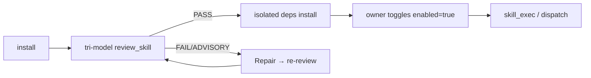

# Creating Skills for NEILA

This is the practical guide for **writing your own skills** that
NEILA can install, review, enable, and execute. It is the
single place where the manifest schema, the `PluginAPI`, the review
checklist, the lifecycle (install → review → enable → execute), the
widget render schemas, and the marketplace publishing flows are
explained together.

If you are looking for the *runtime* architecture (how the loader
imports plugins, how the tri-model review pipeline is wired, etc.),
read [`docs/ARCHITECTURE.md`](ARCHITECTURE.md). If you want to know
exactly what a reviewer model is asked to check, read the "Skill
Review Checklist" section of [`docs/CHECKLISTS.md`](CHECKLISTS.md).

## What is a skill?

A **skill** is a small package that adds capabilities to NEILA:
new tools the agent can call, HTTP routes the desktop app can fetch,
WebSocket message handlers, and host-rendered widget UIs. Skills are
**reviewed** before they can run — every payload goes through a
tri-model security review and is gated behind owner toggles, so a
malicious or buggy skill cannot silently mutate the runtime.

There are three skill types:

| Type | What it ships | When to use |
|------|---------------|-------------|
| `instruction` | Markdown-only `SKILL.md` (no code). | Pure prompts / playbooks for the agent. |
| `script` | One or more scripts under `scripts/` plus a manifest. | Heavy / batch work that runs as a subprocess. |
| `extension` | A `plugin.py` that registers tools/routes/widgets via `PluginAPI`. | Long-lived in-process capabilities, including widgets and chat-driven tools. |

The **runtime ownership** of an installed skill is also tagged:

- `native`: bundled with the launcher (e.g. `weather`).
- `external`: dropped into `data/skills/external/` by the user.
- `clawhub`: installed via the ClawHub marketplace.
- `NEILAhub`: installed via the official NEILAHub catalog.

User-authored or manually copied skills belong under
`data/skills/external/<name>/`. The `native` bucket is reserved for
launcher-seeded skills that carry a `.seed-origin` marker. If a user
payload is accidentally left under `native/`, NEILA migrates it to
`external/` so the Repair workflow can edit and re-review it.

## Manifest schema (`SKILL.md` frontmatter or `skill.json`)

A manifest is YAML frontmatter inside `SKILL.md`, OR a standalone
`skill.json`. Both shapes parse to the same dataclass. Use whichever
fits your editing workflow.

```yaml
---
name: weather                       # required, alnum/underscore/dash, ≤64 chars
description: Live weather widget    # required, short summary
version: 0.2.1                      # required, free-form (semver recommended)
type: extension                     # instruction | script | extension
runtime: python3                    # script skills: python/python3/bash/node/deno/ruby/go; extension entry modules are Python plugin.py
entry: plugin.py                    # type=extension only — relative to skill dir
scripts:                            # type=script only
  - name: fetch.py                  # name resolves under scripts/ unless slashes/extensions
    description: Fetch and render
permissions: [net, tool, route, widget, read_settings]   # see "Permissions"
env_from_settings: [OPENROUTER_API_KEY]                  # core keys require an owner grant
when_to_use: User asks for the weather forecast.
timeout_sec: 60                     # default 60, hard cap 300
ui_tab:                             # extension widgets (optional)
  tab_id: live
  title: Weather
  icon: cloud
  render:
    kind: declarative
    schema_version: 1
    components:
      - type: form
        route: search
        method: POST
        target: result
        fields:
          - name: city
            label: City
            type: text
        submit_label: Refresh
      - type: kv
        target: result
        fields:
          - label: Temperature
            path: temp_c
---

# Weather

Markdown body explaining the skill to the user / reviewer / agent.
Everything below the closing `---` becomes `manifest.body`.
```

`runtime` is optional for `type: instruction` (instruction skills never
execute), and required for `script` / `extension`. Allowed values are
`python`, `python3`, `bash`, `node`, plus the v5.7.0 additions
`deno`, `ruby`, `go`. The actual binary is resolved through
`shutil.which` at exec time, so the operator's host must ship the
runtime; otherwise `skill_exec` fails closed with a clear error.

## Lifecycle: install → review → enable → execute



- **Install** lands the payload under the appropriate bucket
  (`data/skills/<bucket>/<name>/`). Marketplace installs also write
  a provenance sidecar (`.clawhub.json` / `.NEILAhub.json`).
- **Review** runs three reviewer models in parallel against the
  Skill Review Checklist (see [`docs/CHECKLISTS.md`](CHECKLISTS.md)).
  The review pack hashes every runtime-reachable file in the skill
  directory; any later edit invalidates the PASS verdict.
- **Isolated deps** (pip / npm / uv / node) install into
  `data/skills/<bucket>/<name>/.NEILA_env/`. Status is recorded
  in `data/state/skills/<name>/deps.json`.
- **Enable** flips `enabled.json` after PASS + grants + deps. The
  Skills UI surfaces a toggle; agents can also call `toggle_skill`.
- **Execute**: `skill_exec` runs `type: script` skills as
  subprocess; `type: extension` runs in-process via the loader.

### Declaring dependencies

Skills may declare auto-installable dependencies in frontmatter:

```yaml
dependencies: [ddgs]
```

or with explicit install specs:

```yaml
install:
  - kind: pip
    package: ddgs
```

Bare `dependencies` entries are treated as Python packages. `pip`,
`pipx`, `uv`, `npm`, and `node` specs are installed only after a fresh
PASS review and only under the skill's `.NEILA_env` directory.
Global package-manager or arbitrary-download specs remain manual setup
guidance.

## The `skill_preflight` tool

When you are writing a skill (or repairing one in heal mode),
`skill_preflight` runs cheap, offline syntax validators on the
payload — in-process Python `compile()` for `.py` files (no
`__pycache__` writes), `node --check` for `.js`/`.mjs`/`.cjs`,
`bash -n` for `.sh`/`.bash`, plus a manifest parse and explicit
entry/script existence checks. It does not call any LLM and does not
mutate review state, so the agent can iterate without burning review
tokens.

```text
skill_preflight(skill="weather")
skill_preflight(skill="weather", paths=["plugin.py"])
```

## Permissions

The manifest's `permissions` list authorises specific PluginAPI
calls and runtime behaviours:

| Permission | What it grants |
|------------|----------------|
| `net` | The skill may make outbound network calls. |
| `fs` | The skill may write outside its state dir (review item still enforces confinement). |
| `subprocess` | The skill may spawn child processes (review items + cwd-confinement still enforce). |
| `widget` | The skill may call `register_ui_tab` and `register_settings_section`. |
| `ws_handler` | The skill may call `register_ws_handler` and `send_ws_message`. |
| `route` | The skill may call `register_route`. |
| `tool` | The skill may call `register_tool`. |
| `read_settings` | The skill may call `api.get_settings([...])`. |

A missing permission causes the matching `register_*` call to raise
`ExtensionRegistrationError`, surfaced as a skill load error in the
Skills UI.

## Grants for "core" keys

Some settings keys are protected: `OPENROUTER_API_KEY`,
`OPENAI_API_KEY`, `OPENAI_COMPATIBLE_API_KEY`, `ANTHROPIC_API_KEY`,
`CLOUDRU_FOUNDATION_MODELS_API_KEY`, `TELEGRAM_BOT_TOKEN`,
`GITHUB_TOKEN`, `NEILA_NETWORK_PASSWORD`. These keys are NEVER
forwarded to a skill by default, even when listed in
`env_from_settings`. The desktop launcher's owner-grant bridge
captures explicit, content-hash-bound consent before forwarding.

The Skills UI surfaces missing grants on the skill card. The agent
can also call `toggle_skill enabled=true` only after grants are
approved (the tool returns `SKILL_TOGGLE_ERROR: cannot enable until
requested key grants are approved`).

## PluginAPI reference

The frozen ABI is documented in
[`NEILA/contracts/plugin_api.py`](../NEILA/contracts/plugin_api.py).
This section shows the practical shape.

```python
def register(api):
    # Tools — agent-callable, namespaced as ext_<len>_<token>_<name>.
    api.register_tool(
        "search",
        handler=do_search,
        description="Web search",
        schema={
            "type": "object",
            "properties": {"query": {"type": "string"}},
            "required": ["query"],
        },
        timeout_sec=60,
    )

    # HTTP routes — mounted at /api/extensions/<skill>/<path>.
    api.register_route("search", handler=http_search, methods=("POST",))

    # WebSocket message handlers (inbound) and broadcasts (outbound).
    api.register_ws_handler("ping", handler=ws_ping)
    api.send_ws_message("event", {"hello": "world"})

    # Widget UI tab on the Widgets page.
    api.register_ui_tab(
        "live",
        title="Search",
        render={
            "kind": "declarative",
            "schema_version": 1,
            "components": [...],
        },
    )

    # Settings sub-section on the Settings page (v5.7.0+).
    # Settings sections use a narrow declarative subset: form/action for
    # configuration writes and markdown/json for explanatory diagnostics.
    # Rich widget-only components (media, stream, map, kanban, module JS)
    # belong on the Widgets page, not Settings.
    api.register_settings_section(
        "config",
        title="Search settings",
        schema={"components": [
            {"type": "form", "route": "config/save", "method": "POST", "fields": [...]},
        ]},
    )

    # Cleanup callback when the extension is unloaded / disabled.
    api.on_unload(close_pool)

    # Read-only runtime info (v5.7.0+).
    info = api.get_runtime_info()
    # {runtime_mode, app_version, data_dir, server_port, skill_dir, state_dir}

    # Read settings keys allow-listed in env_from_settings.
    keys = api.get_settings(["OPENROUTER_API_KEY"])
```

### Async tool handlers (v5.7.0+)

Tool handlers can be plain functions OR `async def` coroutines —
the registry detects coroutines and runs them on a helper thread with
a fresh event loop under `asyncio.wait_for(timeout_sec)`. They do not
execute on the server's main event loop, so do not rely on loop-local
state captured at registration time. HTTP routes and WS handlers have
always supported async; v5.7.0 closes the asymmetry for tools.

```python
async def do_search(ctx, query: str = ""):
    async with httpx.AsyncClient() as client:
        resp = await client.get(...)
    return resp.text

api.register_tool("search", handler=do_search, description=..., schema=...)
```

### `kind: "module"` widgets (v5.7.0+)

For widget surfaces that the host's declarative components cannot
express (Leaflet maps, custom charts, drag/drop editors), you can
ship a `widget.js` that the host mounts inside a sandboxed
`<iframe srcdoc>`:

```yaml
ui_tab:
  tab_id: editor
  title: Editor
  render:
    kind: module
    entry: widget.js
```

The host fetches the reviewed `widget.js` text through
`GET /api/extensions/<skill>/module/<entry>` and embeds it into a
sandboxed `srcdoc` iframe. The iframe carries `sandbox="allow-scripts"`
(no `allow-same-origin`) so the script runs as an opaque origin —
`document.cookie` and `localStorage` of the SPA are unreachable. Since
opaque-origin iframes cannot directly use normal same-origin `fetch`,
the host injects a tiny `window.fetch` / `window.NEILAWidget.fetch`
bridge: calls to `/api/extensions/<skill>/...` are forwarded to the
parent, executed by the parent, and returned as a `Response` object.
The bridge rejects every path outside the owning skill's route prefix.
The companion review item `widget_module_safety` enforces source-level
discipline; do not rely on the iframe sandbox alone.

For everything else, prefer the existing declarative components
(form / action / poll / subscription / stream / table / chart /
markdown / json / kv / status / tabs / progress / gallery /
image / audio / video / file / map / calendar / kanban). They
handle XSS / CSRF / lifecycle automatically.

## Skill Review Checklist (eight items)

Reviewers grade your skill on eight checklist items
(see [`docs/CHECKLISTS.md`](CHECKLISTS.md) §"Skill Review Checklist"
for the authoritative text). All items must reach `PASS` for
`status=pass`:

1. **manifest_schema** — does the manifest parse, and do `type` /
   `runtime` / `timeout_sec` cohere with the actual payload?
2. **permissions_honesty** — does the manifest declare every
   capability the code actually uses (e.g. `net` if you import
   `httpx`, `subprocess` if you spawn a child)?
3. **no_repo_mutation** — does the skill avoid writing into
   `~/NEILA/repo/` or staging git commits?
4. **path_confinement** — do scripts stay inside `skill_dir` and
   `state_dir`? Absolute paths and `..` traversal fail this item.
5. **env_allowlist** — is `env_from_settings` short and justified?
   Core keys require explicit owner grants and a stated need.
6. **timeout_and_output_discipline** — is `timeout_sec` reasonable;
   does the script avoid unbounded loops; does stdout output stay
   under the byte caps?
7. **extension_namespace_discipline** — for `type: extension`, do
   tool/route/ws-handler names live under the `ext_<len>_<token>_…`
   namespace; do widget components use the host-owned schema?
8. **widget_module_safety** (v5.7.0+) — for `kind: "module"`
   widgets, does `widget.js` avoid `document.cookie`, `localStorage`,
   `sessionStorage`, and `fetch` URLs outside `/api/extensions/`?

## Reference skills

The simplest reference for each type lives in `repo/skills/` and
the NEILAHub catalog:

- `weather` — `type: extension`, declarative inline-card widget,
  reads no env keys.
- `duckduckgo` — `type: extension`, declarative form widget, no
  env keys, declares the `ddgs` Python package as an isolated dependency.
- `perplexity` — `type: extension`, declarative form widget,
  `read_settings` for `OPENROUTER_API_KEY`.

You can read their full source under
`data/skills/native/<name>/` for launcher-seeded examples, under
`data/skills/external/<name>/` for your own local skills, or by browsing
`joi-lab/NEILAHub` on GitHub.

## Publishing

### NEILAHub (official, curated)

`joi-lab/NEILAHub` is the official catalog NEILA installs
from. Publishing:

1. Add a directory `skills/<slug>/` containing `SKILL.md` (and
   `plugin.py` for extensions / `scripts/<file>` for scripts).
2. Append an entry to `catalog.json` with the slug, name,
   description, version, type, and `files: [{path, sha256, size}]`.
   Recompute the sha256 every time you change the file bytes.
3. Open a PR. After it merges, the NEILA Skills UI's
   NEILAHub tab will list the new skill within the catalog
   client cache TTL (~5 min on raw.githubusercontent.com).

### ClawHub (third-party, registry-driven)

ClawHub is the broader OpenClaw registry. Publishing requires an
OpenClaw publisher account; once your skill is on the registry the
ClawHub tab in the Marketplace will install it via the
`adapt_openclaw_skill` translation pipeline. Note that the adapter
preserves the original `SKILL.openclaw.md` next to the translated
`SKILL.md` so reviewers can cross-check both manifests.

## Migration patterns

When you bump the schema your `state_dir/` files use, run the
migration in your `register(api)` (idempotent, fast). Example:

```python
def register(api):
    state = pathlib.Path(api.get_state_dir())
    legacy = state / "legacy_db.json"
    modern = state / "db_v2.json"
    if legacy.exists() and not modern.exists():
        modern.write_text(_migrate(legacy.read_text(encoding="utf-8")), encoding="utf-8")
        legacy.unlink()
    # ... continue registration
```

## Troubleshooting

| Symptom | Likely cause |
|---------|--------------|
| `SKILL_EXEC_BLOCKED: review status is 'pending'` | Run `review_skill` for this skill. |
| `SKILL_TOGGLE_ERROR: dependency fingerprint is stale` | Re-run `review_skill`; the post-PASS deps reconciliation will reinstall. |
| `EXTENSION_NOT_LIVE` on tool dispatch | The skill is disabled or the loader had a load_error — check the Skills UI. |
| `HEAL_MODE_BLOCKED: ...` | The Repair task tried to call a tool the internal heal-mode allowlist does not permit; finish the Repair flow with `review_skill` and exit. |
| `PluginAPI.register_*` raises `ExtensionRegistrationError` | The skill is missing the matching permission in its manifest. |
| Reviewer marks `widget_module_safety: FAIL` | `widget.js` is touching `document.cookie` / `localStorage` / cross-origin `fetch`. Move the data through `/api/extensions/<skill>/` routes. |

For deeper integration questions read
[`docs/ARCHITECTURE.md`](ARCHITECTURE.md) §12 (extensions runtime)
and [`docs/CHECKLISTS.md`](CHECKLISTS.md) §"Skill Review Checklist".
